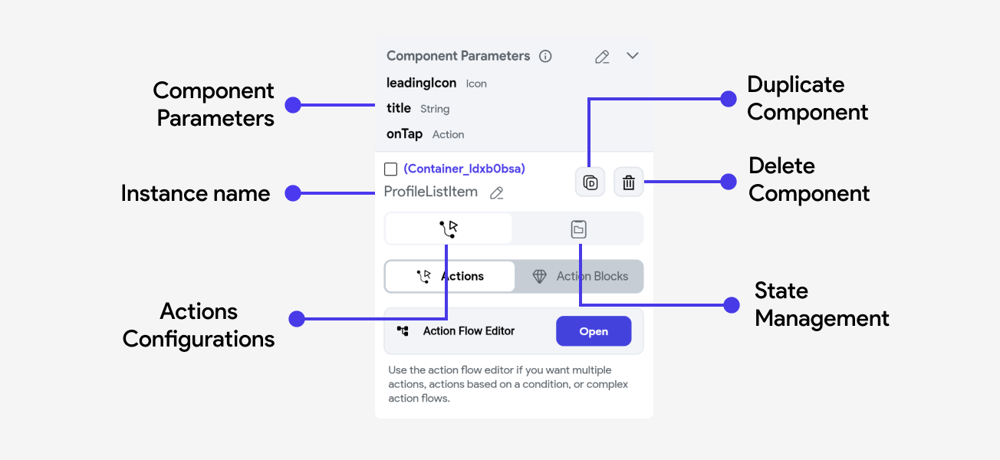
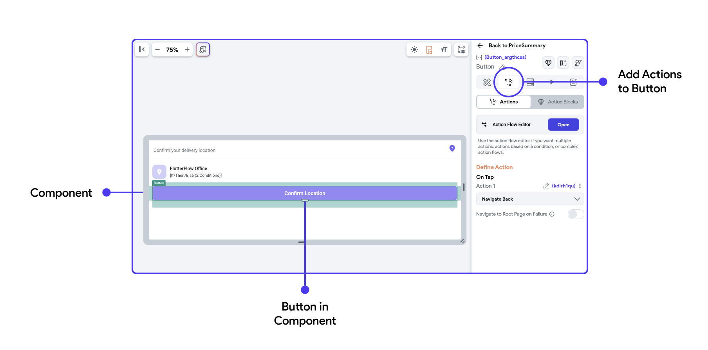

import setComponentParam from '@site/static/img/set-component-parameter.png';
import levComponentParam from '@site/static/img/leverage-component-parameter.png';

# Components

Components are reusable widgets you create to meet the specific needs of your app. This approach ensures consistency, saves
time, and simplifies maintenance across your project.

## Creating a Component from Scratch

To create a component from scratch, click the **Add Button** in the **Page Selector** or **Widget Tree** tab. Then choose **New Component.**

    <iframe 
        src="https://demo.arcade.software/h9WUKl6igLbyoCPewFLr?embed&show_copy_link=true"
        title="Create Component From Scratch"
        style={{
            position: 'absolute',
            top: 0,
            left: 0,
            width: '100%',
            height: '100%',
            colorScheme: 'light'
        }}
        frameborder="0"
        loading="lazy"
        webkitAllowFullScreen
        mozAllowFullScreen
        allowFullScreen
        allow="clipboard-write">
    </iframe>

## Convert into a Component

If you have already built a complex widget in your page, you can convert that entire widget into a component and reuse it throughout your app.

To convert a complex widget into a reusable component, right click on the root widget that contains the
entire widget tree you want to convert, then select **Convert to Component.**

    <iframe 
        src="https://demo.arcade.software/if0fCrWpn6wVDdcGbW0E?embed&show_copy_link=true"
        title="Convert into a component"
        style={{
            position: 'absolute',
            top: 0,
            left: 0,
            width: '100%',
            height: '100%',
            colorScheme: 'light'
        }}
        frameborder="0"
        loading="lazy"
        webkitAllowFullScreen
        mozAllowFullScreen
        allowFullScreen
        allow="clipboard-write">
    </iframe>

## Creating a Component from a Popular Template

FlutterFlow offers multiple popular templates for components across various use cases that you can
apply to your project in seconds, saving you a lot of time.

    <iframe 
        src="https://demo.arcade.software/z3yZcGihUz7yGc3jgIbK?embed&show_copy_link=true"
        title="Create from template"
        style={{
            position: 'absolute',
            top: 0,
            left: 0,
            width: '100%',
            height: '100%',
            colorScheme: 'light'
        }}
        frameborder="0"
        loading="lazy"
        webkitAllowFullScreen
        mozAllowFullScreen
        allowFullScreen
        allow="clipboard-write">
    </iframe>

## Create an AI Generated Component

You can quickly create a component using FlutterFlow AI by describing what you want in natural language. The AI uses your description or visual reference, along with your project context, to build the component.

To create and add an AI-generated component, open the **Widget Tree**, click **Generate with AI** (magic wand) button and select the **Component** tab. Next, describe the component you want to build, and hit the **Send** (up arrow) button.

FlutterFlow will process your request and display progress in the **AI Generation History** panel in the toolbar. Once the component is ready, you can preview it in both light and dark themes and apply various color schemes. If you're happy with the result, give it a name and add it to your project.

:::tip

- You can also upload a screenshot or image of the component you want to build. FlutterFlow AI will use it as a reference to generate the layout.
- While the AI is generating your component, you can continue working on other tasks within FlutterFlow, but make sure you don’t close the FlutterFlow app.

:::

    <iframe 
        src="https://demo.arcade.software/BZD7f7OmwPdyHuOia2lY?embed&show_copy_link=true"
        title="AI Generated Component"
        style={{
            position: 'absolute',
            top: 0,
            left: 0,
            width: '100%',
            height: '100%',
            colorScheme: 'light'
        }}
        frameborder="0"
        loading="lazy"
        webkitAllowFullScreen
        mozAllowFullScreen
        allowFullScreen
        allow="clipboard-write">
    </iframe>

#### Import from Figma Frame

You can also quickly turn your Figma designs into functional components in FlutterFlow. By providing a Figma Frame URL, FlutterFlow AI will analyze the design and automatically generate UI layouts that closely match your mockup.

To import from a Figma Frame, first, connect your Figma account, [import the Figma theme](../../../ff-concepts/design-system/design-system.md#import-figma-theme), and map your colors and typography accordingly. Next, open the **Generate with AI** dialog and click the **Plus (+)** button. Select **Import from Figma**, enter your **Figma frame URL**, and press **Send**.

A preview of the frame you are importing will appear. To finalize the import, click **Send** again. Once completed, the component will appear in the AI Generation History, where you can preview and add it to your project.

:::warning

Currently, we don't support importing SVG elements from Figma frames. However, you can manually add the SVGs directly to your project [**assets**](../../../generated-code/directory-structure.md#assets) after generation is complete, or replace them in Figma with supported image formats like PNG or JPEG.

:::

    <iframe 
        src="https://demo.arcade.software/BZD7f7OmwPdyHuOia2lY?embed&show_copy_link=true"
        title="AI Generated Component"
        style={{
            position: 'absolute',
            top: 0,
            left: 0,
            width: '100%',
            height: '100%',
            colorScheme: 'light'
        }}
        frameborder="0"
        loading="lazy"
        webkitAllowFullScreen
        mozAllowFullScreen
        allowFullScreen
        allow="clipboard-write">
    </iframe>

## Component Properties Panel

When you select a component from the widget tree, the properties panel opens up on the right
side of the interface. It plays a crucial role in configuring and managing the various aspects of
your components.

Here’s a detailed look at what you can typically find and modify in this panel:

## Component Parameters

Component parameters are values that a component receives from its parent entity, such as a page or
another component. These parameters allow the component to be dynamic and adaptable based on the
context in which it is used. By using parameters, you can customize components for different
scenarios without altering the base design or functionality.

### Creating a Component Parameter

To create a component parameter, go to the root widget in the component's widget tree.

    <iframe 
        src="https://demo.arcade.software/chgEkWJpUFAIUzoB0LuG?embed&show_copy_link=true"
        title="Adding a Parameter"
        style={{
            position: 'absolute',
            top: 0,
            left: 0,
            width: '100%',
            height: '100%',
            colorScheme: 'light'
        }}
        frameborder="0"
        loading="lazy"
        webkitAllowFullScreen
        mozAllowFullScreen
        allowFullScreen
        allow="clipboard-write">
    </iframe>

### Bind the Parameter

Once you have created a component parameter, you can link data from the parent entity to your
component.

Here's a small example of how we can bind the parameters created in `ProfileListItem` to their
respective widgets and action triggers.

    <iframe 
        src="https://demo.arcade.software/ixR32sxe5W97bEaS1hTt?embed&show_copy_link=true"
        title="Bind Parameters in Components"
        style={{
            position: 'absolute',
            top: 0,
            left: 0,
            width: '100%',
            height: '100%',
            colorScheme: 'light'
        }}
        frameborder="0"
        loading="lazy"
        webkitAllowFullScreen
        mozAllowFullScreen
        allowFullScreen
        allow="clipboard-write">
    </iframe>

Aside from standard data types used throughout FlutterFlow, you can also create parameters that are of type:

- **Action (callback)**: This allows you to pass in actions into the component. The component can then invoke the action, usually referred to as a callback, in its own action flows. Callbacks are often using to handle events, like updating a parent's state when a button has been pressed. [You can learn more about how to use callbacks here.](/resources/ui/components/callbacks)

- **Widget Builders**: Widget builders allows you to pass in widgets to be used within the component's widget tree. This is especially useful when you want to dynamically substitute content for some part of a component - like displaying an item in a custom dropdown, or creating a component for some consistent layout. [You can learn more about how to use Widget Builders here.](widget-builder-parameters.md)

### Actions

This tab allows you to define and manage interactions or events triggered by user actions. For
example, you can configure a button to navigate to another page or execute a callback action from
the page using the current component.

Adding an action to a component element is exactly the same experience as adding actions to any page elements. Here's a quick overview:

For component actions, you can establish specific behaviors or functions that are triggered by
certain events related to the component's lifecycle, such as **On Initialization**.

:::info
To learn more about component lifecycle and adding **On Initialization** action to your component 
[**refer here.**](component-lifecycle.md)
:::

### State Management

Components can have their own internal state variables that track information like form inputs,
toggles, or other user interactions. Components can update their state in response to user
actions (e.g., clicking a button) or external events (e.g., receiving new data from an API).

Effective state management ensures that components dynamically update their UI to reflect changes in
state, providing a responsive user experience.

:::info 
Learn how to **[Create a State variable](component-lifecycle.md#creating-a-component-state)** 
for your components and how to 
**[Update them](component-lifecycle.md#update-component-state-action)**.
:::
