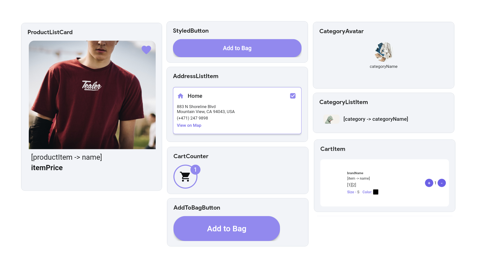

# Components

Components in FlutterFlow are reusable widgets. You design the widget once and can use it throughout your app
to save time, ensure consistency, and make it easier to maintain.

When you add a component to a [**Page**](../pages/intro-pages.md), it becomes part of that page's **[Widget Tree](../widgets/intro-widgets.md#widget-tree)**. This allows the component to interact with other widgets, inherit properties, and respond to state changes as part of the page's structure.

Components help in the following ways:

- **Consistency:** Components provide a consistent look and behavior, reducing the likelihood of
  discrepancies that can occur when the same UI elements are created multiple times.

- **Centralized Updates:** By creating a component once and reusing it across
  different parts of your app, you ensure that any design or functionality changes are made in
  one place. When that component is updated, all instances of that component across the
  app automatically reflect those changes. This significantly reduces the effort required to
  maintain and update the app.

  :::info[CLasses vs Instances]
  Learn more about **[Classes and their Instances](../overview.md)** and what they mean in
  FlutterFlow.
  :::

- **Error Reduction:** Since components reduce design duplication, the risk of errors
  decreases. Fixing an issue in a component means it is fixed everywhere, leading to fewer bugs and
  inconsistencies.

- **Scalability:** As your app grows, maintaining a DRY codebase through components makes it easier
  to scale. Adding new features or modifying existing ones becomes more straightforward and less
  prone to introducing errors.
  :::tip[DRY PRINCIPLE]
  The **DRY (Don't Repeat Yourself)** principle is a software development concept that emphasizes
  the
  importance of reducing repetition within code and design.
  :::

Leveraging components effectively helps you build a consistent, efficient, and maintainable app.

## Common Use-cases

Components can be used in various scenarios to accelerate your app development process. Here are
some common use-cases.

- Design a **standard button once** and reuse it across multiple screens to maintain a cohesive
   look.

- Utilize components for **card designs** frequently used in your app, such as product cards, user
   profiles, or news articles.

- **Standardize input forms** for tasks like user registration, login, or feedback collection,
   ensuring
   a consistent user experience.

- Design **pop-up messages or dialogs** that match the overall theme of your app, enhancing visual
   consistency.

- Build interactive elements such as **custom sliders, ratings, or progress bars**, and use them
   across various parts of your app.

- Design sections of a screen that are frequently repeated, such as testimonials, image galleries,
   or feature highlights, and reuse them to maintain a cohesive layout.

Here's an example of all the widely used components used in the [EcommerceFlow demo](https://bit.ly/ff-docs-demo-v1) app.

<figure>
    
  <figcaption class="centered-caption">Some of the custom components from the Ecommerce Demo App</figcaption>
</figure>

