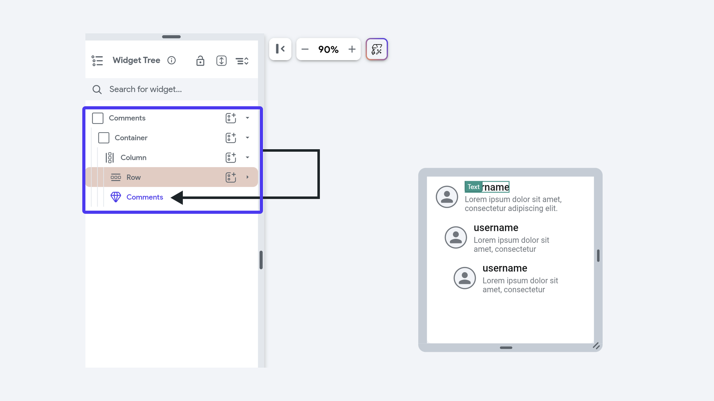

# Using Components

Components in FlutterFlow can be added to the widget tree of a page or another component. They help streamline
development by allowing you to reuse design and functionality throughout your app. Components can
accept parameters, making them adaptable to specific contexts. Additionally, you can use [callbacks](/resources/ui/components/callbacks)
to pass actions from parent entities to child components, enabling dynamic and interactive behavior. You can also use [widget builders](widget-builder-parameters.md) to substitute dynamic content into the component's widget tree.

To learn more about creating components, see [Creating a Component](/resources/ui/components/creating-components).

## Add a Component to a Widget Tree

To add a component to the widget tree of a page or another component, choose the parent entity where you want to add the new component. Next, you can find the component in the Widget Palette, under the **Components** section.

    <iframe 
        src="https://demo.arcade.software/EBpdB2PtNGPGzKh7O2eQ?embed&show_copy_link=true"
        title="Add component to Page"
        style={{
            position: 'absolute',
            top: 0,
            left: 0,
            width: '100%',
            height: '100%',
            colorScheme: 'light'
        }}
        frameborder="0"
        loading="lazy"
        webkitAllowFullScreen
        mozAllowFullScreen
        allowFullScreen
        allow="clipboard-write">
    </iframe>

### Specify Parameter Values

In FlutterFlow, each component instance can receive unique values from its parent entity.
When you add a component to the widget tree, you can set the parameter values by clicking on the instance of the component and going to the **Properties panel**.

    <iframe 
        src="https://demo.arcade.software/t4r4TKLGrRvdthCZYdvm?embed&show_copy_link=true"
        title="Pass Down Values"
        style={{
            position: 'absolute',
            top: 0,
            left: 0,
            width: '100%',
            height: '100%',
            colorScheme: 'light'
        }}
        frameborder="0"
        loading="lazy"
        webkitAllowFullScreen
        mozAllowFullScreen
        allowFullScreen
        allow="clipboard-write">
    </iframe>

## Setting a Unique Key
When you use a component in a dynamically generated list, you can set a unique key. For example, imagine a dynamic list where items change frequently, such as a to-do list where tasks are added and removed. Think of it as giving each task a unique ID number. This is important for a few reasons:

- **Tracking Changes:** The **Unique Key** helps the app recognize which tasks are new, completed, or removed, ensuring accurate updates.

- **Efficiency:** With unique IDs, the app updates only the tasks that have changed instead of the entire list, improving performance.

- **Retaining Details:** When you modify a task and move away from it, the **Unique Key** ensures the changes are remembered and displayed correctly when you return.

:::tip
If it's a list of documents, the unique key might be the document ID.
:::

## Recursive Components

You can create a recursive component, which means the component can include an instance of itself within its own widget tree. This is especially useful for nested content.

For example, in social media applications or forums, comments can have replies, and each reply can have further replies. A recursive component can display this nested structure effectively.

