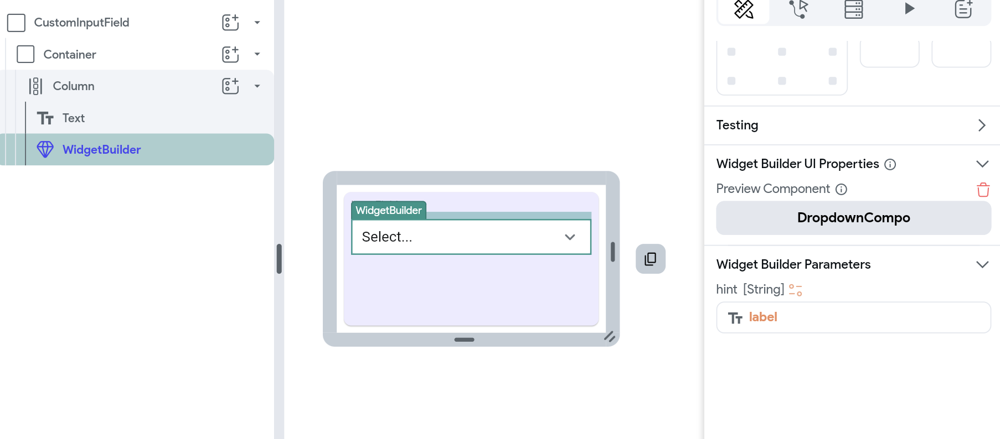

# Widget Builder Parameters

Sometimes, you want to create a component that offers some consistent design, while also allowing for customization. This is where passing widget builder as parameters becomes valuable. 

Widget builder parameters allow component authors to substitute in dynamic content within the widget tree of the component. This means that when someone uses the component, they can dynamically pass in pieces of UI to be used within the component. 

For example, consider a custom dropdown component. While the overall structure of the dropdown remains the same, you might need to change the style or content of the dropdown items based on different use cases. By passing the dropdown item widget as a parameter, you can use the dropdown's appearance and behavior without creating new components for each variation.

:::tip[possible use casses]
- **Custom Cards**: Imagine you need to display product cards in an e-commerce app. You can build a reusable card component with parameters for the image, header, content, and call-to-action button. This card can be reused across multiple pages but with different content.
- **Dynamic Forms**: Build a form component where different fields (TextFields, Dropdowns, or Checkboxes) are passed in as parameters. This allows you to reuse the same form structure but adapt to various input fields.
- **Modular Layouts**: Create a consistent layout structure with areas like headers and footers that remain the same while passing in different body content as parameters to adapt to different pages.
:::

Let’s see an example from an eCommerce app. On the shipping address page, you may want to maintain a consistent design for the various input fields (where the user can specify their name, email, etc). However, you may want to allow some customization different inputs - for example, you want to use a `TextField` to allow the user to type their name, and a `DropDown` to allow the user to select their country. 

## Creating Widget Builders as Parameters

To create a component with a widget builder as a parameter, use the steps outlined below. 

### Create a Parameter of Type Widget Builder
Create a new component and add the base widgets that will be unmodified. Next, define a parameter and set its type to **Widget Builder**. To pass data from the current component to the widget builder, you can specify a parameter for the widget builder.

    

        <iframe 
            src="https://demo.arcade.software/4JjEozeplDTGYYr1pqnF?embed&show_copy_link=true"
            title=""
            style={{
                position: 'absolute',
                top: 0,
                left: 0,
                width: '100%',
                height: '100%',
                colorScheme: 'light'
            }}
            frameborder="0"
            loading="lazy"
            webkitAllowFullScreen
            mozAllowFullScreen
            allowFullScreen
            allow="clipboard-write">
        </iframe>
    

    

### Add the Widget Builder to the Widget Tree
Add the widget builder placeholder into the desired spot in the component’s widget tree where the dynamic element should appear. Widget Builders appear in the **Components** section of the **Widget Palette** when adding a widget to the widget tree.

    

        <iframe 
            src="https://demo.arcade.software/WIQE90y3f14ajwx2Wy7H?embed&show_copy_link=true"
            title=""
            style={{
                position: 'absolute',
                top: 0,
                left: 0,
                width: '100%',
                height: '100%',
                colorScheme: 'light'
            }}
            frameborder="0"
            loading="lazy"
            webkitAllowFullScreen
            mozAllowFullScreen
            allowFullScreen
            allow="clipboard-write">
        </iframe>
    

    

### Pass Parameters to the Widget Builder

Sometimes, you need to pass data from the component to the widget builder. For example, on the shipping address page, you might want the hint text in an input field to change depending on some configuration. In this case, you can pass the hint as a parameter into the widget builder.
Here’s how you do it:

    <iframe 
        src="https://demo.arcade.software/eNz0LKXEpeh90p9qNIyU?embed&show_copy_link=true"
        title=""
        style={{
            position: 'absolute',
            top: 0,
            left: 0,
            width: '100%',
            height: '100%',
            colorScheme: 'light'
        }}
        frameborder="0"
        loading="lazy"
        webkitAllowFullScreen
        mozAllowFullScreen
        allowFullScreen
        allow="clipboard-write">
    </iframe>

#### Preview the Widget Builder using Different Components
You can select different components to use as a preview while building the component that has a widget builder parameter. 

To select a component to use in the preview, select the Widget Builder, then go to the **Widget Builder UI Properties** section of the **Property Panel**.

## Using Components with Widget Builders as Parameters
When you use a component that has a widget builder as a parameter, you can pass in [components](/resources/ui/components) to customize the content according to your needs.

In this example, we create two additional components for `TextField` and `Dropdown` — and pass them as widget builders. 

    

        <iframe 
            src="https://demo.arcade.software/zlTGZrEymy56lONPvSn5?embed&show_copy_link=true"
            title=""
            style={{
                position: 'absolute',
                top: 0,
                left: 0,
                width: '100%',
                height: '100%',
                colorScheme: 'light'
            }}
            frameborder="0"
            loading="lazy"
            webkitAllowFullScreen
            mozAllowFullScreen
            allowFullScreen
            allow="clipboard-write">
        </iframe>
    

    

