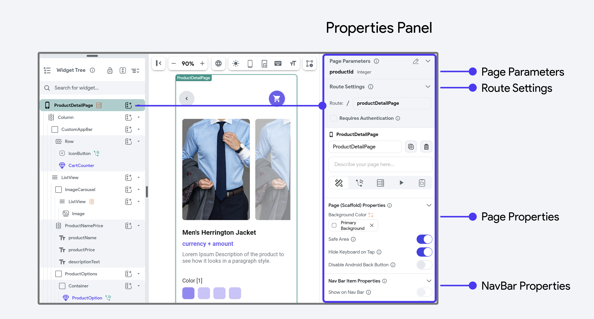
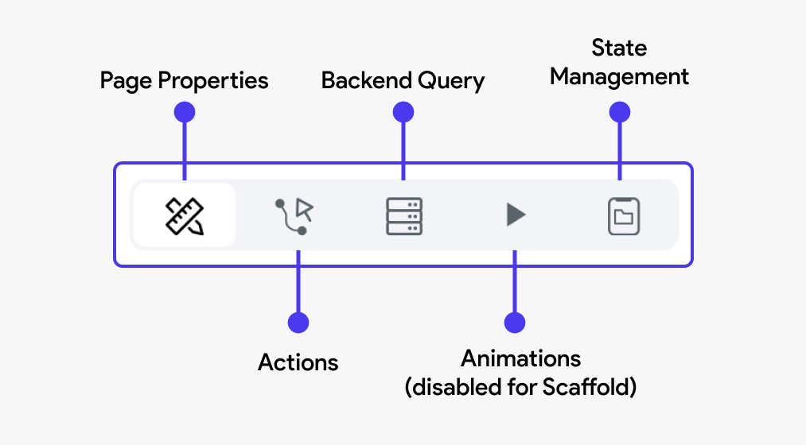

# Properties Panel

In FlutterFlow, the properties panel on the right helps you set up and manage your pages. It opens when you click on the root element in the [Widget Tree](../widgets/intro-widgets.md#widget-tree) (on the left).

The panel is organized into sections, each focusing on different settings to customize your pages.

Here’s a detailed look at what you can typically find and modify in this panel:


### Page Parameters

This section allows you to define and manage parameters that your page can
receive from other pages of the app. Parameters are essentially variables that
hold values which can be passed between pages. For example, you might pass a
user ID from a list page to a detail page to display specific information about
that user.

:::info[LEARN MORE]
Learn more about passing data between pages [**here**](../../../ff-concepts/navigation-routing/passing-data.md).
:::

### Route Settings

In FlutterFlow, Route Settings are essential for defining how pages within your
application are accessed and interacted with. These settings allow you to
customize the URL paths for web and mobile deep linking, set meaningful Page
Names as unique identifiers, integrate dynamic parameters into your routes, and
set access restrictions based on user authentication.


**Skip On Page Load When Inactive**

Ensures that actions are bypassed if the Entry Page or Logged In Page is detected as inactive. This is designed specifically for entry points in the app to prevent unnecessary operations when the page is not fully active, optimizing performance and avoiding redundant executions.

:::tip[Generated Code]
When this check is enabled, the following code is added to your `initState` of your page:
```js
if (RootPageContext.isInactiveRootPage(context)) {
       return;
    }
      // On Page Load Actions added after this
```
:::

**Requires Authentication**

When the "Requires Authentication" option is enabled for a page, it ensures that only users who are logged in can access that page. This setting is particularly useful for protecting sensitive or personalized content, as it prevents unauthorized users from viewing or interacting with the page.

:::tip[Generated Code]
When the Route object is created for this Page, setting `requireAuth: true` ensures that only authenticated users can access this page. If "Requires Authentication" is checked, the app will automatically enforce authentication checks before navigating to this page. This is automatically enabled for **Logged In Page**.

```js
FFRoute(
    name: 'promotionPage',
    path: '/promotionPahe',
    requireAuth: true, 
    builder: (context, params) => PromotionPageWidget(),
  )
```
:::


:::info[LEARN MORE]
Learn more about Routing [**here**](../../../ff-concepts/navigation-routing/nav-overview.md).
:::

## Advanced Configurations

For more advanced customization and functionality within your FlutterFlow
projects, the **Properties Panel** offers various configuration settings. These settings allow
for appearance modification, greater interactivity, dynamic data handling, and more tailored user
experiences.

Here's an overview of these additional configurations:

- [Page Properties](#page-scaffold-properties)
- [Actions](#actions)
- [Backend Query](#backend-query)
- [State Management](#state-management)



### Page (Scaffold) Properties

This section is where you set the fundamental aspects of a page’s layout and
behavior, including:

- **Background Color:** This property allows you to set a background color for the
entire page. You can choose a color that fits the theme and design of your app.

- **Safe Area:** When this toggle is enabled, the page content will be
automatically adjusted to not overlap with the system status bar, navigation
bar, and other critical device UI elements. This ensures that all elements of
the page are visible and accessible on different devices.

- **Hide Keyboard on Tap:** Enabling this option makes the keyboard retract when
the
user taps anywhere outside the keyboard area on the screen. This is particularly
useful for improving user experience by preventing the keyboard from obscuring
content.

- **Disable Android Back Button:** This toggle, when activated, prevents the
Android
back button from affecting the navigation on this particular page. This can be
useful in scenarios where you don't want users to navigate back to the previous
screen easily, such as in a login or payment screen.

### Actions

This section allows you to define and manage interactions or events triggered by
user actions. For example, you can configure a button to navigate to another
page, submit form data, or call an API. Actions are crucial for creating
interactive and functional apps.

In the case of Scaffold (Page) actions, you can establish specific behaviors or
functions that are triggered by certain events related to the page's lifecycle such as [**On Page 
Load**](page-lifecycle.md#on-page-load-action-trigger) or [**On Phone Shake**](page-lifecycle.md#on-phone-shake-action-trigger). 

:::info[LEARN MORE]
To learn about the page lifecycle and other methods exposed by FlutterFlow, [**refer to this resource**](page-lifecycle.md).
:::

### Backend Query

Here, you can configure the page to fetch data from a backend source or
database. This is typically done through API calls or direct database queries.
Setting up a backend query allows the page to display dynamic content, such as
user profiles, product lists, or any other data your app needs to retrieve from
a server.

:::info[LEARN MORE]
To learn more about how to connect to a backend source, refer to our [**Database section**](../../../resources/control-flow/backend-logic/backend-query/backend-query.md)
:::

### State Management

State management configurations are essential for maintaining the state or
status of a page across user interactions or app sessions. This can include
tracking user inputs, remembering user choices, or preserving the app's state
during navigation between pages. 

:::info[LEARN MORE]
Learn how to create and **[manage the update lifecycle](page-lifecycle.md)** of Page State variables.
:::
