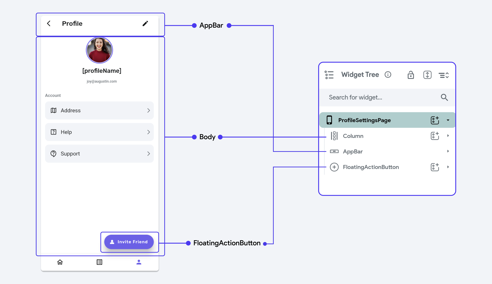

# Getting Started with Pages

In FlutterFlow, each **Page** you create is fundamentally structured using a **Scaffold**, which is
a [widget from Flutter](https://api.flutter.dev/flutter/material/Scaffold-class.html)
that provides the basic material design visual layout structure. The `Scaffold` widget offers a
consistent framework for each page, allowing you to define and organize its structure.

Here's how the `Scaffold` contributes to page design in FlutterFlow:

- **[AppBar](page-elements.md#appbar)** : Scaffold allows you to easily include an `AppBar` at the top of the
  page,
  which can house the title, navigation controls, and other actions.

- **[Floating Action Button (FAB)](page-elements.md#floating-action-button-fab)**: An action button that is commonly used for
  primary actions on the screen, like adding a new contact or composing a message.

- **[Drawer & End-Drawer](page-elements.md#drawers)**: A slide-out menu for app navigation, accessible from
  the `AppBar` or by swiping from the side.

- **Body:** The main content area where you place your widgets for the body of the Page.

:::note[PLEASE NOTE]
In FlutterFlow, you won't find a section explicitly labeled as "Body". For example, in the 
`ProfileSettingsPage`, the `Column` serves as the root of the widget tree for the body, with the rest of the child widgets assembled underneath.

:::

In FlutterFlow, you will find these Page Widgets under **[Page Elements](page-elements.md)** in Widget Palette.

<!--
:::tip[Generated Code]

[See how](../generated-code.md) FlutterFlow converts your page into Flutter
code
:::
-->

## Creating a Page

In FlutterFlow, you can craft a page tailored to your expertise, design preferences, or specific
use case needs. Whether you're starting from scratch, using a template, or leveraging AI tools,
there are several pathways to achieve the desired functionality and aesthetic of your desired Page.

FlutterFlow allows you to easily create new pages using the Page Selector
button, which is available in the **Widget Tree menu (Tab+2)**. This will help you
quickly start and add new pages to your app.

### Create an empty page

When creating your page in FlutterFlow, one option is to start with an empty page, providing you
with a blank canvas. This approach allows you to build your UI from the ground up by composing
widgets and components together according to your specific design vision and functional
requirements.

To create an empty FlutterFlow Page from scratch, follow the steps:

<iframe src="https://demo.arcade.software/rtOPRXVUByUAXxUynd8T?embed&show_copy_link=true" title="app.flutterflow.io/authentication" frameborder="0" loading="lazy" webkitallowfullscreen mozallowfullscreen allowfullscreen allow="clipboard-write" width="100%" height="600"></iframe>

### Create a page from a popular template

FlutterFlow simplifies the process of page creation by offering a variety of
popular template use cases. These templates provide a basic structure for your
pages, which you can quickly customize with your own styling, widgets, and text.

To utilize a template from FlutterFlow, follow these steps:

    <iframe 
        src="https://demo.arcade.software/bkaz68ipgi497Pf4v8EB?embed&show_copy_link=true"
        title="Create a page from a popular template"
        style={{
            position: 'absolute',
            top: 0,
            left: 0,
            width: '100%',
            height: '100%',
            colorScheme: 'light'
        }}
        frameborder="0"
        loading="lazy"
        webkitAllowFullScreen
        mozAllowFullScreen
        allowFullScreen
        allow="clipboard-write">
    </iframe>

### Create an AI generated page

FlutterFlow's **AI Gen** feature allows you to generate various elements,
including pages, from a prompt. This can be particularly useful when you're
unsure where to start. Once the page is generated, you can preview it with different color 
schemes, in both light and dark themes, and add new UI elements as desired. 

To create an AI Generated page, follow the steps:

    <iframe 
        src="https://demo.arcade.software/hLpE44TVjb72rzTTpxRK?embed&show_copy_link=true"
        title="Create an AI generated page"
        style={{
            position: 'absolute',
            top: 0,
            left: 0,
            width: '100%',
            height: '100%',
            colorScheme: 'light'
        }}
        frameborder="0"
        loading="lazy"
        webkitAllowFullScreen
        mozAllowFullScreen
        allowFullScreen
        allow="clipboard-write">
    </iframe>

	
