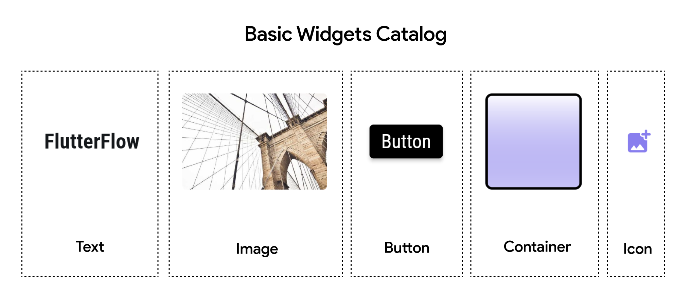

# Basic Widgets
FlutterFlow offers a range of basic widgets that are the building blocks of a Page or Component. In this guide, we'll cover five fundamental widgets: **Container**, **Text, Icon, Button,** and **Image**. Understanding these widgets is crucial for building any FlutterFlow app.

Some basic widgets include: 
- **[Container](container.md)**: The **Container** widget is one of the most commonly used widgets in FlutterFlow. It allows you to create a rectangular or circular box that is allowed to have one single child - any other basic or advanced widget, and you can style it with various properties such as padding, margins, borders, and colors, etc.
- **[Text](text.md)**: The **Text** widget is used to display a string of text with single style. It’s a basic yet powerful widget that allows you to customize text appearance, alignment, and behavior.

- **[Icon](icons.md)**: The **Icon** widget is used to display an icon from the Material Icons, Font Awesome or your own custom icons set. Icons are essential for building user-friendly interfaces, providing visual cues to users.

- **[Button](button.md)**: In FlutterFlow, **Button** widgets are specialized interactive elements that come with built-in visual feedback and default hover properties.

- **[Image](image.md)**: The **Image** widget is used to display images in your app. FlutterFlow supports various sources for images, including assets, network URLs, and uploaded files.
