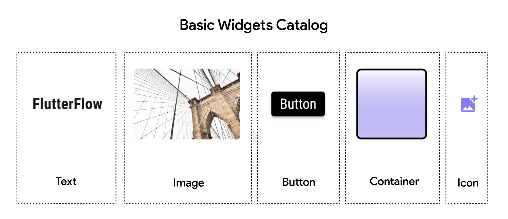

# Basic Widgets
FlutterFlow's basic widgets are common building blocks for a Page or Component. This section covers **Container**, **Text**, **Icon**, **Button**, and **Image**.

Some basic widgets include:
- **[Container](container.md)**: Creates a styled box with up to one child. Configure size, padding, alignment, fill, border, radius, and other decoration properties.
- **[Text](text.md)**: Displays text and supports typography, alignment, overflow, selection, and dynamic values.

- **[Icon](icons.md)**: Displays a Material, Font Awesome, custom, or dynamically supplied icon with configurable size and color.

- **[Button](button.md)**: Runs actions from tap, double-tap, or long-press triggers and supports loading, disabled, hover, text, and optional icon styles.

- **[Image](image.md)**: Displays network, asset, or uploaded-file images with fit, alignment, caching, placeholder, expandable-view, and Hero options.
