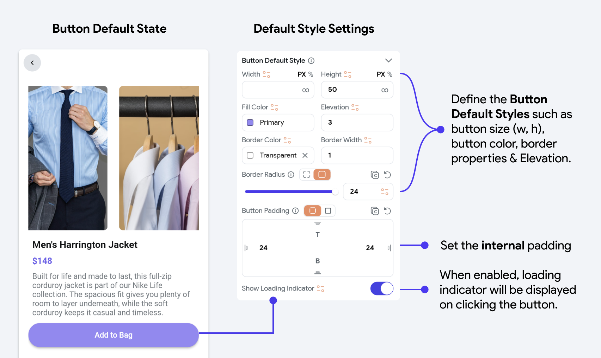
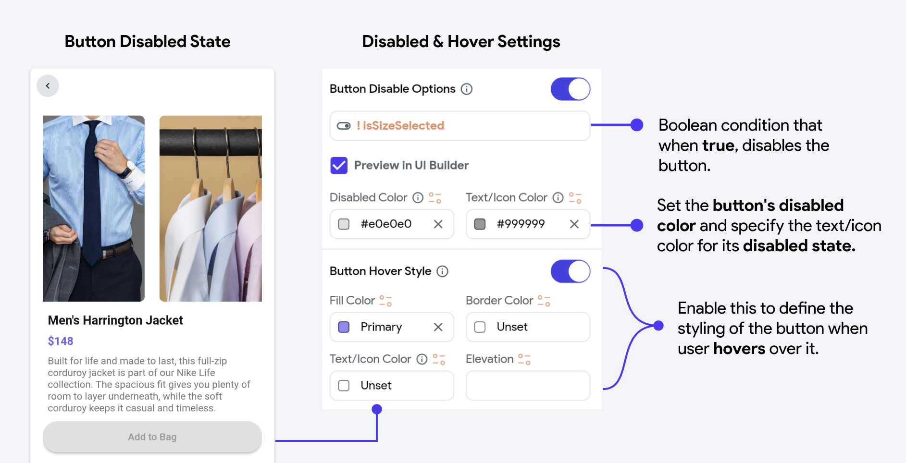

# Button 
The Button widget is a fundamental component in user interface design, utilized extensively across web and mobile applications. It serves as a primary means of user interaction, allowing users to execute actions or commands within an application. Buttons are essential for:

- **Initiating Actions:** Whether it's submitting a form, opening a new page, or performing any 
operational task, buttons trigger these functionalities.

- **User Feedback:** Buttons often change visually in response to user actions—like hover effects, 
changes in color on click, or disabled states—providing immediate visual feedback that confirms an action has been recognized.

- **Navigational Purposes:** Buttons can guide users through a site or application, such as moving to 
the next page of a form or returning to the home page.

- **Enhancing User Experience:** Well-designed buttons are crucial for creating a smooth and 
intuitive user experience. They are designed to be easily recognizable and accessible, facilitating a seamless interaction by clearly communicating their function.

When you add a Button widget to your Page or Component and select it, the Properties Panel on the right displays various properties and functionalities:

Some significant properties are illustrated below:

### Button Default Styling Settings

Define the initial appearance of your button, including its size, color, border, and padding. 
These settings determine how the button looks under default conditions.

### Button Disabled & Hover Settings

Customize how your button appears when disabled or when a user hovers over it. These settings allow you to alter the button's color, border, and elevation to indicate its state visually.

Additionally, you can define the style of the text inside the Button and, if enabled, the style of the Icon within the Button.

