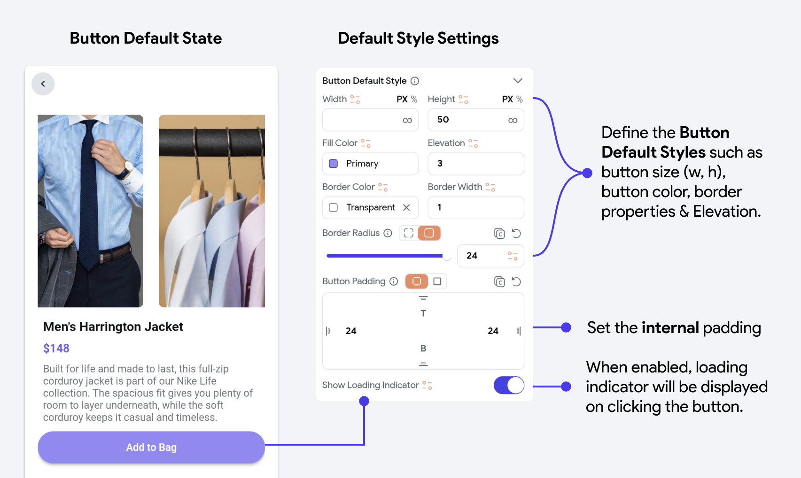
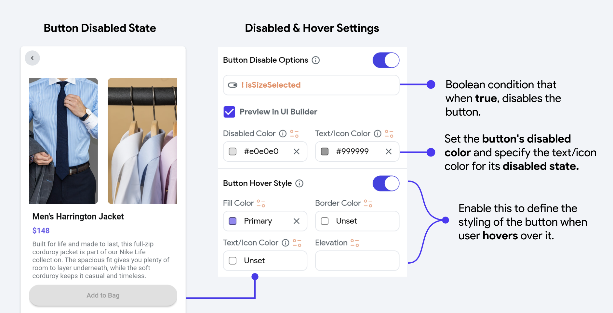

---
tags:
  - FlutterFlow
  - Resources
  - UI
slug: /resources/ui/widgets/button
title: Button
description: >-
  Configure FlutterFlow Button text, actions, loading, disabled and hover
  states, dimensions, borders, and optional icons.
keywords:
  - Button
  - Widgets
  - Ui
last_verified: 2026-09-02
---
# Button
The **Button** widget displays styled text and an optional icon, then runs the actions attached to **On Tap**, **On Double Tap**, or **On Long Press**.

- **Initiating Actions:** Whether it's submitting a form, opening a new page, or performing any
operational task, buttons trigger these functionalities.

- **User Feedback:** Buttons often change visually in response to user actions—like hover effects,
changes in color on click, or disabled states—providing immediate visual feedback that confirms an action has been recognized.

- **Navigational Purposes:** Buttons can guide users through a site or application, such as moving to
the next page of a form or returning to the home page.

- **Enhancing User Experience:** Well-designed buttons are crucial for creating a smooth and
intuitive user experience. They are designed to be easily recognizable and accessible, facilitating a seamless interaction by clearly communicating their function.

When you add a Button widget to your Page or Component and select it, the Properties Panel on the right displays various properties and functionalities:

## Add and configure a Button

1. Add a **Button** to a page or component.
2. Under **Button Text**, set the label and typography.
3. Configure height, optional width, **Button Padding**, fill color, border, radius, and elevation.
4. Under **Icon Properties**, optionally choose an icon, size, and color. Set **Icon Position** to **Leading** or **Trailing** and adjust **Icon Padding**.
5. Open the **Actions** panel and add the appropriate tap, double-tap, or long-press flow.
6. Test default, pressed, loading, disabled, keyboard-focus, and hover states on the relevant target platforms.

:::tip

Use a specific action label such as "Save changes" instead of a generic label such as "Submit." A disabled button should still remain understandable from surrounding text; do not communicate its state with color alone.

:::

Some significant properties are illustrated below:

### Button Default Styling Settings

Define the initial appearance of your button, including its size, color, border, and padding.
These settings determine how the button looks under default conditions.

**Show Loading Indicator** is enabled by default. While an asynchronous On Tap action is running, the generated button can replace its content with a progress indicator and ignore another press until the action finishes. Disable this option when the action manages its own progress UI.

### Button Disabled & Hover Settings

Customize how your button appears when disabled or when a user hovers over it. These settings allow you to alter the button's color, border, and elevation to indicate its state visually.

Enable **Button Disable Options** and provide a Boolean condition. When it evaluates to true, the button's press callback is null and its actions cannot run. Configure **Disabled Color** and **Text/Icon Color** for that state.

Enable **Button Hover Style** to set hover fill, border, text/icon color, and elevation. Hover styling is relevant to pointer-based platforms and does not replace pressed or focus feedback.

Additionally, you can define the style of the text inside the Button and, if enabled, the style of the Icon within the Button.

## Troubleshooting

| Symptom | What to check |
| --- | --- |
| The button does not run its actions | Check **Button Disable Options**, the selected action trigger, and any action-flow conditions. |
| The loading indicator never appears | Keep **Show Loading Indicator** enabled and confirm the On Tap action returns an asynchronous Future rather than starting detached work. |
| Text or icon is clipped | Increase the dimensions or Button Padding, or shorten the label. Test at larger system text scales. |
| Hover styling is not visible on a phone | Hover applies to pointer input. Validate the pressed and disabled states separately on touch devices. |

## Related documentation

See [Basic Widgets](/resources/ui/widgets/basic-widgets) for a related FlutterFlow workflow.
