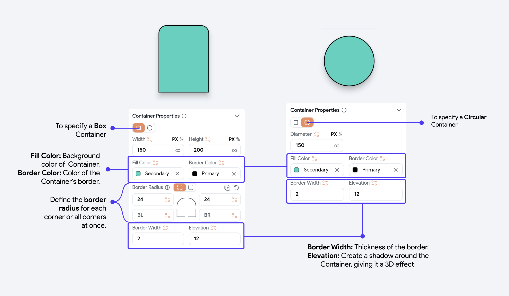
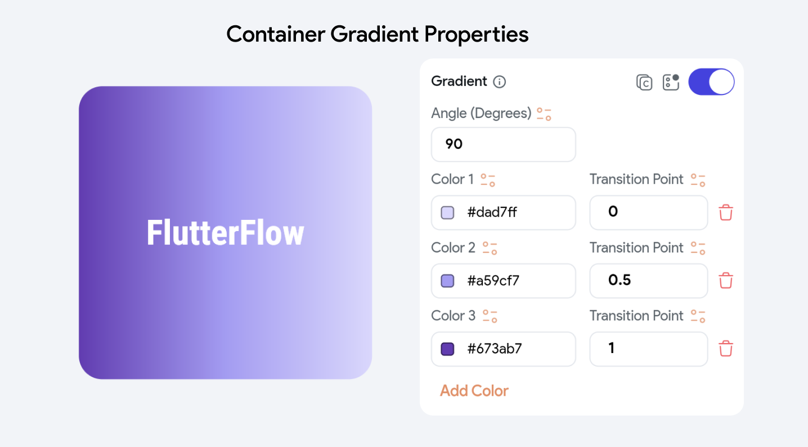

# Container

A Container is a highly versatile widget that functions much like a multi-purpose box in your app's
interface. It is primarily used to decorate, position, and arrange child widgets—smaller components
within your app. Containers are useful for dividing the screen into smaller, logical parts, and
styling or positioning these parts effectively.

For instance, you can use a Container to assign a background color, shape, or specific size to
elements like text or buttons. Think of it as placing an item inside a box and then customizing the
appearance and placement of that box within the screen layout.

## Container Properties

The Container properties can be adjusted to customize the appearance and layout of a Container
widget. Here's a brief explanation of each:

### Limiting Size

Sometimes, you don't set the height and width of the container explicitly and allow it to be the size of its child widget. If you do so, you may find layout issues where widgets may become too large or too small on different devices, leading to a poor user experience. To overcome this, you can limit the size of the container by specifying the Min W, Min H, Max W, and Max H.

For example, in a responsive design, you might want a button to grow with the screen size but not exceed a certain width. By setting these properties, you can ensure the button is at least a certain size for usability but doesn't become too large on bigger screens.

- **Min W (Minimum Width) & Min H (Minimum Height):** These set the minimum dimensions the Container
  can shrink to, in pixels or percentage.

- **Max W (Maximum Width) & Max H (Maximum Height):** These set the maximum dimensions the Container
  can expand to, in pixels or percentage.

<iframe src="https://www.loom.
com/embed/08c0b595502e4aa7ae865071533ffd64?sid=e1a84140-3667-459e-9808-7192b8a73f36" frameborder="0" allow="accelerometer; autoplay; clipboard-write; encrypted-media; gyroscope; picture-in-picture; web-share" referrerpolicy="strict-origin-when-cross-origin" allowfullscreen></iframe>

### Clip Content

Determines whether the content inside the Container should be clipped if it
  exceeds the boundaries of the Container. When enabled, anything outside the Container's bounds
  will not be visible.

<iframe src="https://www.loom.
com/embed/5eeaeea02f9d43fba5ac9b148aaf5693?sid=bce9230d-d5f3-4e42-9766-c68805a6dcde" frameborder="0" allow="accelerometer; autoplay; clipboard-write; encrypted-media; gyroscope; picture-in-picture; web-share" referrerpolicy="strict-origin-when-cross-origin" allowfullscreen></iframe>

## Box Shadow Properties

The Box Shadow properties allow you to add and customize a shadow effect for your
Container widget.
Here's a brief explanation of each property:

- **Shadow Color:** The color of the shadow, typically specified in a hex format including an alpha
  value for transparency, like `#33000000.` You can select from Theme Colors, use a color picker, or
  input a hex code.

- **Blur:** Determines the blur radius of the shadow. A higher value produces a more diffused
  shadow,
  while a lower value makes the shadow sharper and more defined.

- **Spread:** Controls the **spread radius of the shadow**. **Increasing** this value will **expand** the area
  that the shadow covers, making it appear larger.

- **Offset X & Offset Y:** These properties set the horizontal (X) and vertical (Y) displacement of the shadow relative to the widget. **Offset X** shifts the shadow horizontally, and **Offset Y** moves it vertically. Positive values move the shadow right and down, respectively, while negative values move it left and up.

Here's a quick demo to show the box shadow property in Container: 

<iframe src="https://www.loom.
com/embed/afde4e70630a4ff4aa6d7ce6831f7731?sid=1ad86738-3f6b-4b83-a91c-e033da1976a7" frameborder="0" allow="accelerometer; autoplay; clipboard-write; encrypted-media; gyroscope; picture-in-picture; web-share" referrerpolicy="strict-origin-when-cross-origin" allowfullscreen></iframe>

## Gradient Properties

The Gradient properties allow you to create and customize a gradient effect for a Container widget.
Here's an overview of each property:

- **Angle (Degrees):** Sets the orientation of the gradient by specifying the angle in degrees. An
  angle of **0 degrees** creates a **horizontal** gradient, and **90 degrees** would make it **vertical**.

- **Colors**: These are the colors used in the gradient. You can set these colors
  using Theme Colors, a color picker, or hex codes. Two color values are added by
  default.
- **Add Color:** This option allows you to add additional colors to the gradient, further
      customizing the effect by adjusting their transition points and choosing from Theme Colors, a color picker, or hex codes.
- **Transition Point:** These values determine where each color starts transitioning within the
  gradient. Transition points are set as a fraction of the total gradient distance:

In the above example,

- The Transition Point for Color 1 is set at 0, meaning it starts at the very beginning of the
  gradient.
- The Transition Point for Color 2 is 0.5, indicating that this color starts transitioning at the
  halfway point.
- The Transition Point for Color 3 is 1, which places the start of this color's transition at the
end of the gradient.
  

## Background Image Properties
The Background Image properties provide options for setting up an image as the background of a
Container widget.
:::info
 For a detailed guide on configuring **common Image properties**, please refer 
to the relevant section [**here**](image.md#common-image-properties).
:::

## Child Properties

- **Child Alignment:** This allows you to specify the alignment of child widgets within the
  Container. The grid indicates possible positions (center, top, bottom, left, right, and etc), and
  you can adjust the alignment precisely using the X and Y values, which shift the child widget
  horizontally and vertically within the Container.

## Implicit Animated

This property enables the use of implicit animations for changes in the Container’s properties (like
size or color). This makes transitions between property changes smoother and visually appealing.

Here's an example of Container's width and color changing without the use of Implicit Animation. 

    <iframe 
        src="https://demo.arcade.software/lpzJoDHTDylLJ3sniFYi?embed&show_copy_link=true"
        title=""
        style={{
            position: 'absolute',
            top: 0,
            left: 0,
            width: '100%',
            height: '100%',
            colorScheme: 'light'
        }}
        frameborder="0"
        loading="lazy"
        webkitAllowFullScreen
        mozAllowFullScreen
        allowFullScreen
        allow="clipboard-write">
    </iframe>

Now we enable **Implicit Animation** for this Container and see the difference: 

    <iframe 
        src="https://demo.arcade.software/b2w2d8ddS6aKkSNrtUX4?embed&show_copy_link=true"
        title=""
        style={{
            position: 'absolute',
            top: 0,
            left: 0,
            width: '100%',
            height: '100%',
            colorScheme: 'light'
        }}
        frameborder="0"
        loading="lazy"
        webkitAllowFullScreen
        mozAllowFullScreen
        allowFullScreen
        allow="clipboard-write">
    </iframe>

The properties of Implicit Animation are as follows:

- **Animation Curve:** Specifies how the animation progresses over time. The options are Ease In,
  Ease in Out, Ease Out, Bounce, Linear, Elastic.

- **Duration (ms):** Sets the duration of the animation in milliseconds. A shorter duration makes
  the animation faster, while a longer duration slows it down.

## Safe Area

This toggle ensures that the Container and its contents are positioned within the safe area of the
device’s screen, avoiding obscured areas like notches or rounded corners. This is particularly
useful for ensuring good visibility and interactivity across different devices.

To enable the safe area, navigate to the properties panel and turn on the Safe Area toggle.

:::tip[Watch the video tutorial]
If you prefer watching a video tutorial, here is the guide for you:

    <iframe 
        src="https://www.youtube.com/embed/EQgUvPEMd2E"
        title="Containers"
        style={{
            position: 'absolute',
            top: 0,
            left: 0,
            width: '100%',
            height: '100%',
            colorScheme: 'light'
        }}
        frameborder="0"
        loading="lazy"
        webkitAllowFullScreen
        mozAllowFullScreen
        allowFullScreen
        allow="clipboard-write">
    </iframe>

:::