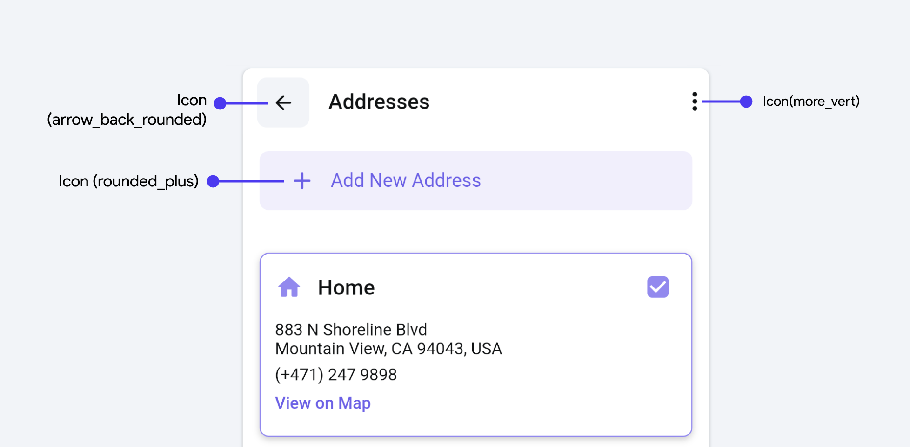
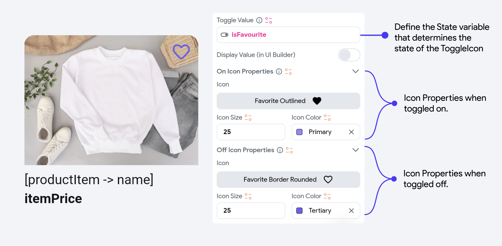

# Icons

Icons are integral elements in user interfaces, providing visual cues that enhance user interaction and aesthetic appeal. They communicate action, represent functionality, and improve navigation efficiency within applications. 

## Types of Icon widgets

FlutterFlow allows a bunch of widgets and components: 

- **Icon Widget**: The **Icon** widget in FlutterFlow is used for displaying symbols from a variety of 
  available icon packs like Material Icons. It's straightforward to use, allowing for quick integration of visual symbols into your app.

- **Icon Button Widget**: The **IconButton** widget combines the functionality of an icon with the 
  capabilities of a button, making it a clickable icon. It's commonly used for actions like opening a menu, submitting a form, or any other interactive task.

- **Toggle Icon Widget**: The **ToggleIcon** widget offers a specific functionality where the icon 
  toggles between two states based on a boolean condition. This widget is ideal for "favorite" or "like" buttons, where the icon state changes to represent an active or inactive state. The ToggleIcon reacts to user taps, changing its appearance and also allowing for callback functionality to handle the state change.

## Common Icon Properties

Upon selecting the Icon, you can modify properties such as **Icon color** and **Icon size** from the Properties Panel on the right. Additionally, you can set the Icon value by selecting from a vast catalog of **Material Icons** and **FontAwesome** Icons provided by FlutterFlow.

:::tip[Custom Icons]
You can also upload your own licensed Custom Icons. Check out [**this video**](https://youtu.be/rlGkbnhP75g) to learn more.
:::

## Icon Button Properties
The Properties Panel for your IconButton allows you to modify the Icon Properties, Button Styling, Disabled state, and Hovered state properties. It also lets you determine if you want a loading indicator when the icon button is clicked.

To get a quick demo of the styling changes, check this out:

    <iframe 
        src="https://demo.arcade.software/tJZ2NaRO3UG3trpOVopQ?embed&show_copy_link=true"
        title=""
        style={{
            position: 'absolute',
            top: 0,
            left: 0,
            width: '100%',
            height: '100%',
            colorScheme: 'light'
        }}
        frameborder="0"
        loading="lazy"
        webkitAllowFullScreen
        mozAllowFullScreen
        allowFullScreen
        allow="clipboard-write">
    </iframe>

## Toggle Icon Properties

ToggleIcon is a special component created for you that lets you add a toggle on and toggle off icon, and define a State variable that determines the state of the Toggle icon. The properties are straightforward and include the following:

### On Toggle [Action]

By default, FlutterFlow handles the toggling of the State variable from true to false and vice versa when the button is clicked. However, you can also add another action under the On Toggle action trigger to perform extra tasks.

<!--- TODO In this example, we trigger the SnackBar action that displays the value of the State variable.
 Show the App DEMO --->
