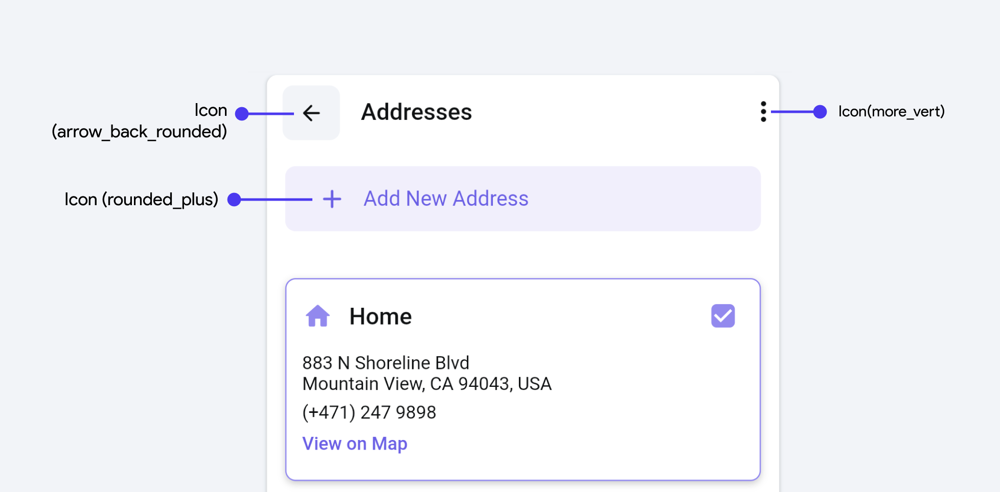
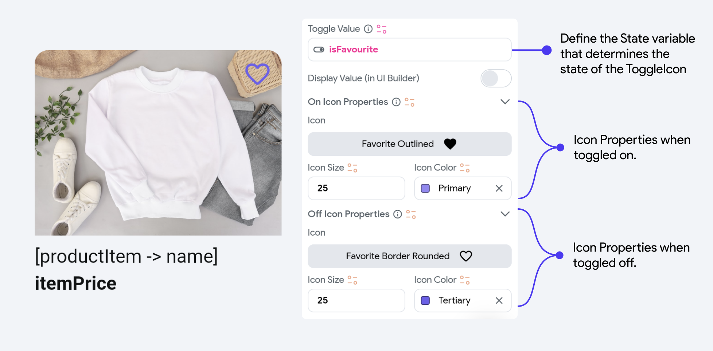

---
tags:
  - FlutterFlow
  - Resources
  - UI
slug: /resources/ui/widgets/icons
title: Icons
description: >-
  Configure FlutterFlow Icon, IconButton, and ToggleIcon widgets, including
  dynamic values, loading and disabled states, and toggle data sources.
keywords:
  - Icons
  - Widgets
  - Ui
last_verified: 2026-09-02
---
# Icons

Icons are integral elements in user interfaces, providing visual cues that enhance user interaction and aesthetic appeal. They communicate action, represent functionality, and improve navigation efficiency within applications.

## Types of Icon widgets

FlutterFlow provides three related widgets:

- **Icon Widget**: Displays a Material, Font Awesome, custom, or dynamically supplied icon. Configure its icon data, size, and color.

- **Icon Button Widget**: Provides a dedicated tap target and supports **On Tap**, **On Double Tap**, and **On Long Press** actions. Configure button size, fill, border, radius, loading, disabled, and hover states separately from the icon.

- **Toggle Icon Widget**: Displays an On or Off icon from a supported Boolean-like data source and exposes an **On Toggle** action trigger.

## Common Icon Properties

Upon selecting the Icon, you can modify properties such as **Icon color** and **Icon size** from the Properties Panel on the right. Additionally, you can set the Icon value by selecting from a vast catalog of **Material Icons** and **FontAwesome** Icons provided by FlutterFlow.

The entire Icon value can also come from a variable whose type is **Icon**. When a fixed icon references a custom icon that no longer exists, FlutterFlow reports a project configuration error.

:::tip[Custom Icons]
You can also upload your own licensed Custom Icons. Check out [**this video**](https://youtu.be/rlGkbnhP75g) to learn more.
:::

## Icon Button Properties
The Properties Panel for your IconButton allows you to modify the Icon Properties, Button Styling, Disabled state, and Hovered state properties. It also lets you determine if you want a loading indicator when the icon button is clicked.

Use **Button Size** to control the tappable area; **Icon Size** changes only the glyph. FlutterFlow warns when an IconButton with an On Tap action has a fixed button size below 40 pixels. **Show Loading Indicator** displays progress while its On Tap action is running. A true **Disable** condition prevents the callback from running.

To get a quick demo of the styling changes, check this out:

    <iframe
        src="https://demo.arcade.software/tJZ2NaRO3UG3trpOVopQ?embed&show_copy_link=true" title="Icons interactive tutorial"
        style={{
            position: 'absolute',
            top: 0,
            left: 0,
            width: '100%',
            height: '100%',
            colorScheme: 'light'
        }}
        frameborder="0"
        loading="lazy"
        webkitAllowFullScreen
        mozAllowFullScreen
        allowFullScreen
        allow="clipboard-write">
    </iframe>

## Toggle Icon Properties

ToggleIcon requires **Toggle Value** to come from either a Firestore value or Local State. The selected value must resolve to a Boolean field or a **List Contains** operation. Configure separate **On Icon Properties** and **Off Icon Properties**. **Display Value (in UI Builder)** chooses the state shown on the canvas; it does not replace the runtime data source.

### On Toggle [Action]

When selected, ToggleIcon updates the supported Firestore or Local State value first and then runs the actions under **On Toggle**. For a Boolean it negates the value; for List Contains it adds or removes the selected element.

## Accessibility guidance

An icon alone may be ambiguous. Use a familiar symbol and provide visible nearby text or another semantic description for actions whose meaning is not obvious. Keep the IconButton's tappable area large enough even when the visual icon is small, and do not use On/Off color as the only indication of toggle state.

<!--- TODO In this example, we trigger the SnackBar action that displays the value of the State variable.
 Show the App DEMO --->

## Related documentation

See [Basic Widgets](/resources/ui/widgets/basic-widgets) for a related FlutterFlow workflow.
