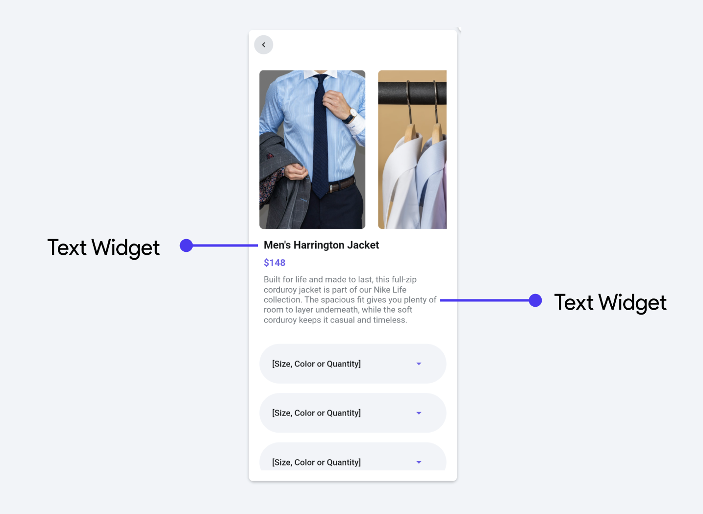
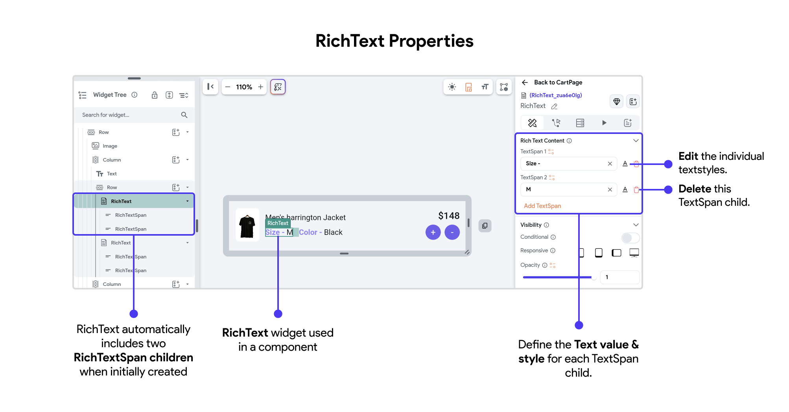
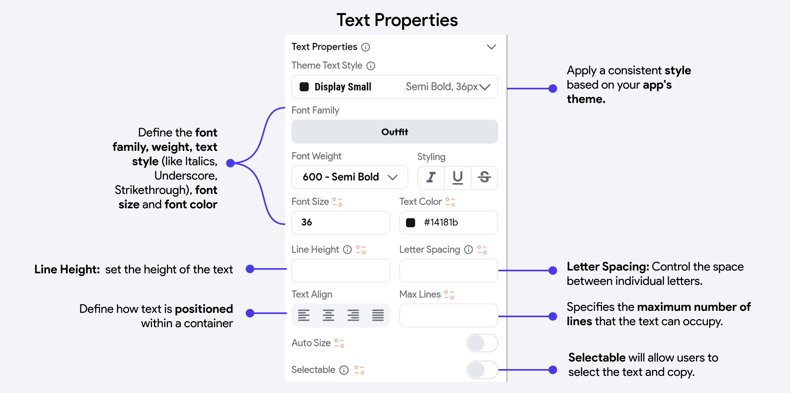
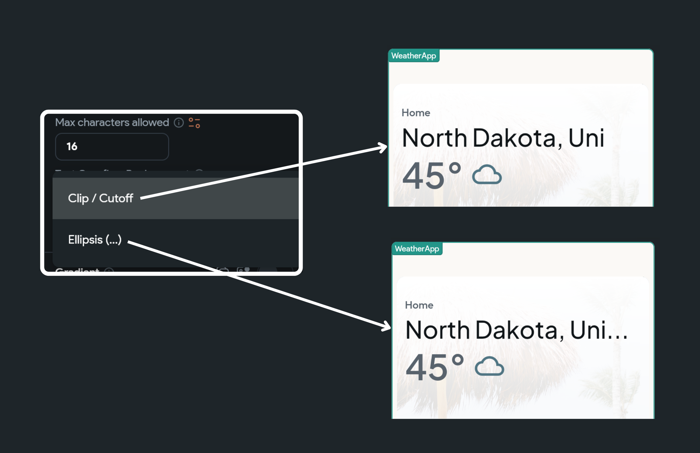

# Text

Text is a fundamental element in any user interface, used to convey information and interact 
with users. In app development, effectively presenting text can significantly enhance the user 
experience, making information accessible and interactions intuitive. Two common widgets used 
for displaying text in FlutterFlow are the Text widget and the RichText widget. Each serves a 
distinct purpose and offers different capabilities for integrating text into an application.

## Text Widget
The Text widget is used to display a piece of text on the screen. It's one of the most commonly used widgets in app development.

For example, in this screen, the Text widget is used to present different pieces of information 
clearly and effectively. The Text widgets display the product name, "Men's Harrington Jacket," its price, "$148," and a detailed description of the product. These Text widgets are styled differently to emphasize specific pieces of information.

The Text widget can be found under the **Base Elements** tab in the **Widget Palette**. You can either drag it to your desired location on the screen or insert it directly via the widget tree.

Once the Text widget is selected, the Properties Panel on the right side becomes active, allowing you to customize the styling of your Text widget. Here, you can adjust various attributes such as font size, color, alignment, and more to tailor the appearance to fit your design needs.

## RichText Widget

The **RichText** widget offers more elaborate formatting capabilities compared to the basic Text widget. It allows for the mixing of multiple styles within a single text sequence, enabling the creation of stylized textual content. 

This widget uses a tree of **TextSpan** objects to define the rich formatting options, including different fonts, sizes, and colors for various parts of the text. RichText is particularly useful for text-heavy applications that need inline styling and linking, like in a formatted article or a document viewer.

The RichText widget can be found under the **Base Elements** tab in the **Widget Palette**. You can 
either drag it to your desired location on the screen or insert it directly via the widget tree.

When the RichText widget is added to your widget tree, FlutterFlow automatically creates two RichTextSpan child objects. You can modify the text value and styling of each object to create multiple styles within your paragraph.

To modify the RichTextSpan objects, see the quick demo below: 

    <iframe 
        src="https://demo.arcade.software/Jm4t61jo3xd3e12Q5958?embed&show_copy_link=true"
        title=""
        style={{
            position: 'absolute',
            top: 0,
            left: 0,
            width: '100%',
            height: '100%',
            colorScheme: 'light'
        }}
        frameborder="0"
        loading="lazy"
        webkitAllowFullScreen
        mozAllowFullScreen
        allowFullScreen
        allow="clipboard-write">
    </iframe>

## Common Text Styling Properties

:::tip
For consistency, we recommend defining your Typography and custom text styles from **Theme
Settings > Typography & Icons** before creating any screens.
:::

Few things to note:

- **Line Height:** Sets the height of the text (e.g. a value of 1.5 would make the line height 50% 
larger than the font size.

- **Text Align:** Define how text is positioned within a container, typically as left-aligned, right-aligned, centered, or justified

## Advanced Properties for Text Widget

- **Max Lines:** This property specifies the maximum number of lines that the text can occupy. If the 
content exceeds the set number of lines, it will be truncated or end with an ellipsis, depending on the configuration. This is useful for maintaining a clean and consistent layout where text space is limited.

<iframe src="https://www.loom.
com/embed/62fd114580c94b0e84e837f19e5b57f8?sid=002d6a75-25c0-426f-9b09-9300f0cd5658" frameborder="0" allow="accelerometer; autoplay; clipboard-write; encrypted-media; gyroscope; picture-in-picture; web-share" referrerpolicy="strict-origin-when-cross-origin" allowfullscreen></iframe>

- **Auto Size:** This automatically adjusts the font size of the text to fit the space 
available within the widget boundaries. It ensures that the text remains legible without overflowing its container, making it especially handy for responsive designs where the display may vary across different devices.

<iframe src="https://www.loom.
com/embed/caf1377d41d44238996fa66d06d63cb4?sid=f05598ca-e44f-4db6-bb72-82692de0ffc7" frameborder="0" allow="accelerometer; autoplay; clipboard-write; encrypted-media; gyroscope; picture-in-picture; web-share" referrerpolicy="strict-origin-when-cross-origin" allowfullscreen></iframe>

### Setting Text Overflow replacement

You may want to limit the number of characters shown inside the Text widget and replace the extra characters with the ellipsis or completely hide them.

:::note[Important]
This option is only available if the value is set from the variable.
:::

To set the text overflow replacement:

1. Select the **Text** widget, navigate to the **Properties Panel > Text Properties >** enter the 
value for **Max character** to limit the number of characters.

2. Set the **Text Overflow Replacement** to either **Clip/Cutoff** or **Ellipsis (...)**

### Adding Gradient color

:::caution[Conditional Properties]
Note that enabling the Gradient option disables AutoSize and setting Max Lines for your Text.
:::

Adding a gradient color to the text gives it a modern look and feel. You can either use our ready-made templates or create it from scratch.

Here's how you do it:

1. Select the **Text** widget, navigate to the **Properties Panel > Text Properties >** enable the 
**Gradient** toggle.

2. To add your own colors:
    1. Select the **Type** among the **Linear** and **Radial**. The *Linear* distributes the 
   colors horizontally, whereas the *Radial* circularly spreads the color.
   
    2. If you choose *Linear*, specify the **Direction,** and for *Radial*, specify the **Radius**.
    3. Add/Remove or customize the existing colors.

:::info
You can also add gradient colors from a preset template as shown in the video demo.
:::

<iframe src="https://www.loom.
com/embed/259549fd8258455293eefda40b12852e?sid=6f0061cb-8241-47dc-b680-34c59c18b66c" frameborder="0" allow="accelerometer; autoplay; clipboard-write; encrypted-media; gyroscope; picture-in-picture; web-share" referrerpolicy="strict-origin-when-cross-origin" allowfullscreen></iframe>

## Formatting numbers

You may want to format large numbers for better readability. Displaying a number like 2,354,000 or 4,356,634,444 instead of 2354000 or 4356634444 enhances the user experience.

For instance, it's clearer to show the population as 1,200,000 rather than 1200000 and currency values like $2K or $5M instead of $2000 or $5000000.

### Types of formatting

Below are the types of formatting that we support:

- **Decimal**: Shows numbers in decimal format (e.g., 1,200,000 and 1.200.000).
- **Percent**: Shows numbers in percentage format (e.g., 28%, 99.99%).
- **Scientific**: Shows numbers in scientific format (e.g., 1e3, 1E6).
- **Compact**: Shows numbers in compact format (e.g., 2.1K, 2.3M, 5B).
- **Compact Long**: Shows numbers in compact long format (e.g., 2.1 thousand, 2.3 million, 5 billion).
- **Custom**: If the given formatting options do not fit your requirement, you can use specify a 
  custom format.

### Format a number

Use the instructions below to format a number:

1. Select the **Text** widget, move to the [Properties Panel](../../../../intro/ff-ui/builder.md#properties-panel) > **Set from Variable >** 
   display the value from a variable of type **Integer** or **Double**. (e.g., **App State > App 
   State Variable Name**).
2. After selecting a variable, set the **Available Options** to **Number Format** and **Number 
   Format Options** to the required [type](#types-of-formatting).

    1. If you choose **Decimal**, you must set the **Decimal Type** as well. The decimal values 
   can be shown in two ways, i.e., 1,200 (with a comma) and 1.200 (with a period). 

        1. Select **Automatic** to show decimal value based on the user's country.
       
        5. Select **Period for Decimal** to show decimal value with a period (e.g., 1.200).
        8. Select **Comma for Decimal** to show decimal value with a comma (e.g., 1,200).
    5. If you choose **Custom**:

        1. Find the **Custom Format** box, and enter your format. For example, entering `###,###.###` will convert the number 123456.789 into 123,456.789, and 000.00 will convert the number 12.786 into 012.79.
       
        5. In the **Locale** input box, enter the locale in which you want to display the number. (If you leave this property empty, the locale is automatically set as per the user's location). Learn more about how to format a number [here](https://pub.dev/documentation/intl/latest/intl/NumberFormat-class.html).
3. To display this number as currency, enable the **Display as Currency** toggle and specify the **Currency Symbol**.
4. Click **Confirm**.

<iframe src="https://www.loom.
com/embed/3aa929751ba9406fb4b3198176c5183b?sid=cb7697c6-5053-4c2c-a936-fe22579ba4a5" frameborder="0" allow="accelerometer; autoplay; clipboard-write; encrypted-media; gyroscope; picture-in-picture; web-share" referrerpolicy="strict-origin-when-cross-origin" allowfullscreen></iframe>

