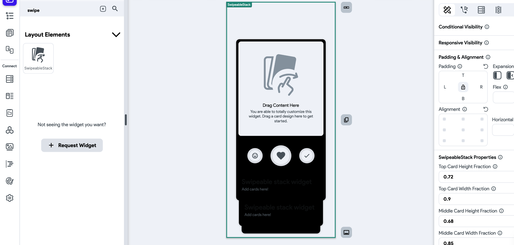
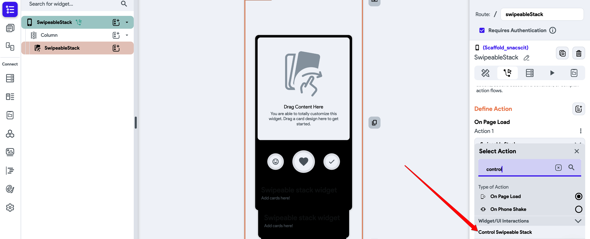
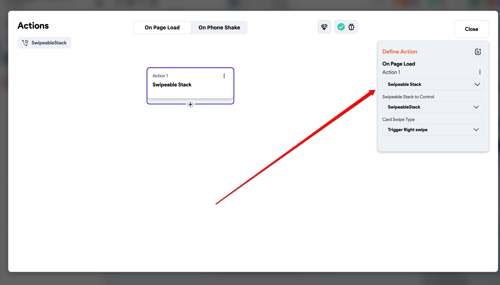
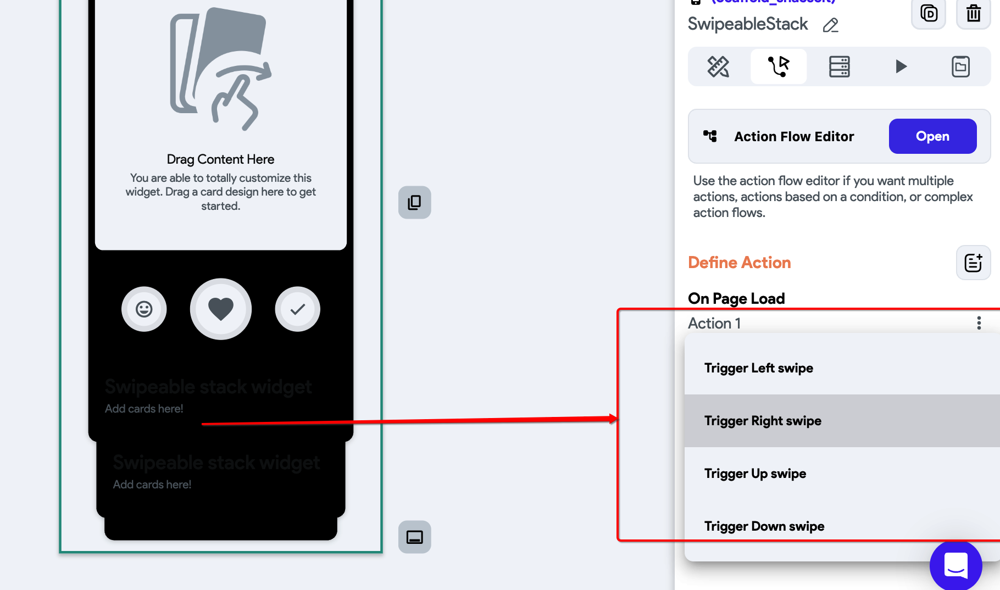

# Use the SwipeableStack Widget in FlutterFlow

The `SwipeableStack` widget allows you to present a stack of items that users can swipe in various directions—left, right, up, or down. This pattern is useful for building gesture-based interactions such as card swipes or content previews.

**Use Cases:**
    - **Tinder-like Cards**: Implement like/dislike behavior by swiping left or right.
    - **Image Gallery or Carousel**: Let users swipe horizontally through images.
    - **Onboarding Screens**: Present onboarding steps that can be swiped through.
    - **Content Browsing**: Let users explore products, articles, or content items via gestures.

:::note
For large stacks, test performance on physical devices. Animations and widget rendering can affect low-end devices.
:::

:::info[Prerequisites]
- Ensure your page has a valid `Scaffold` widget as the root.
- Add the `SwipeableStack` widget to the canvas.
:::

Follow the steps below: 

    1. **Add the SwipeableStack Widget**

        Drag the **SwipeableStack** widget onto the canvas and configure it with the content you want to display.

    2. **Set Up the Swipe Action on Page Load**

        - Select the `Scaffold` or parent widget.
        - In the **Actions** panel, choose the `Page Load` trigger.

        

    3. **Configure the Control SwipeableStack Action**

        - Under **Define Actions**, select **Control Swipeable Stack**.

        

    4. **Choose a Swipe Trigger Type**

        Select one of the available swipe directions:

            1. **Trigger Left Swipe** – Initiates a leftward swipe.
            2. **Trigger Right Swipe** – Initiates a rightward swipe.
            3. **Trigger Up Swipe** – Initiates an upward swipe.
            4. **Trigger Down Swipe** – Initiates a downward swipe.

            

            Once selected, the stack will respond to the defined swipe gesture.

