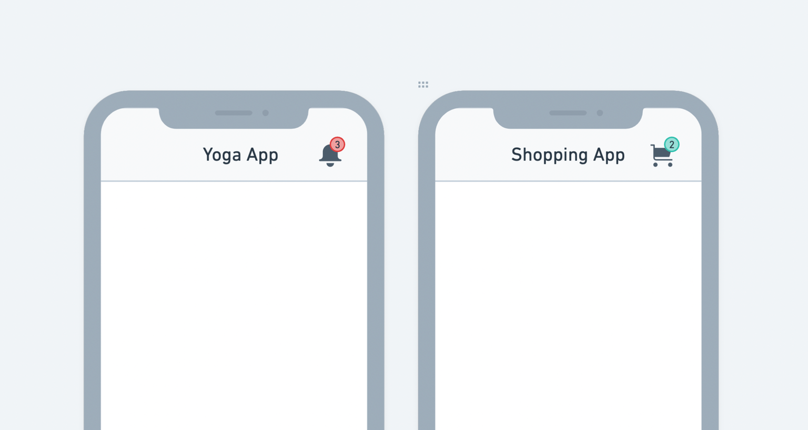

# Badge

The **Badge** widget displays a small indicator over a child widget. It commonly shows a numeric count, but it can also display short text. For example, use it to show the number of unread notifications or items in a shopping cart.

## Adding the Badge Widget

To add the Badge widget:

1. Drag the **Badge** widget from the **Base Elements** section to the desired location, such as the **Actions** section of an AppBar.
2. Add a child widget, such as an **IconButton**, and customize it as needed.
3. Under **Badge Properties**, adjust **Padding** to position the badge over the child widget.

    <iframe 
        src="https://demo.arcade.software/asTJy8XhRUHkcMdDnePw?embed&show_copy_link=true"
        title="Add a Badge Widget"
        style={{
            position: 'absolute',
            top: 0,
            left: 0,
            width: '100%',
            height: '100%',
            colorScheme: 'light'
        }}
        frameBorder="0"
        loading="lazy"
        webkitAllowFullScreen
        mozAllowFullScreen
        allowFullScreen
        allow="clipboard-write">
    </iframe>

## Customizing the Badge Widget

Select the **Badge** widget and use **Badge Properties** to customize its content, appearance, and behavior:

- **Text:** Sets the text displayed in the badge, typically a number. You can enter a fixed value or set it dynamically from a variable, then expand **Text** to customize the text style.
- **Show Badge:** Controls whether the badge is visible. Set this option from a variable to show the badge only when users need to see it.
- **Badge Color:** Sets the badge's background color.
- **Elevation:** Controls the badge's visual depth and shadow prominence. Use `0` to remove the shadow.
- **Position (Start or End):** Positions the badge on the start or end side of its child widget.
- **Padding:** Adjusts the space around the badge to fine-tune its position over the child widget.
- **Animate:** Controls whether the badge animates when its value changes.
