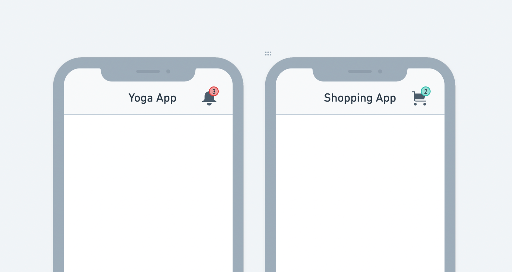

# Badge

The Badget widget indicates the number of items that need your attention. Typically it's a medium-sized dot that floats over other widgets such as IconButton.

For example, You could use the badge widget to show the number of unread notifications and items in your shopping cart.

## Adding Badge widget

Here's an example of how you can add the Badge widget to your project:

1. First, drag the **Badge** widget from the Base Elements tab and carefully drop it into the 
Actions section of the AppBar.
2. Now, add the **IconButton** widget inside the **Badge** widget. Customize the Icon and its color as per your requirement.
3. Select the **Badge** widget, move to the properties panel, and set the **top** side padding to 5 and **right** side padding to 15.

    <iframe 
        src="https://demo.arcade.software/5cTUQAbE32UQzrdnFwtO?embed&show_copy_link=true"
        title=""
        style={{
            position: 'absolute',
            top: 0,
            left: 0,
            width: '100%',
            height: '100%',
            colorScheme: 'light'
        }}
        frameborder="0"
        loading="lazy"
        webkitAllowFullScreen
        mozAllowFullScreen
        allowFullScreen
        allow="clipboard-write">
    </iframe>

## Customizing

You can customize the appearance and behavior of the badge widget using the various properties 
available under the **Properties Panel**.

### Setting badge text

You can set the badge text that appears inside the badge. Usually, it's a numeric value.

To set the badge text:

1. Select the **Badge** widget from the widget or the canvas area.
2. Move to the properties panel (on the right side of your screen), and scroll down to the **Badge Properties** section.
3. Find the **Text** property and enter a value. You would probably set this value from the variable or field from the backend database, such as the API response variable and Firestore document field. To do so, click on the **Set from Variable**.

    <iframe 
        src="https://demo.arcade.software/TJTALzWwwYWwj7vCTMmJ?embed&show_copy_link=true"
        title=""
        style={{
            position: 'absolute',
            top: 0,
            left: 0,
            width: '100%',
            height: '100%',
            colorScheme: 'light'
        }}
        frameborder="0"
        loading="lazy"
        webkitAllowFullScreen
        mozAllowFullScreen
        allowFullScreen
        allow="clipboard-write">
    </iframe>

### Styling badge text

To change the badge text style:

1. Select the **Badge** widget from the widget or the canvas area.
2. Move to the properties panel (on the right side of your screen), and scroll down to the **Badge Properties** section.
3. Find the **Theme Text Style** property and change the style as per instructions 
[here](../../widgets/basic-widgets/text.md).

### Show/hide badge

You might want to hide the badge widget initially and only show it when some items need the user's attention—for example, showing the notification badge only when there are new/unread notifications.

To show/hide the badge widget:

1. Select the **Badge** widget from the widget or the canvas area.
2. Move to the properties panel (on the right side of your screen), and scroll down to the **Badge Properties** section.
3. Find the **Show Badge** property and check/uncheck to show/hide the badge. Most probably, you would set this value from the variable such as the app state variable and variable from API response. To do so, click on the **Set from Variable**.

    <iframe 
        src="https://demo.arcade.software/Qi5uf3nPfZHwCoY7VA33?embed&show_copy_link=true"
        title=""
        style={{
            position: 'absolute',
            top: 0,
            left: 0,
            width: '100%',
            height: '100%',
            colorScheme: 'light'
        }}
        frameborder="0"
        loading="lazy"
        webkitAllowFullScreen
        mozAllowFullScreen
        allowFullScreen
        allow="clipboard-write">
    </iframe>

### Changing badge color

To change the badge color:

1. Select the **Badge** widget from the widget or the canvas area.
2. Move to the properties panel (on the right side of your screen), and scroll down to the **Badge Properties** section.
3. Find the Badge Color property, click on the box next to the already selected color, select the color, and then click **Use Color** or click on an already selected colorand enter a Hex Code directly. You can also choose the color by clicking the **Palette** and **Simple** button.

    <iframe 
        src="https://demo.arcade.software/IwwmHUITgPBfFkK5VWI4?embed&show_copy_link=true"
        title=""
        style={{
            position: 'absolute',
            top: 0,
            left: 0,
            width: '100%',
            height: '100%',
            colorScheme: 'light'
        }}
        frameborder="0"
        loading="lazy"
        webkitAllowFullScreen
        mozAllowFullScreen
        allowFullScreen
        allow="clipboard-write">
    </iframe>

### Changing elevation

To change the elevation (depth or Z-axis) of the badge:

1. Select the **Badge** widget from the widget or the canvas area.

2. Move to the properties panel (on the right side of your screen), and scroll down to the **Badge Properties** section.
3. Find the **Elevation** input box and enter the value to see the drop shadow effect below the badge. The Higher value sets the bigger size of the shadow, and the 0 value removes the shadow.

    <iframe 
        src="https://demo.arcade.software/0RTCxjg1LBR3W0TeErYK?embed&show_copy_link=true"
        title=""
        style={{
            position: 'absolute',
            top: 0,
            left: 0,
            width: '100%',
            height: '100%',
            colorScheme: 'light'
        }}
        frameborder="0"
        loading="lazy"
        webkitAllowFullScreen
        mozAllowFullScreen
        allowFullScreen
        allow="clipboard-write">
    </iframe>

### Changing badge position

By default, the badge is displayed on the top right side of its child widget. You can change its position and bring it to the left side.

To change the badge position:

1. Select the **Badge** widget from the widget or the canvas area.
2. Move to the properties panel (on the right side of your screen), and scroll down to the **Badge Properties** section.
3. Find the **Position (Start or End)** property and click on the icons to change the position.

    <iframe 
        src="https://demo.arcade.software/oBTo3m1sHq4rYDWEnLW1?embed&show_copy_link=true"
        title=""
        style={{
            position: 'absolute',
            top: 0,
            left: 0,
            width: '100%',
            height: '100%',
            colorScheme: 'light'
        }}
        frameborder="0"
        loading="lazy"
        webkitAllowFullScreen
        mozAllowFullScreen
        allowFullScreen
        allow="clipboard-write">
    </iframe>

### Allow animating badge

By default, the badge widget animates whenever the value is changed.

To allow/disallows animating badge:

1. Select the **Badge** widget from the widget or the canvas area.

2. Move to the properties panel (on the right side of your screen), and scroll down to the **Badge Properties** section.
3. Find the **Animate** toggle, and then turn it on or off.

    <iframe 
        src="https://demo.arcade.software/qRMyvLeZaqz9SnYBaZcE?embed&show_copy_link=true"
        title=""
        style={{
            position: 'absolute',
            top: 0,
            left: 0,
            width: '100%',
            height: '100%',
            colorScheme: 'light'
        }}
        frameborder="0"
        loading="lazy"
        webkitAllowFullScreen
        mozAllowFullScreen
        allowFullScreen
        allow="clipboard-write">
    </iframe>

