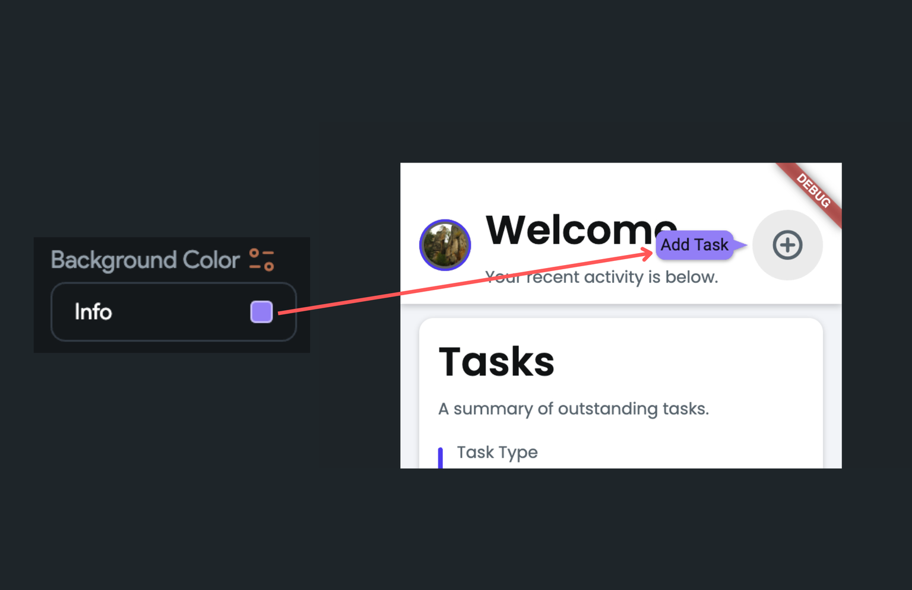

# Barcode

The Barcode widget is used to embed the information inside the series of lines and patterns. The data inside the barcode can be easily retried with a scanner machine, an app like [Google Lens](https://lens.google/) (Android), [Apple Camera](https://support.apple.com/en-in/HT208843) (iOS), or your [own app](#scan-barcode--qr-code-action) created using FlutterFlow.

It is typically used to retrieve product information quickly and accurately. For example, you could track the inventory/books (e.g., price, description, location, etc.), share website/app URL, quick onboarding process, and so on.

## Adding Barcode widget

To add a Barcode widget to your app:

1. First, click on the **+ Add Widget**, drag the **Barcode** widget from the **Base Elements** 
tab, or add it directly from the widget tree.

2. By default, the barcode is displayed in a linear fashion called **1D Barcode**. (i.e., a series of lines and space of various widths). To display the barcode in a matrix form, such as QR-Code, move to the properties panel and set the **Barcode Dimensions** to the **2D Barcode**.
3. Now, you'll need to figure out the type of information you want to embed and select the **Barcode Type**. The barcode type options are available based on the *Barcode Dimensions* you selected in the previous step. For example, to label the retail products (i.e., 12 digits numeric only number), you can set it to *UPC-A* or *UPC-E*, and to embed the URL, you can set it to the *QR-Code*. If you are unsure which type to choose, [here](https://packagex.io/blog/barcode-types) is a guide to help.
4. Finally, you can provide the data/information into the **Barcode Value** property. You can also click **Set from Variable** to set it based on the value from the app state, your backend, or any other source.

    <iframe 
        src="https://demo.arcade.software/BzaX87aGYVZJgZYTYQ1d?embed&show_copy_link=true"
        title=""
        style={{
            position: 'absolute',
            top: 0,
            left: 0,
            width: '100%',
            height: '100%',
            colorScheme: 'light'
        }}
        frameborder="0"
        loading="lazy"
        webkitAllowFullScreen
        mozAllowFullScreen
        allowFullScreen
        allow="clipboard-write">
    </iframe>

## Customizing

You can customize the appearance and behavior of this widget using the various properties 
available under the **Properties Panel**.

### Changing size

To change the size of the barcode widget, select the **Barcode** widget, move to the properties panel, find the **Width** and **Height** property and enter the values.

    <iframe 
        src="https://demo.arcade.software/VvvoHWVQHbs2Bbe9spPy?embed&show_copy_link=true"
        title=""
        style={{
            position: 'absolute',
            top: 0,
            left: 0,
            width: '100%',
            height: '100%',
            colorScheme: 'light'
        }}
        frameborder="0"
        loading="lazy"
        webkitAllowFullScreen
        mozAllowFullScreen
        allowFullScreen
        allow="clipboard-write">
    </iframe>

### Changing color

To change barcode colors, select the **Barcode** widget, move to the properties panel, and [change the colors](../../widgets/widget-commonalities.md#change-color) for the following properties:

* **Foreground Color**: This sets the line or pattern color.
* **Background Color**: This sets the background color behind the line or pattern.

    <iframe 
        src="https://demo.arcade.software/SWE9YosOBiXigQRbFcdl?embed&show_copy_link=true"
        title=""
        style={{
            position: 'absolute',
            top: 0,
            left: 0,
            width: '100%',
            height: '100%',
            colorScheme: 'light'
        }}
        frameborder="0"
        loading="lazy"
        webkitAllowFullScreen
        mozAllowFullScreen
        allowFullScreen
        allow="clipboard-write">
    </iframe>

### Show barcode text

You can also display the actual data below the barcode by enabling the **Show Text** property. 

:::info[Note]
This option is only available when using the *1D Barcode*.
:::

## Scan Barcode / QR code [Action]

Using this Action, you open a barcode or QR code interface and scan a code using the device camera.

    <iframe 
        src="https://demo.arcade.software/tI9UOnpYhVyOrvxhmAuo?embed&show_copy_link=true"
        title=""
        style={{
            position: 'absolute',
            top: 0,
            left: 0,
            width: '100%',
            height: '100%',
            colorScheme: 'light'
        }}
        frameborder="0"
        loading="lazy"
        webkitAllowFullScreen
        mozAllowFullScreen
        allowFullScreen
        allow="clipboard-write">
    </iframe>

Follow the steps below to define a Scan Action to any widget.

1. Select **Actions** from the Properties panel (the right menu)
2. Click **+ Add Action** button
3. Choose a gesture from the dropdown among ***On Tap**, **On Double Tap**, or* **On Long Press**
4. Select the **Action Type** as ***Scan Barcode/QR code**.*
5. If you check the **Barcode Mode** checkbox then the UI will look like a barcode scanner. Otherwise, the UI will be like a QR code scanner.
6. **Cancel button text** would be ***Cancel*** by default, but you can specify any other text if you want.
7. In the **Output Variable Name** field, you can specify the name of the variable where the scanned text would be saved and then you can access it via the **Set from Variable menu > Action Outputs > [Action Output Variable Name]**.

    <iframe 
        src="https://demo.arcade.software/Uk6JLbnrMDFFAACn5No6?embed&show_copy_link=true"
        title=""
        style={{
            position: 'absolute',
            top: 0,
            left: 0,
            width: '100%',
            height: '100%',
            colorScheme: 'light'
        }}
        frameborder="0"
        loading="lazy"
        webkitAllowFullScreen
        mozAllowFullScreen
        allowFullScreen
        allow="clipboard-write">
    </iframe>

