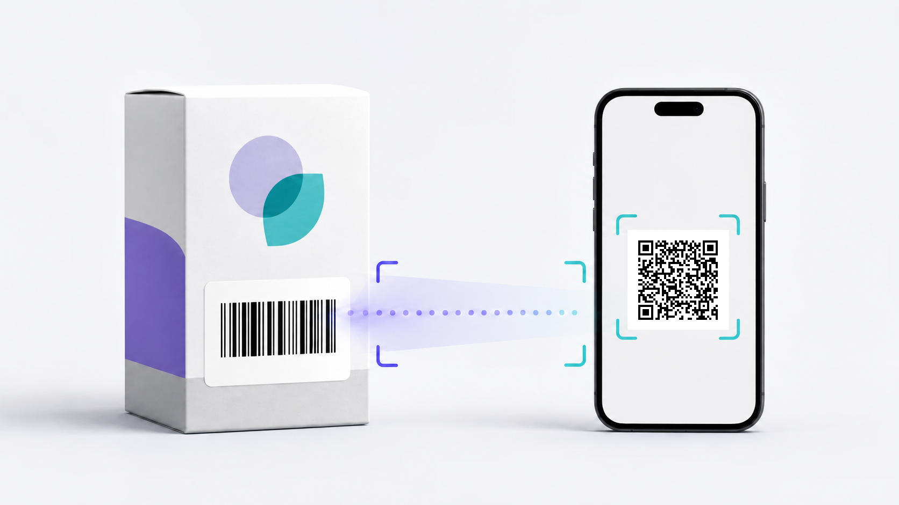

# Barcode

The **Barcode** widget converts a value into a scannable 1D or 2D barcode, such as a QR code. Use it for product identifiers, inventory labels, URLs, tickets, or onboarding links.

Users can scan the generated code with a camera app or supported barcode scanner. You can also let users scan codes inside your FlutterFlow app with the [**Scan Barcode / QR Code** action](#scan-barcode--qr-code-action).

## Adding the Barcode Widget

To add and configure a barcode:

1. Add the **Barcode** widget from the **Base Elements** section of the Widget Palette.
2. Set **Barcode Dimensions** to **1D Barcode** for linear formats or **2D Barcode** for formats such as QR Code, PDF417, Data Matrix, Aztec, and RM4SCC.
3. Choose a **Barcode Type**. The available types depend on the selected **Barcode Dimensions** option. See [**Barcode Types**](#barcode-types) for a brief description of each option.
4. Enter the data to encode under **Barcode Value**, or use **Set from Variable** to supply a dynamic value from your app state, backend, or another source.

Ensure that the value matches the requirements of the selected barcode type. For example, UPC formats accept specific numeric values, while QR codes can contain text or URLs.

### Barcode Types

When **1D Barcode** is selected, you can use the following types:

| Type | Common use |
| --- | --- |
| **ITF-16** | Encodes 16-digit numeric values for packaging and distribution. |
| **ITF-14** | Identifies cartons and shipping containers using a 14-digit GTIN. |
| **EAN 13** | Identifies retail products internationally using 13 digits. |
| **EAN 8** | Provides a compact eight-digit product code for small packages. |
| **EAN 5** | Adds a five-digit supplemental code, commonly used for book prices. |
| **EAN 2** | Adds a two-digit supplemental code, often used for magazine issues. |
| **ISBN** | Encodes an International Standard Book Number for books and publications. |
| **Code 39** | Encodes uppercase letters, numbers, and a limited set of symbols. |
| **Code 93** | Provides a denser, more reliable alternative to Code 39. |
| **UPC-A** | Identifies retail products in North America using 12 digits. |
| **UPC-E** | Provides a compact version of UPC-A for smaller packages. |
| **Code 128** | Encodes letters, numbers, and symbols in a compact format. |
| **GS1-128** | Encodes supply-chain data such as product, batch, and expiration details. |
| **Telepen** | Encodes numeric or ASCII data, commonly for inventory and library systems. |
| **Codabar** | Encodes numbers and a few symbols for libraries, blood banks, and logistics. |
| **Interleaved 2 of 5 (ITF)** | Encodes pairs of digits for warehouse, distribution, and packaging labels. |

When **2D Barcode** is selected, the following types are available:

| Type | Common use |
| --- | --- |
| **RM4SCC** | Encodes postal routing information for Royal Mail. FlutterFlow lists this format under **2D Barcode**. |
| **QR-Code** | Stores text, URLs, contact details, and other data for quick scanning. |
| **PDF417** | Stores larger amounts of data on IDs, tickets, and transport documents. |
| **Data Matrix** | Encodes data in a compact square code for small items and industrial parts. |
| **Aztec** | Stores data in a compact code that does not require a surrounding blank area. |

    <iframe
        src="https://demo.arcade.software/vdQDrbX7ITbVJBFUhA8V?embed&show_copy_link=true"
        title="Add and Configure the Barcode Widget"
        style={{
            position: 'absolute',
            top: 0,
            left: 0,
            width: '100%',
            height: '100%',
            colorScheme: 'light'
        }}
        frameBorder="0"
        loading="lazy"
        webkitAllowFullScreen
        mozAllowFullScreen
        allowFullScreen
        allow="clipboard-write">
    </iframe>

## Customizing the Barcode Widget

Select the **Barcode** widget and use the Properties panel to customize its appearance:

- **Width and Height:** Set the widget's dimensions.
- **Foreground Color:** Set the color of the barcode lines or pattern.
- **Background Color:** Set the color behind the barcode.
- **Show Text:** Display the encoded value below a 1D barcode. This option is not available for 2D barcodes.

## Scan Barcode / QR Code [Action]

The **Scan Barcode / QR Code** action opens a camera interface that lets users scan a code and use its value in your app.

To configure the action:

1. Select the widget that should start the scan and open the [**Action Flow Editor**](../../../control-flow/functions/action-flow-editor.md).
2. Add the **Scan Barcode / QR Code** action to the desired trigger.
3. Enable **Barcode Mode** to display a barcode-style scanner overlay, or leave it disabled to display a QR code-style scanner overlay.
4. Optionally, customize the **Cancel Button Text**. The default text is **Cancel**.
5. Enter an **Output Variable Name** to store the scanned value. You can access it in subsequent actions by selecting **Set from Variable > Action Outputs**.
