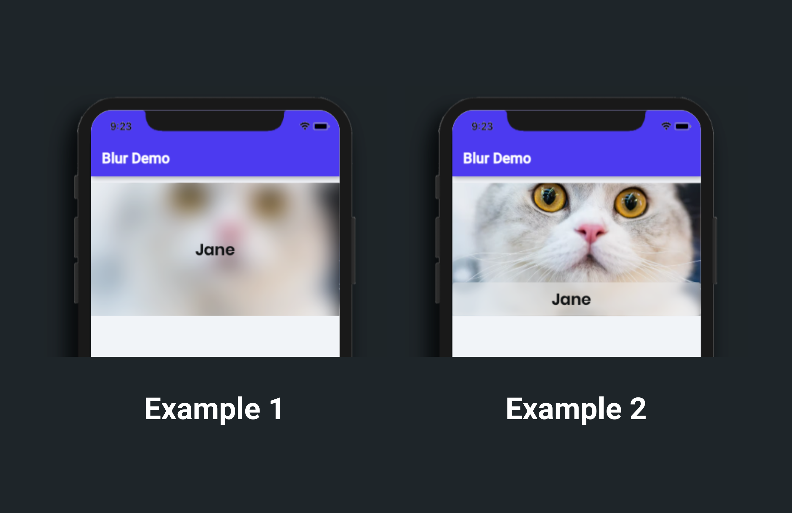

# Blur

The Blur widget is used to blur its child or parent widget. You can use this widget to create the [Frosted glass](https://en.wikipedia.org/wiki/Frosted_glass) effect, typically seen in iOS.

## Adding Blur widget

Here's an example of how you can add the Blur widget to your project:

1. First, drag the **Blur** widget from the **Base Elements** tab (in the Widget Panel) or add it directly from the widget tree.
2. Now, add the **Image** widget inside the **Blur** widget. Customize the Image as per your requirement.

    <iframe 
        src="https://demo.arcade.software/aAaia80E7pMBBNt6Jv37?embed&show_copy_link=true"
        title=""
        style={{
            position: 'absolute',
            top: 0,
            left: 0,
            width: '100%',
            height: '100%',
            colorScheme: 'light'
        }}
        frameborder="0"
        loading="lazy"
        webkitAllowFullScreen
        mozAllowFullScreen
        allowFullScreen
        allow="clipboard-write">
    </iframe>

## Adding blur effect to the parent widget

By default, the Blur widget adds the blur effect on the child. For example, if you add the image widget as a child of the Blur widget, you will see the effect on the image. But sometimes, you might want to create the blur effect on the parent widget of the Blur widget.

:::tip
Adding a blur effect on the parent helps create the **Frosted Glass effect**.
:::

Here is how you can create the first example:

1. First, add the **Container** widget. Move to the properties panel, set its **width** to **Inifinity** and **height** to **200**. Also, set its **Background Image**.
2. Inside the Container, add the **Blur** widget.
3. Now, add the **Text** widget inside the blur widget and bring it to the center by changing its alignment.
4. Finally, select the **Blur** widget from the widget tree or the canvas area. Move to the properties panel, scroll down to the **Blur Properties** section, and **turn on** the **Backdrop** toggle. This toggle decides whether to add a blur effect on the parent or child widget. If enabled, it will blur the parent widget, while disabling it will cast the blur effect on its child.

    <iframe 
        src="https://demo.arcade.software/PbIrNY2UyXR6G9BYttdj?embed&show_copy_link=true"
        title=""
        style={{
            position: 'absolute',
            top: 0,
            left: 0,
            width: '100%',
            height: '100%',
            colorScheme: 'light'
        }}
        frameborder="0"
        loading="lazy"
        webkitAllowFullScreen
        mozAllowFullScreen
        allowFullScreen
        allow="clipboard-write">
    </iframe>

Here are the steps to create the second example:

1. First, add the **Container** widget. Move to the properties panel, set its **width** to **Inifinity** and **height** to **200**. Also, set its **Background Image**.
2. Add the **Column** widget (inside the Container) and set its **Main Axis Alignment** to **end**.
3. Add the **Blur** widget (inside the Column).
4. Add the **Container** widget (inside the Blur) and set its **width** to **infinity** and **height** to **50**. Also, make the container's background around 40% transparent by selecting the **Fill Color** and bringing the second slider to the left.
5. Add the **Text** widget (inside the Container) and bring it to the center by changing its alignment.
6. Finally, select the **Blur** widget from the widget tree or the canvas area. Move to the properties panel, scroll down to the **Blur Properties** section and **turn on** the **Backdrop** toggle. This toggle decides whether to add a blur effect on the parent or child widget. If enabled, it will blur the parent widget, while disabling it will cast the blur effect on its child.

    <iframe 
        src="https://demo.arcade.software/ljykrxj3HErDgbFs8qCV?embed&show_copy_link=true"
        title=""
        style={{
            position: 'absolute',
            top: 0,
            left: 0,
            width: '100%',
            height: '100%',
            colorScheme: 'light'
        }}
        frameborder="0"
        loading="lazy"
        webkitAllowFullScreen
        mozAllowFullScreen
        allowFullScreen
        allow="clipboard-write">
    </iframe>

## Customization

You can customize the behavior of this widget using the various properties available under the properties panel.

### Changing blur strength

The blur strength is the blurriness added to the widget. This widget adds blur strength by utilizing the Sigma X and Sigma Y property. Sigma X sets the blur strength in the horizontal direction, while Sigma Y sets the blur strength in the vertical direction. The higher Sigma X and Y values increase the blurriness, whereas setting them to 0 completely removes the blurriness.

To change the blur strength:

1. Select the **Blur** widget from the widget tree or the canvas area.
2. Move to the properties panel (on the right side of your screen), and scroll down to the **Blur Properties** section.
3. Change the values in the **Sigma X** and **Sigma Y** input boxes.

    <iframe 
        src="https://demo.arcade.software/6CxxZ9rtejQMap3DuL0t?embed&show_copy_link=true"
        title=""
        style={{
            position: 'absolute',
            top: 0,
            left: 0,
            width: '100%',
            height: '100%',
            colorScheme: 'light'
        }}
        frameborder="0"
        loading="lazy"
        webkitAllowFullScreen
        mozAllowFullScreen
        allowFullScreen
        allow="clipboard-write">
    </iframe>

### Show or hide blur effect

To show or hide the blur effect:

1. Select the **Blur** widget from the widget tree or the canvas area.
2. Move to the properties panel (on the right side of your screen), and scroll down to the **Blur Properties** section.
3. **Check**/**Uncheck** the **Should Apply Blur** property to show/hide the blur effect. You can also set this value from a variable such as the App State variable, API response variable, or Firestore document by clicking on the **Set from Variable**.

    <iframe 
        src="https://demo.arcade.software/dcJtOrmYkAgvdb70bYrx?embed&show_copy_link=true"
        title=""
        style={{
            position: 'absolute',
            top: 0,
            left: 0,
            width: '100%',
            height: '100%',
            colorScheme: 'light'
        }}
        frameborder="0"
        loading="lazy"
        webkitAllowFullScreen
        mozAllowFullScreen
        allowFullScreen
        allow="clipboard-write">
    </iframe>

