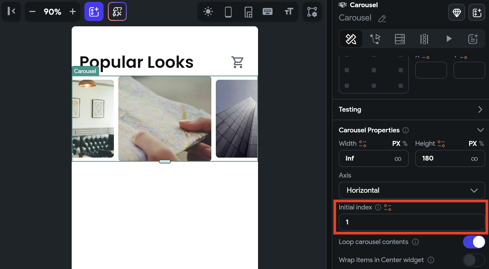
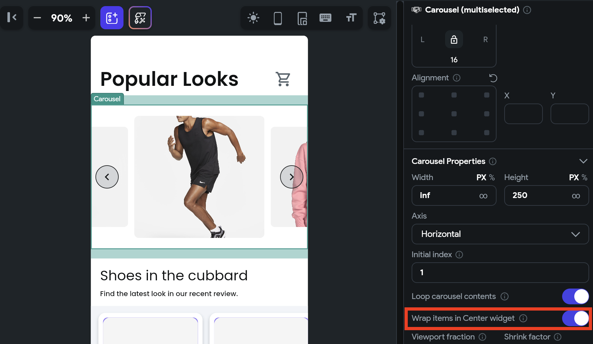

# Carousel
The Carousel widget, often called an image slider, is a popular design element used to display a series of images or content in a horizontal or sometimes vertical format. The primary purpose of a carousel slider is to showcase multiple pieces of information, such as images, product features, news articles, or testimonials, within limited screen space.

    <iframe 
        src="https://www.loom.com/embed/bab0e793fb1c4235b9e535223fb5e2ad?sid=2d987f69-d133-48ca-904f-74af107be539"
        title=""
        style={{
            position: 'absolute',
            top: 0,
            left: 0,
            width: '100%',
            height: '100%',
            colorScheme: 'light'
        }}
        frameborder="0"
        loading="lazy"
        webkitAllowFullScreen
        mozAllowFullScreen
        allowFullScreen
        allow="clipboard-write">
    </iframe>

## Adding Carousel widget

To add the Carousel widget to your app:

1. Add the **Carousel** widget from the **Layout Elements** tab.
2. By default, it adds four slides and shows the first one in the canvas. In the widget tree, it is represented as **Carousel Page**. To see another slide in the canvas, move to the **Properties Panel >** set the **Active Page** to the slide you want to see.
3. To add a new slide, move to the **Properties Panel > Active Page >** click **+ Add Page**.
4. To delete any slide, select the **Carousel Page** from the widget tree or the canvas area and press the **Delete** key on the keyboard.
5. By default, Carousel Page contains an Image widget; however, you can customize it as per your requirements.

    <iframe 
        src="https://www.loom.com/embed/511b49c17a0b4d53a2185214c77169ab?sid=4a0fa5e5-a7ba-45be-a4a9-3bd9a67a96ae"
        title=""
        style={{
            position: 'absolute',
            top: 0,
            left: 0,
            width: '100%',
            height: '100%',
            colorScheme: 'light'
        }}
        frameborder="0"
        loading="lazy"
        webkitAllowFullScreen
        mozAllowFullScreen
        allowFullScreen
        allow="clipboard-write">
    </iframe>

## Customizing

You can customize the appearance and behavior of this widget using the various properties available under the properties panel.

### Changing the scroll direction

By default, the Carousel comes with a horizontal scroll for the slides. To change the scroll direction to vertical, move to the **Properties Panel > Carousel Properties >** set the **Axis** to **Vertical**.

    <iframe 
        src="https://www.loom.com/embed/53ef57bfc81745fa9d5801a6d6b2f981?sid=92e6838a-c3d5-48e4-9c11-00e0b41e974e"
        title=""
        style={{
            position: 'absolute',
            top: 0,
            left: 0,
            width: '100%',
            height: '100%',
            colorScheme: 'light'
        }}
        frameborder="0"
        loading="lazy"
        webkitAllowFullScreen
        mozAllowFullScreen
        allowFullScreen
        allow="clipboard-write">
    </iframe>

### Trigger action on slide chang

You might want to trigger an action when the slide is swiped. For example, If your carousel has an auto-play feature, you can listen for slide change events to pause or resume auto-play. You could also have a custom indicator below the Carousel and have it synchronize with the current slide to provide users with clear feedback about their position within the carousel.

To trigger action on page or slide change:

1. Select the widget from the widget tree or canvas area.
2. Select **Actions** from the Properties panel (the right menu), and click **+ Add Action**.
3. You will notice that the **Type of Action** (aka callback) is already set to **On Page Change**. That means actions added under this will be called whenever the slide is swiped.
4. Now you can add any action here.

Here is an example showing the snackbar message whenever the slide is swiped.

    <iframe 
        src="https://www.loom.com/embed/29c3d883bef041a0ba5000a6511186b7?sid=a6de26a0-3d0c-425d-8bca-21de2a254956"
        title=""
        style={{
            position: 'absolute',
            top: 0,
            left: 0,
            width: '100%',
            height: '100%',
            colorScheme: 'light'
        }}
        frameborder="0"
        loading="lazy"
        webkitAllowFullScreen
        mozAllowFullScreen
        allowFullScreen
        allow="clipboard-write">
    </iframe>

### Setting initial page index

You might want to display a specific slide as soon as it is loaded. To do so, move to the **Properties Panel > Carousel Properties >** enter the **Initial Page Index** value. Please **note** that the slide index starts from 0. So, if you want to set slide 1, you should enter 0. If you want to set slide 2, you should enter 1, and so on.

### Loop carousel contents

By default, the content of the carousel loops continuously. To stop this behavior, move to the **properties panel > Carousel Properties >** disable **Loop carousel contents**.

    <iframe 
        src="https://www.loom.com/embed/4753d753382f4ef1ae0869c7590742e9?sid=7dda2093-d11f-40d7-9bda-a6487d4248b4"
        title=""
        style={{
            position: 'absolute',
            top: 0,
            left: 0,
            width: '100%',
            height: '100%',
            colorScheme: 'light'
        }}
        frameborder="0"
        loading="lazy"
        webkitAllowFullScreen
        mozAllowFullScreen
        allowFullScreen
        allow="clipboard-write">
    </iframe>

### Wrap items in a center widget

If you want all items in a center position, move to the **properties panel > Carousel Properties >** enable **Wrap items in Center Widget**.

### Changing Viewport and Shrink factor

You can use the **Viewport Fraction** to change the size of a single item, i.e., the item in the center. The **Shrink Factor** lets you adjust the size of other items, i.e., items that are not in focus. Both the properties accept the value between 0 and 1. where 1 is full size, and 0.5 is half of the actual size.

    <iframe 
        src="https://www.loom.com/embed/b13c9f9021154347be2bed1df64c783e?sid=664e2f8d-d4ed-44ae-bed0-90ef4ec78b68"
        title=""
        style={{
            position: 'absolute',
            top: 0,
            left: 0,
            width: '100%',
            height: '100%',
            colorScheme: 'light'
        }}
        frameborder="0"
        loading="lazy"
        webkitAllowFullScreen
        mozAllowFullScreen
        allowFullScreen
        allow="clipboard-write">
    </iframe>

### Enabling autoplay

When autoplay is enabled, the carousel will automatically transition from one slide to the next at regular intervals, determined by the following options:

- **Duration**: The amount of time (in milliseconds) that it takes to transition from the current slide to the next.
- **Delay**: The amount of time (in milliseconds) that the item remains in the center before moving to the next one.

    <iframe 
        src="https://www.loom.com/embed/50f87efbab6c4905bfd8a90645e949b4?sid=6e04b563-0ee0-4710-a667-6ea627bfd060"
        title=""
        style={{
            position: 'absolute',
            top: 0,
            left: 0,
            width: '100%',
            height: '100%',
            colorScheme: 'light'
        }}
        frameborder="0"
        loading="lazy"
        webkitAllowFullScreen
        mozAllowFullScreen
        allowFullScreen
        allow="clipboard-write">
    </iframe>

### Change slide on button press

You might want to allow users to change the slide on button press (e.g., next, previous, and skip buttons) in addition to the swipe. You can do so by adding the **Control Carousel** action on the Tap of a Button widget.

    <iframe 
        src="https://www.loom.com/embed/8093ca3175d94916bc18dd011c638a6b?sid=a6fdf60a-f7ff-47fa-bcae-aa59a088ba65"
        title=""
        style={{
            position: 'absolute',
            top: 0,
            left: 0,
            width: '100%',
            height: '100%',
            colorScheme: 'light'
        }}
        frameborder="0"
        loading="lazy"
        webkitAllowFullScreen
        mozAllowFullScreen
        allowFullScreen
        allow="clipboard-write">
    </iframe>

Here's how you do it:

1. First, [add the Carousel](#adding-carousel-widget) widget.
2. Add buttons to go to the previous and next pages.
3. Now select any button and define the [Control Carousel](#control-carousel-action) action.

---

## Control Carousel [Action]

By using this action, you can gain more control over the scrolling behavior of the Carousel widget. For instance, you can enable your users to move to the next or previous slide with a single tap of a button.

    <iframe 
        src="https://www.loom.com/embed/8093ca3175d94916bc18dd011c638a6b?sid=77aea599-ae4a-4820-818c-c6496845f4c3"
        title=""
        style={{
            position: 'absolute',
            top: 0,
            left: 0,
            width: '100%',
            height: '100%',
            colorScheme: 'light'
        }}
        frameborder="0"
        loading="lazy"
        webkitAllowFullScreen
        mozAllowFullScreen
        allowFullScreen
        allow="clipboard-write">
    </iframe>

### Types of action

These are the types of actions you can add on the Carousel widget.

- **Previous**: Scroll to the previous slide.
- **Next**: Scroll to the next slide.
- **First**: Scroll to the first slide.
- **Last**: Scroll to the last slide.
- **Jump to**: Scroll to a specific slide in the Carousel widget. Please note that the slide index starts from 0. So, if you want to jump to slide 1, you should enter 0. If you want to jump to slide 2, you should enter 1, and so on.
