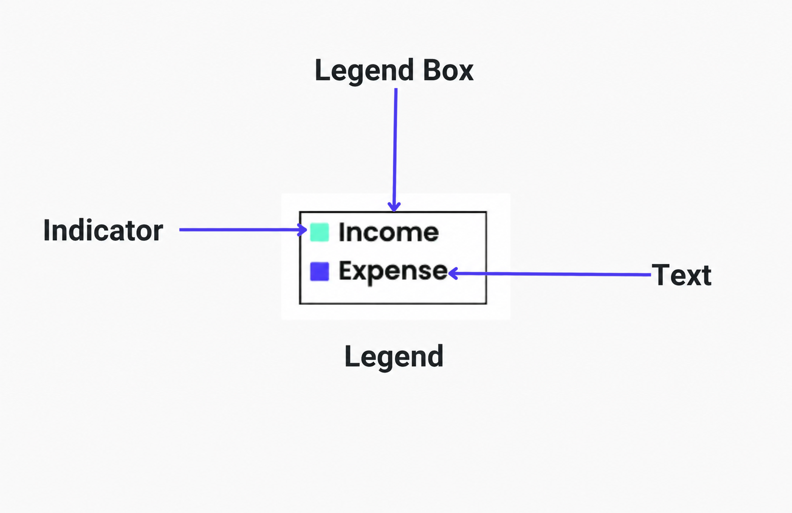

# Chart
The **Chart** widget presents data visually, making complex information easier to understand and compare.

## Chart Types

You can add the following types of charts:

1. [Line Chart](line-chart.md)
2. [Bar Chart](bar-chart.md)
3. [Pie Chart](pie-chart.md)

## Customizing the Chart {#customizing-chart}

Use the options under **Chart Properties** in the Properties panel to customize the widget's appearance and behavior.

:::info
Available properties vary by chart type. Axis settings apply to line and bar charts, while pie charts use section-specific settings.
:::

### Show Legend

A legend helps users identify each data series by displaying its name next to its color.

To show and customize the legend:

1. Select the **Chart** widget from the widget tree or the canvas area.
2. Open **Chart Data** and enter a **Legend** name for each data series.
3. Under **Chart Properties**, enable **Show Legend**.
4. Open **Legend Properties** to adjust the legend's size, position, background, border, padding, text, and indicator.

### Change the Background Color

The **Chart** widget uses a white background by default. To change it, select the **Chart** widget and choose a color from **Chart Properties > Background Color**.

    <iframe 
        src="https://demo.arcade.software/MZdYeM0mCJQF56GRK2yy?embed&show_copy_link=true"
        title="Change the Chart Background Color"
        style={{
            position: 'absolute',
            top: 0,
            left: 0,
            width: '100%',
            height: '100%',
            colorScheme: 'light'
        }}
        frameBorder="0"
        loading="lazy"
        webkitAllowFullScreen
        mozAllowFullScreen
        allowFullScreen
        allow="clipboard-write">
    </iframe>

### Show the Grid

Enable **Show Grid** under **Chart Properties** to display grid lines behind the chart data.

### Show the Border

Enable **Show Border** under **Chart Properties** to display a border around the chart. Use **Border Color** and **Border Width** to customize its appearance.

### Show the Tooltip

Enable **Show Tooltip** under **Chart Properties** to display the Y-axis value when users interact with the chart. Use **Tooltip Background Color** to customize the tooltip background.

    <iframe
        src="https://demo.arcade.software/URNNI3mXOa3Jkcc9EnXu?embed&show_copy_link=true"
        title="Show and Customize Chart Tooltips"
        style={{
            position: 'absolute',
            top: 0,
            left: 0,
            width: '100%',
            height: '100%',
            colorScheme: 'light'
        }}
        frameBorder="0"
        loading="lazy"
        webkitAllowFullScreen
        mozAllowFullScreen
        allowFullScreen
        allow="clipboard-write">
    </iframe>

### Set Axis Bounds

Use **Axis Bounds** under **Chart Properties** to control the range displayed on the chart:

- **Min X** and **Max X:** Set where the X-axis starts and ends. These options apply only to line charts.
- **Min Y** and **Max Y:** Set where the Y-axis starts and ends.

Select the **Chart** widget, open **Chart Properties > Axis Bounds**, and enter the required values.

:::info
If you leave these fields unset, FlutterFlow determines the axis bounds from the minimum and maximum values in your data.
:::

### Customize the X-axis

Use **X Axis Properties** to configure the axis title and labels:

- **Text:** Adds an axis title, such as *Day*, *Week*, or *Month*. You can enter static text or set the value from a variable, then customize its appearance.
- **Show Label:** Displays numbers or labels along the X-axis.
- **Label Interval:** Controls the spacing between displayed values.
- **Label Format Type:** Formats numeric labels. To format larger numbers, select **Number** and configure the **Number Format Options**.

:::info
For line charts, X-axis numbers are based on **Min X** and **Max X** when [**axis bounds**](#set-axis-bounds) are set; otherwise, FlutterFlow uses the range of the chart data. Bar charts display the labels configured for their data series.
:::

This example shows how to customize the X-axis title and labels.

    <iframe 
        src="https://demo.arcade.software/VsUdrZf0rMINaY9e1LhV?embed&show_copy_link=true"
        title="Customize the Chart's X-axis"
        style={{
            position: 'absolute',
            top: 0,
            left: 0,
            width: '100%',
            height: '100%',
            colorScheme: 'light'
        }}
        frameBorder="0"
        loading="lazy"
        webkitAllowFullScreen
        mozAllowFullScreen
        allowFullScreen
        allow="clipboard-write">
    </iframe>

### Customize the Y-axis

Use **Y Axis Properties** to configure the axis title and labels:

- **Text:** Adds an axis title, such as *Sales*, *Users*, or *Progress*. You can enter static text or set the value from a variable, then customize its appearance.
- **Show Label:** Displays numbers along the Y-axis.
- **Label Interval:** Controls the spacing between displayed values.
- **Label Format Type:** Formats numeric labels. To format larger numbers, select **Number** and configure the **Number Format Options**.

:::info
Y-axis numbers are based on **Min Y** and **Max Y** when [**axis bounds**](#set-axis-bounds) are set; otherwise, FlutterFlow uses the range of the chart data.
:::

This example shows how to customize the Y-axis title and labels.

    <iframe 
        src="https://demo.arcade.software/gvIZcHFr8TWJ9a3FlkJ5?embed&show_copy_link=true"
        title="Customize the Chart's Y-axis"
        style={{
            position: 'absolute',
            top: 0,
            left: 0,
            width: '100%',
            height: '100%',
            colorScheme: 'light'
        }}
        frameBorder="0"
        loading="lazy"
        webkitAllowFullScreen
        mozAllowFullScreen
        allowFullScreen
        allow="clipboard-write">
    </iframe>

