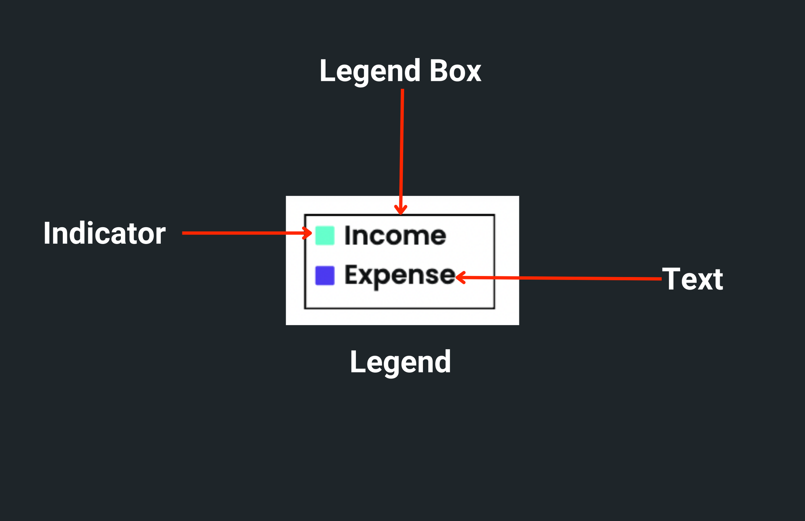
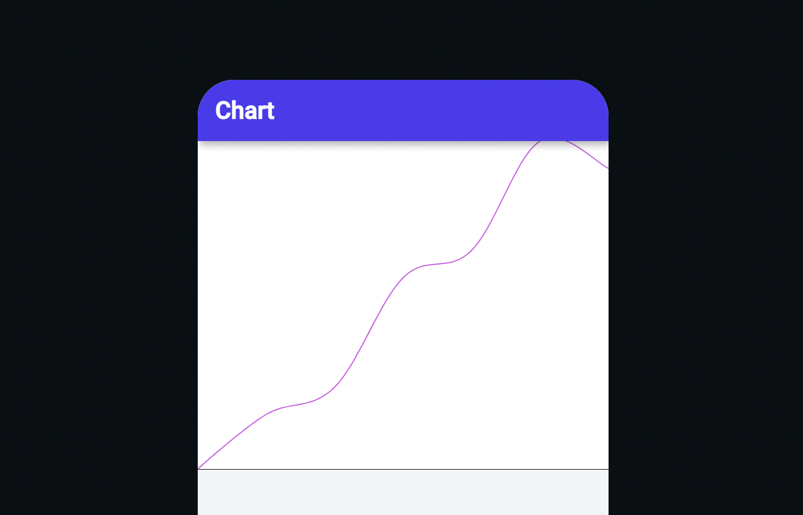

import Tabs from '@theme/Tabs';
import TabItem from '@theme/TabItem';

# Chart
The chart widget is used to represent the information in a graphical format. You can use it to display complex information in an easily understandable format.

## Types of chart

You can add the following types of charts:

1. [Line Chart](line-chart.md)
2. [Bar Chart](bar-chart.md)
3. [Pie Chart](pie-chart.md)

## Customizing chart

Using *Chart* Properties (inside the properties panel), you can customize the appearance and behavior of the widget.

:::info
The following instructions will have a similar effect on the Bar chart.
:::

### Showing legend

Legend helps users identify the data drawn over the chart. It's a small box that shows the chart data name/text next to its color (a color used to draw a line or bar).

To show legend:

1. Select the **Chart** widget from the widget tree or the canvas area.
2. Move to the properties panel and open **Chart Data 1**.
3. Enter the **Legend** name. This will be displayed as the name of the line or bar.
4. If you have multiple chart data (e.g., Chart Data 1, Chart Data 2, and so on), set the legend for them as well.
5. Scroll down to **Chart Properties** and enable the **Show Legend** property.

    <iframe 
        src="https://demo.arcade.software/vDRjSf7zZM4kbflWctVp?embed&show_copy_link=true"
        title=""
        style={{
            position: 'absolute',
            top: 0,
            left: 0,
            width: '100%',
            height: '100%',
            colorScheme: 'light'
        }}
        frameborder="0"
        loading="lazy"
        webkitAllowFullScreen
        mozAllowFullScreen
        allowFullScreen
        allow="clipboard-write">
    </iframe>

### Customizing legend box

You can change the appearance of the legend box by following the instructions below:

1. First, [enable the legend](#showing-legend).
2. Scroll down to the **Legend Properties** section.
3. To change the dimension of the legend box, enter the **Width** and **Height** values.
4. The legend box typically appears over the chart on the bottom right side. To change its position, use the **Horizontal** and **Vertical** **Alignment** slider.
5. To change the background color, find the **Background Color** property and click on the box next to **Unset**, select the color, then click **Use Color** or click on **Unset** and enter a Hex Code directly.
6. To customize the border, use the **Border Color**, **Border Width,** and **Border Radius**.
7. To add space between legend text and its box border, adjust **Padding** property.

    <iframe 
        src="https://demo.arcade.software/Z6bIAKkTqEPaLLfGEHw0?embed&show_copy_link=true"
        title=""
        style={{
            position: 'absolute',
            top: 0,
            left: 0,
            width: '100%',
            height: '100%',
            colorScheme: 'light'
        }}
        frameborder="0"
        loading="lazy"
        webkitAllowFullScreen
        mozAllowFullScreen
        allowFullScreen
        allow="clipboard-write">
    </iframe>

### Customizing legend text and indicator

To customize the legend text and indicator:

1. First, [enable the legend](#showing-legend).
2. To style the legend text, scroll down to the **Legend Properties** > **Legend Text Properties** and change the style as per [here](../../../widgets/basic-widgets/text.md#common-text-styling-properties).
3. To add space between the indicator and the text, adjust the **Text Padding** property.
4. You can change the indicator size by entering a value inside the **Indicator Size** property.
5. To create rounded corners around the indicator, you can use the **Indicator Border Radius** property.

    <iframe 
        src="https://demo.arcade.software/KEqnlLlSr6g5A6T80AFk?embed&show_copy_link=true"
        title=""
        style={{
            position: 'absolute',
            top: 0,
            left: 0,
            width: '100%',
            height: '100%',
            colorScheme: 'light'
        }}
        frameborder="0"
        loading="lazy"
        webkitAllowFullScreen
        mozAllowFullScreen
        allowFullScreen
        allow="clipboard-write">
    </iframe>

### Changing background color

The default background color for the chart widget is white. To change the background color:

1. Select the **Chart** widget from the widget tree or the canvas area.
2. Move to the properties panel, and scroll down to the **Chart Properties** section.
3. Find the **Background Color** property, click on the box next to **Unset**, select any dark/light color, and then click **Use Color** or click on **Unset** and enter a Hex Code directly. You can also choose the color by clicking on the Palette and Simple buttons.

    <iframe 
        src="https://demo.arcade.software/5UIu88qI8jEP9i3Qa15F?embed&show_copy_link=true"
        title=""
        style={{
            position: 'absolute',
            top: 0,
            left: 0,
            width: '100%',
            height: '100%',
            colorScheme: 'light'
        }}
        frameborder="0"
        loading="lazy"
        webkitAllowFullScreen
        mozAllowFullScreen
        allowFullScreen
        allow="clipboard-write">
    </iframe>

### Set axis bounds

Axis Bounds specify limits on the axis. You can set the minimum and maximum limits on the X and Y axes.

You can set four types of bounds on a chart:

1. **Min X** (only applicable in Line Chart): Specifies a number at which the X-axis should start.
2. **Min Y**: Specifies a number at which the Y-axis should start.
3. **Max X** (only applicable in Line Chart): Specifies a number at which the X-axis should end.
4. **Max Y**: Specifies a number at which the Y-axis should end.

:::info
If you don't specify the axis bounds, the start and end numbers for the X and Y axis are set as per the min and max of the actual data.
:::

To set the axis bounds:

1. Select the **Chart** widget from the widget tree or the canvas area.
2. Move to the properties panel, and scroll down to the **Chart Properties** section.
3. Find the **Axis Bounds** section and enter the **Min X**, **Min Y**, **Max X**, and **Max Y** values.

<Tabs>
<TabItem value="1" label="Chart without axis bounds" default>

</TabItem>
<TabItem value="2" label="Chart with axis bounds">
The line chart with bounds set to **Min X:0 ,Min Y:0, Max X:7 and Max Y:100** looks like this:

</TabItem>
</Tabs>

### Showing grid

To display the grid on the chart background:

1. Select the **Chart** widget from the widget tree or the canvas area.
2. Move to the properties panel, and scroll down to the **Chart Properties** section.
3. Find the **Show Grid** toggle and **enable** it.

### Showing border

To display a border around the chart:

1. Select the **Chart** widget from the widget tree or the canvas area.
2. Move to the properties panel, and scroll down to the **Chart Properties** section.
3. Find the **Show Border** toggle and **enable** it.
4. Find the **Border Color** property, click on the box next to **Black**, select the color, and then click **Use Color** or click on **Black** and enter a Hex Code directly.
5. Now, find the **Border Width** property below and enter the value. (e.g. 2,5,10)

### Showing tooltip

Sometimes it becomes difficult to identify the exact Y value. To overcome this, you can enable the tooltip. Enabling the tooltip will display the Y value when you interact with the chart. You can also add background color to the tooltip.

To enable tooltip:

1. Select the **Chart** widget from the widget tree or the canvas area.
2. Move to the properties panel, and scroll down to the **Chart Properties** section.
3. Find the **Show Border** toggle and **enable** it.
4. To change the background color, find the **Tooltip Background Color** property, click on the box next to **Unset**, select any dark/light color, and then click **Use Color** or click on **Unset** and enter a Hex Code directly.

    <iframe 
        src="https://demo.arcade.software/eKwTbxBpdS0Uoosq6Elb?embed&show_copy_link=true"
        title=""
        style={{
            position: 'absolute',
            top: 0,
            left: 0,
            width: '100%',
            height: '100%',
            colorScheme: 'light'
        }}
        frameborder="0"
        loading="lazy"
        webkitAllowFullScreen
        mozAllowFullScreen
        allowFullScreen
        allow="clipboard-write">
    </iframe>

### Customizing X axis (Show name, number, and labels)

You can customize the X axis to display names and numbers on it.

### Displaying name on X-Axis

To show the name on the axis, such as day, week, and month:

1. Select the **Chart** widget from the widget tree or the canvas area.
2. Move to the properties panel, and scroll down to the **Chart Properties** section.
3. Scroll down to the **X Axis Properties** and enter the value in the **Text** input box. You can also set the name from a variable by clicking on the **Set from Variable text**.
4. You can also customize the appearance of the name text.

    <iframe 
        src="https://demo.arcade.software/lhqUBcToHTmZU0eLdAkb?embed&show_copy_link=true"
        title=""
        style={{
            position: 'absolute',
            top: 0,
            left: 0,
            width: '100%',
            height: '100%',
            colorScheme: 'light'
        }}
        frameborder="0"
        loading="lazy"
        webkitAllowFullScreen
        mozAllowFullScreen
        allowFullScreen
        allow="clipboard-write">
    </iframe>

### Displaying numbers or labels on the X axis

Displaying numbers or labels on the axis helps you quickly understand the graph.

**For Line Chart**

If you have set the [Axis bounds](#set-axis-bounds), the start and end numbers are displayed as per the value set in **Min X** and **Max X**. Otherwise, they are shown as per the min and max values of the actual data. You can also specify the intervals between the numbers.

To display numbers on the X-axis:

1. Select the **Chart** widget, head over to the properties panel, and scroll down to the **Chart Properties** section.
2. Scroll down to the **X Axis Properties** and enable the **Show Label** option.
3. When it comes to displaying numbers, it's usually acceptable to show up to two digits as is. However, if the number exceeds that limit, it's recommended to set the **Label Format Type** to **Number** and configure the appropriate **Number Format Options**.
4. Enter the value in the **Label Interval** input box.
5. You can also customize the appearance of the numbers.

<Tabs>
<TabItem value="1" label="Displaying numbers on the X axis" default>

    <iframe 
        src="https://demo.arcade.software/5AcZkCLWyOzTn5fwhLaX?embed&show_copy_link=true"
        title=""
        style={{
            position: 'absolute',
            top: 0,
            left: 0,
            width: '100%',
            height: '100%',
            colorScheme: 'light'
        }}
        frameborder="0"
        loading="lazy"
        webkitAllowFullScreen
        mozAllowFullScreen
        allowFullScreen
        allow="clipboard-write">
    </iframe>

</TabItem>
<TabItem value="2" label="Displaying numbers (with formatting) on the X axis">

    <iframe 
        src="https://demo.arcade.software/JEOGGv8mqnZIdupEMGo1?embed&show_copy_link=true"
        title=""
        style={{
            position: 'absolute',
            top: 0,
            left: 0,
            width: '100%',
            height: '100%',
            colorScheme: 'light'
        }}
        frameborder="0"
        loading="lazy"
        webkitAllowFullScreen
        mozAllowFullScreen
        allowFullScreen
        allow="clipboard-write">
    </iframe>

</TabItem>
</Tabs>

:::info

For the bar chart, you can only display labels on X-axis.

:::

### Customizing Y axis (Show name and numbers)

You can customize the Y axis to display names and numbers on it.

### Displaying name on Y-axis

To show the name on the axis, such as progress, number of users, and sales:

1. Select the **Chart** widget from the widget tree or the canvas area.
2. Move to the properties panel, and scroll down to the **Chart Properties** section.
3. Scroll down to the **Y-Axis Properties** and enter the value in the **Text** input box. You can also set the name from a variable by clicking on the **Set from Variable text**.
4. You can also customize the appearance of the name text.

    <iframe 
        src="https://demo.arcade.software/tA18QzjyjrybHPQkfq1Z?embed&show_copy_link=true"
        title=""
        style={{
            position: 'absolute',
            top: 0,
            left: 0,
            width: '100%',
            height: '100%',
            colorScheme: 'light'
        }}
        frameborder="0"
        loading="lazy"
        webkitAllowFullScreen
        mozAllowFullScreen
        allowFullScreen
        allow="clipboard-write">
    </iframe>

### Displaying numbers on the Y axis

Just like X-axis, If you have set the [Axis bounds](#set-axis-bounds), the start and end numbers are displayed as per the value set in **Min Y** and **Max Y**. Otherwise, they are shown as per the min and max value of the actual data. You can also specify the intervals between the numbers.

To display numbers on the Y axis:

1. Select the **Chart** widget, head over to the properties panel, and scroll down to the **Chart Properties** section.
2. Scroll down to the **Y Axis Properties** and enable the **Show Label** option.
3. When it comes to displaying numbers, it's usually acceptable to show up to two digits as is. However, if the number exceeds that limit, it's recommended to set the **Label Format Type** to **Number** and configure the appropriate **Number Format Options**.
4. Enter the value in the **Label Interval** input box.
5. You can also customize the appearance of the numbers.

<Tabs>
<TabItem value="1" label="Displaying numbers on the Y axis" default>

    <iframe 
        src="https://demo.arcade.software/qJn8HQDX9R64b2AI66vc?embed&show_copy_link=true"
        title=""
        style={{
            position: 'absolute',
            top: 0,
            left: 0,
            width: '100%',
            height: '100%',
            colorScheme: 'light'
        }}
        frameborder="0"
        loading="lazy"
        webkitAllowFullScreen
        mozAllowFullScreen
        allowFullScreen
        allow="clipboard-write">
    </iframe>

</TabItem>
<TabItem value="2" label="Displaying numbers (with formatting) on the Y axis">

    <iframe 
        src="https://demo.arcade.software/iXMOcpbMLmmlDbiauyg7?embed&show_copy_link=true"
        title=""
        style={{
            position: 'absolute',
            top: 0,
            left: 0,
            width: '100%',
            height: '100%',
            colorScheme: 'light'
        }}
        frameborder="0"
        loading="lazy"
        webkitAllowFullScreen
        mozAllowFullScreen
        allowFullScreen
        allow="clipboard-write">
    </iframe>

</TabItem>
</Tabs>