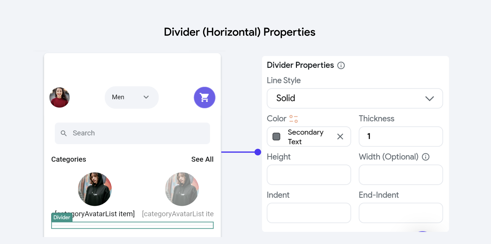
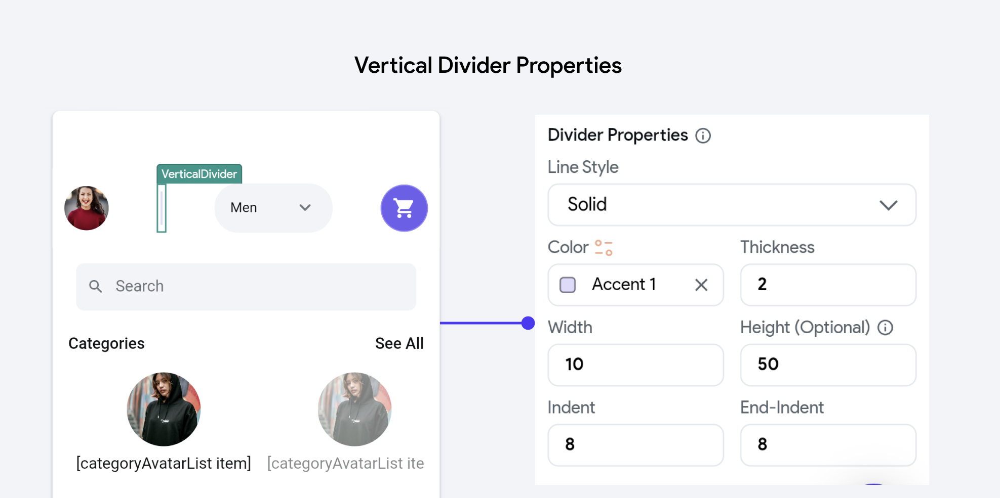

# Dividers

Add a thin horizontal or vertical line, with padding on either side. Customize the color, width 
or height, and style of the divider from the Properties Panel. 

## Divider Properties
Here are the properties in detail:

<figure>
    
  <figcaption class="centered-caption">Divider (Horizontal) Properties </figcaption>
</figure>

<figure>
    
  <figcaption class="centered-caption">Vertical Divider Properties </figcaption>
</figure>

- **Line Style**: This property determines the visual pattern of the divider line. Options 
  typically include:
  - **Solid**: A continuous line.
  - **Dotted**: A series of dots.
  - **Dashed**: A series of dashes.
  - **Dashdotted:** A combination of dashes and dots.

- **Color**: Defines the color of the divider line. This can be set using predefined theme colors or 
  custom values to match or contrast with the application's design scheme.

- **Thickness**: Specifies the thickness of the divider line, influencing its visual prominence. 
  Thicker lines are more noticeable and can be used to make a bold statement, while thinner lines are subtler.

- **Width**: This property sets the horizontal length of the divider. It can be specified in 
  absolute terms (e.g., pixels).

- **Height**: For vertical dividers, this property sets the vertical length. Like width, it can 
  also be defined in pixels. 

- **Indent and End-Indent**: These properties control the spacing from the edges of the container 
  to the start and end points of the divider line, respectively. Indents can be used to fine-tune the placement of the divider within a layout, helping to achieve a balanced or desired aesthetic effect.
