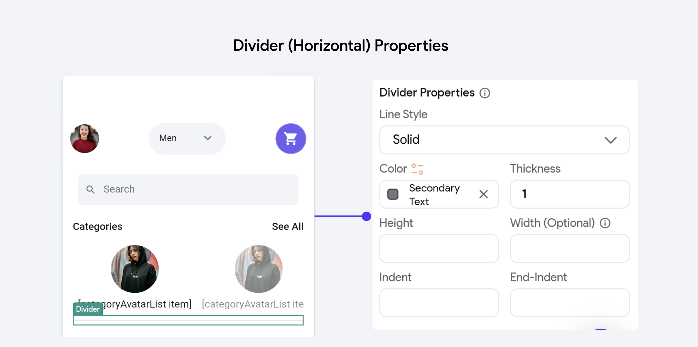

---
tags:
  - FlutterFlow
  - Resources
  - UI
title: Dividers
description: 'Add and style a horizontal Divider inside a FlutterFlow Column.'
keywords:
  - Dividers
  - Built In Widgets
  - Widgets
last_verified: 2026-09-02
---
# Dividers

The **Divider** widget draws a horizontal separating line inside a Column. Customize its line pattern, color, thickness, height, optional width, and leading/trailing indent from **Divider Properties**.

:::note

The current Divider widget is horizontal and can be added only to a Column. It does not generate Flutter's `VerticalDivider` widget.

:::

## Divider Properties
Here are the properties in detail:

<figure>
    
  <figcaption class="centered-caption">Divider (Horizontal) Properties </figcaption>
</figure>

- **Line Style**: This property determines the visual pattern of the divider line. Options
  typically include:
  - **Solid**: A continuous line.
  - **Dotted**: A series of dots.
  - **Dashed**: A series of dashes.
  - **Dashdotted:** A combination of dashes and dots.

- **Color**: Defines the color of the divider line. This can be set using predefined theme colors or
  custom values to match or contrast with the application's design scheme.

- **Thickness**: Specifies the thickness of the divider line, influencing its visual prominence.
  Thicker lines are more noticeable and can be used to make a bold statement, while thinner lines are subtler.

- **Width (Optional)**: Constrains the horizontal length. Leave it unset in a normally bounded Column so the divider can take the available width. Set it when the parent has unbounded horizontal constraints.

- **Height**: Sets the vertical space occupied by the horizontal Divider. **Thickness** controls the painted line within that height.

- **Indent and End-Indent**: These properties control the spacing from the edges of the container
  to the start and end points of the divider line, respectively. Indents can be used to fine-tune the placement of the divider within a layout, helping to achieve a balanced or desired aesthetic effect.

## Related documentation

See [AspectRatio](/resources/ui/widgets/built-in-widgets/aspect-ratio) for a related FlutterFlow workflow.
