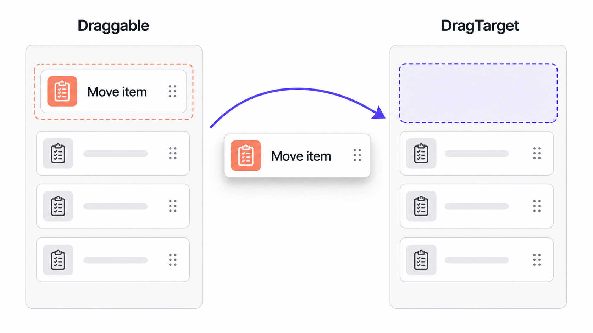
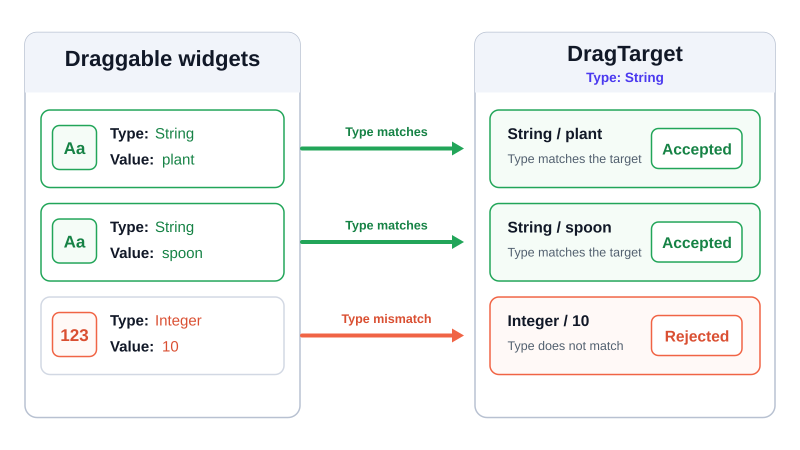

# Draggable and DragTarget

The **Draggable** and **DragTarget** widgets let users move items from one place to another in your app. Use **Draggable** for the item that can be moved and **DragTarget** for the area where it can be dropped. For example, users can sort items, move tasks between columns, or drag products into a cart.

<figure>
  
  <figcaption class="centered-caption">A Draggable item moving to a DragTarget</figcaption>
</figure>

## How Draggable and DragTarget Work

A drag-and-drop interaction has three parts:

1. The user starts dragging the child of a **Draggable** widget.
2. The Draggable carries its configured data **Value**.
3. A **DragTarget** with a matching data **Type** receives the value and runs the appropriate event actions.

The data type controls compatibility between the widgets. The value identifies the dragged item and can be validated before the app updates its state.

## Adding a Draggable Widget

1. Add a **Draggable** widget from the [Widget Palette](../../../../intro/ff-ui/widget-palette.md).
2. Add the widget that users should drag, such as an **Image**, **Container**, or **Card**, as its child.

### Setting the Draggable Data

- **Type:** Defines the kind of data carried by the widget. This must match the Type configured on the intended DragTarget.
- **Value:** Contains the data passed to the DragTarget. It can be static or set from a variable.

For simple interactions, the value can be a string or number that identifies the item. Use a custom data type when the target needs multiple related values, such as a product ID, name, and price.

## Adding a DragTarget Widget

1. Add a **DragTarget** where users should drop an item.
2. Add a child widget to define its visible content and drop area. For example, use a [Container](../../widgets/basic-widgets/container.md) to create a clearly sized target.
3. In the DragTarget properties, set **Type** to the data type used by the corresponding Draggable widgets.

The size of the DragTarget determines the area that can detect the dragged item. Make this area large enough to use comfortably, especially on touchscreens.

## Passing and Validating Data

Matching the data **Type** makes a Draggable compatible with a DragTarget. It does not check whether the DragTarget should process a particular **Value**.

<figure>
  
  <figcaption class="centered-caption">A DragTarget accepts data with a matching type</figcaption>
</figure>

To validate the value after it is dropped:

1. Select the **DragTarget** and open the **Actions** tab.
2. Select **On Drag Accept**, and add a **Conditional Action**.
3. Set the first value to **Drag Target > Dragged Data**.
4. Configure the condition for the value the target should process.
5. Add the required actions to the **TRUE** branch. In the **FALSE** branch, optionally notify the user that the item is not valid for that target.

For example, several Draggable widgets can use the **String** type while carrying different values. A DragTarget can receive all of them because their types match, then use a conditional action to process only a value such as `plant`.

## Handling Drag Events

You can use [Action Triggers](../../../control-flow/functions/action-triggers.md) on both widgets to customize the drag-and-drop experience.

### Draggable Events

- **On Drag Started:** Runs when the user starts dragging the widget.
- **On Drag Update:** Runs as the widget moves during the drag.
- **On Drag Completed:** Runs when a DragTarget accepts the dropped data.
- **On Drag Cancelled:** Runs when the item is released without being accepted.
- **On Drag End:** Runs when the drag finishes, whether it is completed or cancelled.

### DragTarget Events

- **On Drag Enter:** Runs when compatible dragged data enters the target. Use it to highlight the drop area.
- **On Drag Exit:** Runs when dragged data leaves the target. Use it to remove temporary hover feedback.
- **On Drag Accept:** Runs when the data is dropped and accepted. Use it to validate the value and update persistent state.

## Customizing the Drag Experience

Use the drag events with state variables and conditional styling to make the interaction clear:

- Set a temporary state variable with **On Drag Enter** to highlight an active drop area.
- Reset the temporary state with **On Drag Exit** when the item leaves the area.
- Update persistent app or page state only after **On Drag Accept** runs.
- Use **On Drag Started** and **On Drag End** to change the appearance of the draggable item or surrounding interface during the interaction.
- Show a message when a dropped value does not meet the target's conditions.

Keep hover state separate from accepted-drop state. Resetting persistent state with **On Drag Exit** can undo a completed interaction when the pointer leaves the target.

## Example: Accepting a Specific Item

Suppose an interface contains Draggable images of a plant, spoon, and football, but a shelf should accept only the plant:

1. Set every Draggable to the **String** type, and assign the values `plant`, `spoon`, and `football`.
2. Set the shelf's DragTarget to the **String** type.
3. Create a Boolean [Page State variable](../../pages/page-lifecycle.md#creating-a-page-state) named `isShelfFull` with a default value of `false`.
4. In the **On Drag Accept** action flow, check whether **Drag Target > Dragged Data** equals `plant`.
5. In the **TRUE** branch, use [Update Page State](../../pages/page-lifecycle.md#update-page-state-action) to set `isShelfFull` to `true`.
6. Use a [ConditionalBuilder](../../../../ff-concepts/layout/responsive-widgets/conditional-builder-widget.md) to display the appropriate shelf image based on `isShelfFull`.

You can optionally show a [Snackbar](../../pages/page-elements.md#snackbar) when the plant is accepted or when another item is rejected.

## Best Practices

- Use the same data type for each Draggable and its intended DragTarget.
- Give users clear visual feedback when an item is draggable and when it enters a valid drop area.
- Make drop targets large enough to use comfortably on touchscreens.
- Keep temporary hover state separate from state changed by an accepted drop.
- Provide a tap or button-based alternative when drag-and-drop is the only way to complete an important task.
- Validate the dragged value before updating persistent state.
