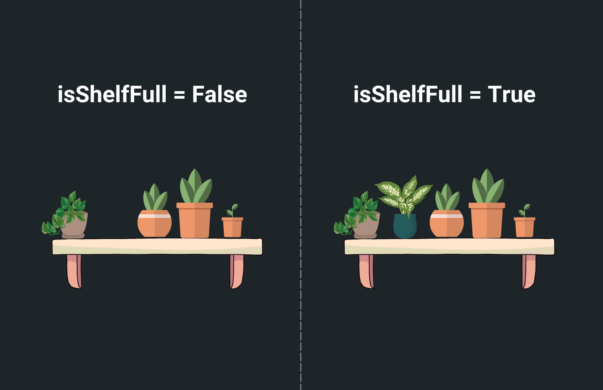

# Draggable + DragTarget

The Draggable widget is used to make a widget that can be dragged and dropped to a different location within the app. It allows users to interact with the app by moving an item using touch gestures or a mouse. The DragTarget widget is used in conjunction with the Draggable widget to specify where a dragged item can be dropped. It creates a region that can accept the data carried by the Draggable widget.

When an item is dragged over a DragTarget, the DragTarget has the opportunity to determine whether it can accept the item. If it accepts, it can then trigger actions such as updating the app's state to reflect the change.

For example, in a shopping cart app, you could use these widgets together to allow users to add items to their cart by dragging and dropping them onto a cart icon.

## Adding Draggable and DragTarget Widgets

Let's see how to add a drag-and-drop functionality by building an example that allows users to put only plants on the shelf. Here's how it looks:

    <iframe 
        src="https://www.loom.
com/embed/68dcc413ad664a7e887e4e305aaec6c2?sid=59c1dcf4-2b71-4dd4-9f13-4cee933bcaf4"
        title=""
        style={{
            position: 'absolute',
            top: 0,
            left: 0,
            width: '100%',
            height: '100%',
            colorScheme: 'light'
        }}
        frameborder="0"
        loading="lazy"
        webkitAllowFullScreen
        mozAllowFullScreen
        allowFullScreen
        allow="clipboard-write">
    </iframe>

The steps to build such an example are as follows:

### 1. Create page state variable

In this example, we have two images of a shelf: one with empty space for one plant and another 
with all plants on the shelf. To control which image to show based on whether the correct item 
is dropped on the shelf, we need a 
[page state variable](../../pages/page-lifecycle.md#page-state). 
Therefore, 
[create a page state variable](../../pages/page-lifecycle.md#creating-a-page-state)
named `isShelfFull` with the datatype *Boolean* and set its default value to *False*.

<figure>
    
  <figcaption class="centered-caption">Control image display based on page state variable</figcaption>
</figure>

### 2. Add Draggable widgets

Let's add the draggable widgets and specify the data for each widget. This data will later be used to determine if the correct item is being dropped on the shelf. For instance, you can assign a unique identifier or a type attribute (e.g., plant, spoon, toy) to each draggable widget.

:::note
As we proceed in this section, you'll learn how this information is crucial for the DragTarget widget to evaluate whether the item being dropped matches the expected type for the shelf.
:::

In this example, the draggable items are a plant, a spoon, and a football. Let's see how to add them:

1. Inside the **Row** widget, add 
**Draggable** widgets directly from the widget tree or canvas area.
2. Inside the **Draggable** widget, you can add any widget as a child widget. For this example, we use the **Image** widget.
3. To add data to draggable widgets, select the **Draggable widget > Properties Panel > Draggable Properties >** specify the **Type** of the data and its **Value**.

    <iframe 
        src="https://www.loom.
com/embed/09755c639a8f4aaaa2ea2df8bb8b0324?sid=c4738082-d7ee-4e9b-8940-e887334e476b"
        title=""
        style={{
            position: 'absolute',
            top: 0,
            left: 0,
            width: '100%',
            height: '100%',
            colorScheme: 'light'
        }}
        frameborder="0"
        loading="lazy"
        webkitAllowFullScreen
        mozAllowFullScreen
        allowFullScreen
        allow="clipboard-write">
    </iframe>

:::info
The Draggable widget also provides you with various drag events (as [**Action Triggers**](../../../control-flow/functions/action-triggers.md)) that you might want to use to customize the drag experience. These include:

- **On Drag Started**: Gets triggered when the user initiates a drag operation.
- **On Drag Update**: Gets triggered when the drag is currently in progress, allowing you to track its movement or update other UI elements accordingly.
- **On Drag Completed**: Gets triggered when the user successfully drags and drops the widget into [**DragTarget**](#3-add-dragtarget-widget) widget.
- **On Drag Cancelled**: Gets triggered when the drag operation is aborted, such as when the user releases the widget outside a **DragTarget** or the DragTarget rejects the widget.
- **On Drag End**: Gets triggered when the drag operation finishes, regardless of whether it was completed or cancelled.
:::

### 3. Add DragTarget widget

The DragTarget widget in this example allows users to drop items onto the shelf. We utilize the Stack widget to layer the DragTarget widget over the shelf image. Moreover, the display of the shelf image is controlled by the [ConditionalBuilder](../../../../ff-concepts/layout/responsive-widgets/conditional-builder-widget.md) widget, which uses the `isShelfFull` variable to determine which image to show. This widget arrangement ensures that the shelf image updates dynamically based on whether the shelf is full or not.

Let's see how to add DragTarget widget:

1. Open the [Widget Palette](../../../../intro/ff-ui/widget-palette.md) and locate the **DragTarget** widget under the **Base Elements** tab. You can drag it into your desired location or add it directly from the widget tree.
2. Inside the **DragTarget** widget, add a [**Container**](../../widgets/basic-widgets/container.md) widget, preferably of the same size as the image, and set its background color to transparent. This will serve as the drop zone for draggable items.
3. Now, you need to specify the type of data this target will receive. To do so select the **DragTarget widget > Properties Panel > Draggable Properties >** specify the **Type** of the data. This is crucial for ensuring that only the correct items can be dropped on the target.

    <iframe 
        src="https://www.loom.
com/embed/ffe78e15510d4cf2b34c1bbe0a54bad2?sid=97dadbab-779b-41ac-a23f-4f8d42e067b3"
        title=""
        style={{
            position: 'absolute',
            top: 0,
            left: 0,
            width: '100%',
            height: '100%',
            colorScheme: 'light'
        }}
        frameborder="0"
        loading="lazy"
        webkitAllowFullScreen
        mozAllowFullScreen
        allowFullScreen
        allow="clipboard-write">
    </iframe>

### 4. Get notified on drag events

The DragTarget widget provides you with the various drag events (aka callbacks) which are essential in building drag and drop functionalities.

Here are they:

- **On Drag Accept:** Actions under this are triggered when the data is dropped over the DragTarget.
- **On Drag Enter:** Actions under this are triggered when the data is being dragged over 
  DragTarget.
- **On Drag Exit:** Actions under this are triggered when a draggable item that was previously 
  over the DragTarget leaves its area. For example, In the shopping app, if the user decides not to drop the item into the cart and moves it away, this event callback can be used to remove the highlight from the shopping cart.

:::tip
You can use On Drag Accept or On Drag Enter to determine if DragTarget can receive the 
data and accordingly update the app state.

It's crucial to think about the user experience you wish to create. For instance, if you aim to trigger an action as soon as an item enters the drop area, utilize On Drag Enter along with On Drag Exit. Conversely, if your action should occur only after the item has been dropped, then On Drag Accept, paired with On Drag Exit, is your go-to option.
:::

Let's see how to add drag events for this example:

1. Select **DragTarget** widget, select **Actions** from the Properties Panel (the right menu), 
and click **Open**. This will open an **Action Flow Editor** in a new popup window.
2. To ensure that only a plant item is being dropped:

    1. Select the **On Drag Accept** and select **+ Add Conditional Action**.
    5. From the **set variable** menu, select **Drag Target > Dragged Data**. This captures the data of the draggable item that we added in [step 2](#2-add-draggable-widgets).
    8. Check if the captured data matches the expected item, i.e., plant.
    11. In the **TRUE** branch, you can add a [snackbar message](../../pages/page-elements.md#snackbar) and [update](../../pages/page-lifecycle.md#page-state) the `isShelfFull` variable to True. This will create an effect like the user has actually dragged and dropped the item onto the shelf.

    <iframe 
        src="https://www.loom.
  com/embed/53acd90e5f394581951173d4626c68a9?sid=0438be54-ed23-46e8-9f45-2cc36974037d"
        title=""
        style={{
            position: 'absolute',
            top: 0,
            left: 0,
            width: '100%',
            height: '100%',
            colorScheme: 'light'
        }}
        frameborder="0"
        loading="lazy"
        webkitAllowFullScreen
        mozAllowFullScreen
        allowFullScreen
        allow="clipboard-write">
    </iframe>

3. Now, select the **On Drag Exit** andadd an action to [update](../../pages/page-lifecycle.md#page-state) the `isShelfFull` variable to False. This ensures that if the user decides not to drop the item and moves it away, the shelf image reverts to the empty one.

  