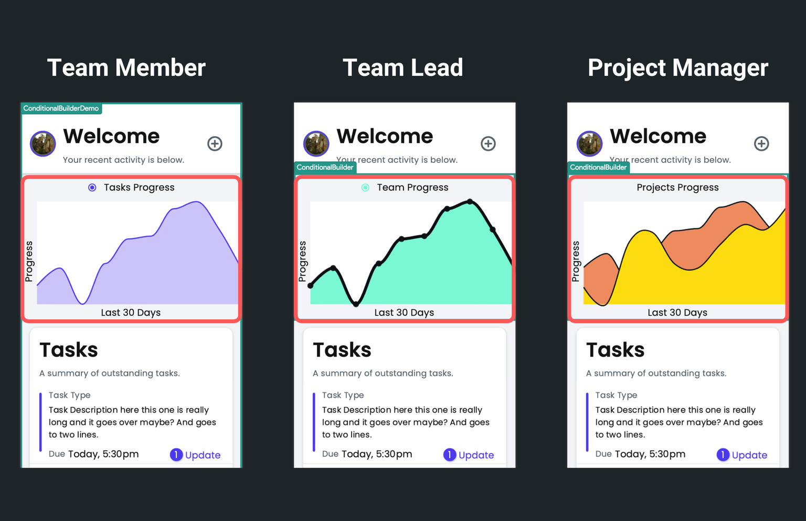

# Markdown

The Markdown widget is used to input and display text using [Markdown syntax](https://www.markdownguide.org/basic-syntax/). It allows you to format text easily, without the complexity of a full-fledged WYSIWYG (What You See Is What You Get) editor or the need to write HTML code.

You could use this widget in various applications like note-taking apps, forums, and blogging platforms. They are particularly popular in technical and coding communities for their ease of formatting code snippets and descriptions.

## Adding Markdown widget

To add a Markdown widget:

1. Open the [Widget Palette](../../../../intro/ff-ui/widget-palette.md) and locate the **Markdown** widget under the **Base Elements** tab. You can either drag it into your desired location or add it directly from the widget tree.
2. To display the markdown content, move to the [Properties Panel](../../../../intro/ff-ui/builder.md#properties-panel) and enter the text inside the **Data** section.
3. Optionally, you have the choice to make your Markdown content selectable. This can be adjusted using the **Selectable** property.

<iframe src="https://www.loom.
com/embed/e4c33cdb4bbf44e194dccbb3c357a317?sid=24c80624-af62-47d4-a60f-53b5f1faeaec" frameborder="0" allow="accelerometer; autoplay; clipboard-write; encrypted-media; gyroscope; picture-in-picture; web-share" referrerpolicy="strict-origin-when-cross-origin" allowfullscreen></iframe>

