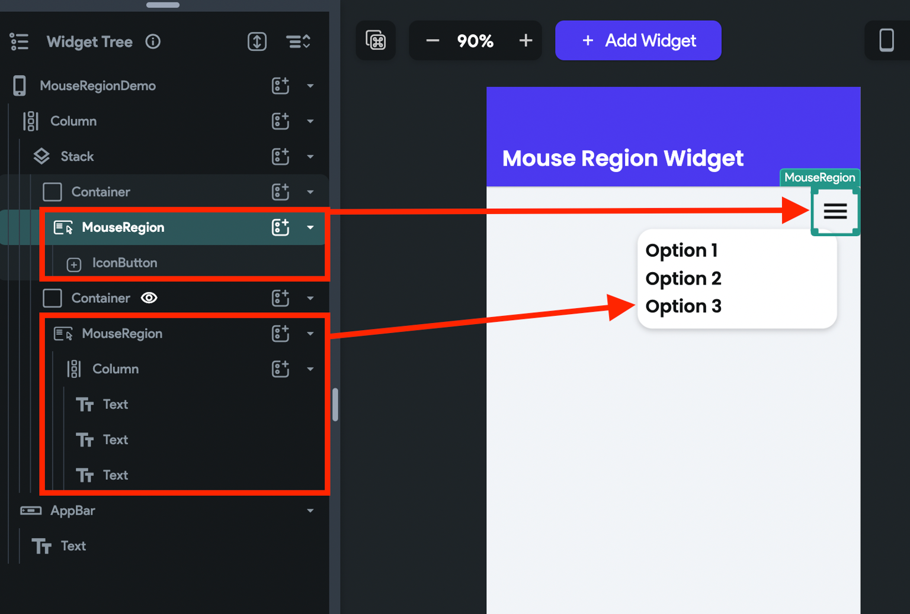

# MouseRegion

The `MouseRegion` widget lets you know whenever the mouse pointer enters or exits from a widget. You could use it to build a user experience (UX), such as animating buttons when a user hovers over them and revealing or hiding menu items when a user hovers over the menu icon.

On this page, you will learn how to [add the MouseRegion widget](#adding-mouseregion-widget), use it to [show/hide elements](#showhide-elements-using-mouseregion), and [customize](#customizing) it.

## Adding MouseRegion widget

Here are the step-by-step instructions to build such an example:

1. First, click on the **+ Add Widget** and drag the **MouseRegion** widget from the **Base 
Elements** tab or add it directly from the widget tree.
2. Add a [**Button**](../basic-widgets/button.md) (inside MouseRegion) 
   with [**On Action Trigger**](../../../../ff-concepts/animations/widget_animations.md#animation-on-action-trigger) animation.
3. Select the **MouseRegion** widget, select **Actions** from the Properties Panel (the right menu), and click **Open**. This will open an **Action flow Editor** in a new popup window.
4. Select the **On Mouse Enter** tab. Actions added under this will be triggered whenever the mouse enters the MouseRegion widget.
    1. Add the [Widget Animation](../../../../ff-concepts/animations/widget_animations.md) action to start the animation on a Button.
5. Select the **On Mouse Exit** tab. Actions added under this will be triggered whenever the mouse leaves the MouseRegion widget.
   1. Add the [Widget Animation](../../../../ff-concepts/animations/widget_animations.md) action to stop the animation on a Button.

    <iframe 
        src="https://demo.arcade.software/fyWTrN674CtK5JKZi8jA?embed&show_copy_link=true"
        title=""
        style={{
            position: 'absolute',
            top: 0,
            left: 0,
            width: '100%',
            height: '100%',
            colorScheme: 'light'
        }}
        frameborder="0"
        loading="lazy"
        webkitAllowFullScreen
        mozAllowFullScreen
        allowFullScreen
        allow="clipboard-write">
    </iframe>

## Show/hide elements using MouseRegion

Using the callbacks provided by the MouseRgion widget, you can show or hide a widget. The idea is to update the *App State* variable when the mouse pointer enters or exits the widget. And then use the same app state variable to add *Conditional Visibility* on a widget.

Let's see how to build the following example:

    <iframe 
        src="https://demo.arcade.software/nFzYivGMxumu0IsrPn4b?embed&show_copy_link=true"
        title=""
        style={{
            position: 'absolute',
            top: 0,
            left: 0,
            width: '100%',
            height: '100%',
            colorScheme: 'light'
        }}
        frameborder="0"
        loading="lazy"
        webkitAllowFullScreen
        mozAllowFullScreen
        allowFullScreen
        allow="clipboard-write">
    </iframe>

Here are the step-by-step instructions:

1. First, add the Stack **>** **Container** **> MouseRegion >** **IconButton** to display the menu 
icon.
2. Add the **Container > MouseRegion >** **Column** (with some menu items/options) inside the same Stack widget.

:::info[Note] 
Note that we wrapped the menu icon and its options inside the MouseRegion widget. In 
the next step, we will add the same actions for both MouseRegion widgets so that the menu options stay visible as long as you hover over them.
:::

3. Create a boolean [App State variable](../../../../resources/data-representation/app-state.md) 
   and use it 
to 
[add conditional visibility](../../widgets/widget-commonalities.md#conditional) 
   on menu options.
4. On both MouseRegion widgets, add an [update app state variable](../../../../resources/data-representation/app-state.md#update-app-state-action) action to set **True** when the mouse enters and **False** when the mouse exit.

<figure>
    

    <iframe 
        src="https://demo.arcade.software/QsKNBHezCkCylYsY6lDB?embed&show_copy_link=true"
        title=""
        style={{
            position: 'absolute',
            top: 0,
            left: 0,
            width: '100%',
            height: '100%',
            colorScheme: 'light'
        }}
        frameborder="0"
        loading="lazy"
        webkitAllowFullScreen
        mozAllowFullScreen
        allowFullScreen
        allow="clipboard-write">
    </iframe>

  <figcaption class="centered-caption">Use app state variable and MouseRegion to show/hide a widget</figcaption>
</figure>

## Customizing

You can customize the appearance and behavior of this widget using the various properties 
available under the **Properties Panel**.

### Customize mouse cursor

When a mouse enters the widget, its cursor will change to the appropriate one by default. However, you can also set it to a custom one if you wish to.

To customize the mouse cursor, select the **MouseRegion** widget, move to the properties panel, find the **Mouse Cursor** dropdown select the one you think fits best.

    <iframe 
        src="https://demo.arcade.software/vTu0IFhJzyfqHryY0GHU?embed&show_copy_link=true"
        title=""
        style={{
            position: 'absolute',
            top: 0,
            left: 0,
            width: '100%',
            height: '100%',
            colorScheme: 'light'
        }}
        frameborder="0"
        loading="lazy"
        webkitAllowFullScreen
        mozAllowFullScreen
        allowFullScreen
        allow="clipboard-write">
    </iframe>

