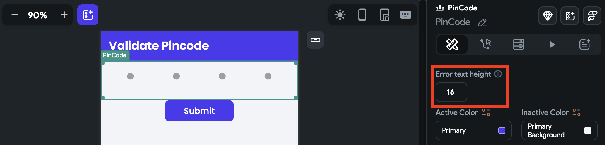
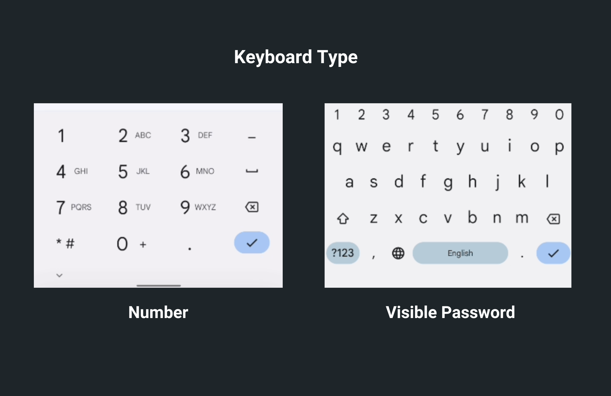
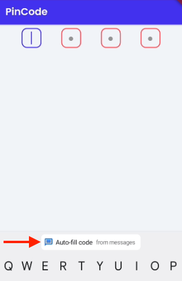

# PinCode

The PinCode widget allows you to enter the PIN or OTP. You could use this widget to verify the user identity or a transaction before making payments in fintech apps.

:::tip[Widget State]
Before diving into form widgets, check out our guide on [**Widget States**](../../../../ff-concepts/state-management/widget-state.md) to efficiently manage the state and behavior of your form elements.
:::

## Adding PinCode widget

To add a PinCode widget:

1. Open the [Widget Palette](../../../../intro/ff-ui/widget-palette.md) and locate the **PinCode** widget under the **Base Elements** tab. You can drag it into your desired location or add it directly from the widget tree or canvas area.
2. To increase the pin length (number of values users can enter), move to the properties panel, see the **Pin Length** property, and enter the value. **Note**: You can only set this value up to 8.
3. If you are using this widget to get a secret PIN from users, you can obscure it with a special character. To do so, enable the **Obscure Text** toggle and select the **Obscuring Character** among the *,-,?, and •.
4. You can also enable/disable the **Hint Text** toggle and select the **Hint Character** displayed when you haven't entered anything.

    <iframe 
        src="https://www.loom.com/embed/53ecfeb06e064a7ebd5994cbb9cc7fc5?sid=31c72410-7e5a-41d5-af86-a4504e5e6f8b"
        title=""
        style={{
            position: 'absolute',
            top: 0,
            left: 0,
            width: '100%',
            height: '100%',
            colorScheme: 'light'
        }}
        frameborder="0"
        loading="lazy"
        webkitAllowFullScreen
        mozAllowFullScreen
        allowFullScreen
        allow="clipboard-write">
    </iframe>

## Trigger action On Completed

Let's see how to trigger an action when you are done entering the value in this widget. This is helpful when you want to compare the entered value with the one stored in your backend.

    <iframe 
        src="https://demo.arcade.software/ZFvwMLCJxOUTDKX7j7KR?embed&show_copy_link=true"
        title=""
        style={{
            position: 'absolute',
            top: 0,
            left: 0,
            width: '100%',
            height: '100%',
            colorScheme: 'light'
        }}
        frameborder="0"
        loading="lazy"
        webkitAllowFullScreen
        mozAllowFullScreen
        allowFullScreen
        allow="clipboard-write">
    </iframe>

To do so:

1. Select the **PinCode** widget, select **Actions** from the Properties panel (the right menu), and click **+ Add Action**.
2. Set the **Type of Action** (aka callback) to **On Completed**. That means actions added under this will be called after the user has entered all PIN field values.
3. Now you can add any action here.

Here is an example of displaying a snackbar message that shows the entered value in the PinCode widget.

    <iframe 
        src="https://www.loom.com/embed/1fbb9539456947eba6036c6247542e25?sid=28f3f788-0111-4184-88ab-c3ee95351509"
        title=""
        style={{
            position: 'absolute',
            top: 0,
            left: 0,
            width: '100%',
            height: '100%',
            colorScheme: 'light'
        }}
        frameborder="0"
        loading="lazy"
        webkitAllowFullScreen
        mozAllowFullScreen
        allowFullScreen
        allow="clipboard-write">
    </iframe>

## Trigger action On Change

Let's see how to trigger an action whenever you enter or delete the value in each field of this widget. This is helpful when you want to provide immediate feedback to the user. For instance, you can check the validity of the entered digit as soon as the user types it in and show a message that it is not valid.

    <iframe 
        src="https://demo.arcade.software/Tu67UorxewVzqpgA5Rx8?embed&show_copy_link=true"
        title=""
        style={{
            position: 'absolute',
            top: 0,
            left: 0,
            width: '100%',
            height: '100%',
            colorScheme: 'light'
        }}
        frameborder="0"
        loading="lazy"
        webkitAllowFullScreen
        mozAllowFullScreen
        allowFullScreen
        allow="clipboard-write">
    </iframe>

To do so:

1. Select the **PinCode** widget, select **Actions** from the Properties panel (the right menu), and click **+ Add Action**.
2. Set the **Type of Action** (aka callback) to **On Change**. That means actions added under this will be called every time when a user enters each pin value.
3. Now you can add any action here.

Here is an example of displaying a snackbar message when a user enters a non-number value.

    <iframe 
        src="https://www.loom.com/embed/fe5cbade24854585b3a67b09354c80f2?sid=ed9d7cf1-015f-477c-8737-1de59c985d72"
        title=""
        style={{
            position: 'absolute',
            top: 0,
            left: 0,
            width: '100%',
            height: '100%',
            colorScheme: 'light'
        }}
        frameborder="0"
        loading="lazy"
        webkitAllowFullScreen
        mozAllowFullScreen
        allowFullScreen
        allow="clipboard-write">
    </iframe>

## Validation

You can validate the Pincode widget to see if a user has entered any value. To do so, wrap the Pincode widget inside the [**Form**](../../../../resources/forms/form-validation#adding-form-widget) widget, In the *Form* widget, enter the error message you want to display and then trigger the [**Validate Form**](../../../../resources/forms/form-validation#3-adding-validate-action) action. This will display an error message when a user tries to submit the form without a pincode value.

    <iframe 
        src="https://demo.arcade.software/iIPpBcXSnv1z3rcC6Qtf?embed&show_copy_link=true"
        title=""
        style={{
            position: 'absolute',
            top: 0,
            left: 0,
            width: '100%',
            height: '100%',
            colorScheme: 'light'
        }}
        frameborder="0"
        loading="lazy"
        webkitAllowFullScreen
        mozAllowFullScreen
        allowFullScreen
        allow="clipboard-write">
    </iframe>

You can also adjust the height to the error text from **Properties Panel > Error text height**.

## Customizing

You can customize the appearance and behavior of this widget using the various properties available under the properties panel.

### Changing keyboard type

When the keyboard opens by default, you can enter only numbers. But you might want to allow users to enter both letters and numbers. To do so, select the **PinCode** widget, move to the **Properties Panel** **> PinCode Properties >** set the **Keyboard Type** to the **Visible Password**.

### Using PinCode for secret pin

To make a *PinCode* a secret pin field, move to the **Properties Panel > Pin Code Properties >** enable the **Obscure Text**. Now, when you enter a value, it will be obscured with the star (*). You can change this symbol using the **Obscuring Character** dropdown.

    <iframe 
        src="https://www.loom.com/embed/b52e810f937d4ea5bcdec5807e7a5623?sid=3ac617d6-3b3c-4277-88ab-bf560f06aed8"
        title=""
        style={{
            position: 'absolute',
            top: 0,
            left: 0,
            width: '100%',
            height: '100%',
            colorScheme: 'light'
        }}
        frameborder="0"
        loading="lazy"
        webkitAllowFullScreen
        mozAllowFullScreen
        allowFullScreen
        allow="clipboard-write">
    </iframe>

### Setting hint character

A hint character refers to a special character or symbol that is displayed in each input field of the PinCode Widget to give users a visual clue about the expected input format. Hint characters are often used in combination with the actual input characters to guide users when entering a PIN or password.

To set the hint text, move to the **Properties Panel > Pin Code Properties > enable the Hint Text > set the Hint Character**.

    <iframe 
        src="https://www.loom.com/embed/700003546e2f48d3b2ee8450da5c88a0?sid=f934a291-81be-40b8-b851-fc5a6e7bd4a6"
        title=""
        style={{
            position: 'absolute',
            top: 0,
            left: 0,
            width: '100%',
            height: '100%',
            colorScheme: 'light'
        }}
        frameborder="0"
        loading="lazy"
        webkitAllowFullScreen
        mozAllowFullScreen
        allowFullScreen
        allow="clipboard-write">
    </iframe>

### Auto focus

When enabled, it mimics the tap event and immediately shows the keyboard. This makes *PinCode* widget ready to receive input from users without having to click on it. In case, you want to disable this behaviour, move to the **Properties Panel** **> Pin Code Properties >** disable the **Auto Focus** property.

    <iframe 
        src="https://www.loom.com/embed/4e492e55a3014319b3b82a67fa416856?sid=8acc9ff5-4313-4d01-a065-aa38163830b4"
        title=""
        style={{
            position: 'absolute',
            top: 0,
            left: 0,
            width: '100%',
            height: '100%',
            colorScheme: 'light'
        }}
        frameborder="0"
        loading="lazy"
        webkitAllowFullScreen
        mozAllowFullScreen
        allowFullScreen
        allow="clipboard-write">
    </iframe>

### Auto Fill

When this is enabled, it can read and auto fill the code from your messages app.

### Aligning pin code fields

By default, all the pin fields are aligned to *Space Evenly*. Meaning there will be equal space between each pin field.

The following options help you align the pin code fields:

- **Start**: Place pin code fields as close to the beginning as possible. 
- **Center**: Place pin code fields as close to the middle as possible.
- **End**: Place pin code fields as close to the end as possible.
- **Space Evenly**: Evenly space pin code fields.
- **Space Around**: Place the free space evenly between the pin code fields with some extra space at the beginning and end.
- **Space Between**: Place the free space evenly between the pin code fields.
To configure the space between and around the pin fields, select the **PinCode** widget, move to the properties panel, find the **Pin Code Alignment** property and select among the above options.

    <iframe 
        src="https://demo.arcade.software/wibrITSlEuquRbg68w2B?embed&show_copy_link=true"
        title=""
        style={{
            position: 'absolute',
            top: 0,
            left: 0,
            width: '100%',
            height: '100%',
            colorScheme: 'light'
        }}
        frameborder="0"
        loading="lazy"
        webkitAllowFullScreen
        mozAllowFullScreen
        allowFullScreen
        allow="clipboard-write">
    </iframe>

### Changing pin field shape and size

To change the pin field shape and size:

1. Select the **PinCode** widget, move to the properties panel, find the **Pin Field Shape** property, and here you can set the shape to **Box**, **Circle**, and **Underline**.
2. To change the height and width, enter the value in **Field Height**, and **Field Width** boxes.
3. To create a rounded border when the shape is set to *Box*, use the **Border Radius** and **Border Width** properties.

    <iframe 
        src="https://www.loom.com/embed/fa11e65c9c0a413fbae2f271bc9d4333?sid=77905cea-5db6-4d7b-8927-d70f0daaa3ed"
        title=""
        style={{
            position: 'absolute',
            top: 0,
            left: 0,
            width: '100%',
            height: '100%',
            colorScheme: 'light'
        }}
        frameborder="0"
        loading="lazy"
        webkitAllowFullScreen
        mozAllowFullScreen
        allowFullScreen
        allow="clipboard-write">
    </iframe>

### Change colors
You can change colors for the different states of the pin fields. To do so:

1. Select the **PinCode** widget, move to the properties panel, and change the colors for the following properties:
    - **Active Color**: This sets the border color when the value is entered.
    - **Inactive Color**: This sets the border color when there is no value.
    - **Selected Color**: This sets the border color when the cursor is inside the pin field and the user is about to enter the value.
2. To change the background color instead of only the border color, **Enable Active Fill**.

    <iframe 
        src="https://www.loom.com/embed/d8ccff9efd844c50a006b5004f09fd15?sid=f568dd9e-3adc-45c3-a6d5-88cdfb0b76db"
        title=""
        style={{
            position: 'absolute',
            top: 0,
            left: 0,
            width: '100%',
            height: '100%',
            colorScheme: 'light'
        }}
        frameborder="0"
        loading="lazy"
        webkitAllowFullScreen
        mozAllowFullScreen
        allowFullScreen
        allow="clipboard-write">
    </iframe>

### Customizing cursor

You can show/hide the cursor using the **Show Cursor** toggle and change the color using the **Cursor Color** property.

:::info[Clear pin code value]
See how to [**reset the pin code value**](../../../../resources/control-flow/user-interactivity/forms/form-actions/reset-form-field.md).
:::