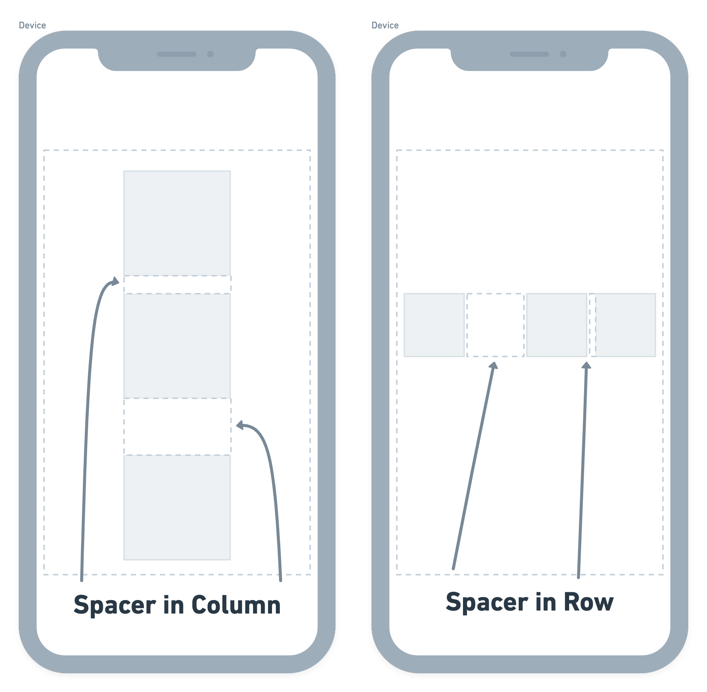

# Spacer

The [Spacer widget](https://www.youtube.com/watch?v=7FJgd7QN1zI) is used to insert a flexible empty
space between the children of the Column and Row widget.

If you want even space between your child widgets, you can add space by setting the **Main Axis
Alignment** to **Space Around**, **Space Evenly,** and **Space Between.** If you want a more
customized space between your child widgets (example below), you should use the Spacer Widget.

:::info
The Spacer widget takes all of the available space so the Spacer Widget will have no effect on a
Column or Row where the **Main Axis Alignment** is set to **Space Around**, **Space Evenly,** and **Space Between.**
:::

To use the Spacer widget, add it between the children of your Row or Column wherever you like, and set the flex value to a positive whole number. By default, it is set to 1.

<figure>
    
  <figcaption class="centered-caption">Spacer Example </figcaption>
</figure>

In the example above, we have added two Spacer widgets between the Row children. One is set to 3, therefore taking up three times more space than the other Spacer widget, which is set to 1.