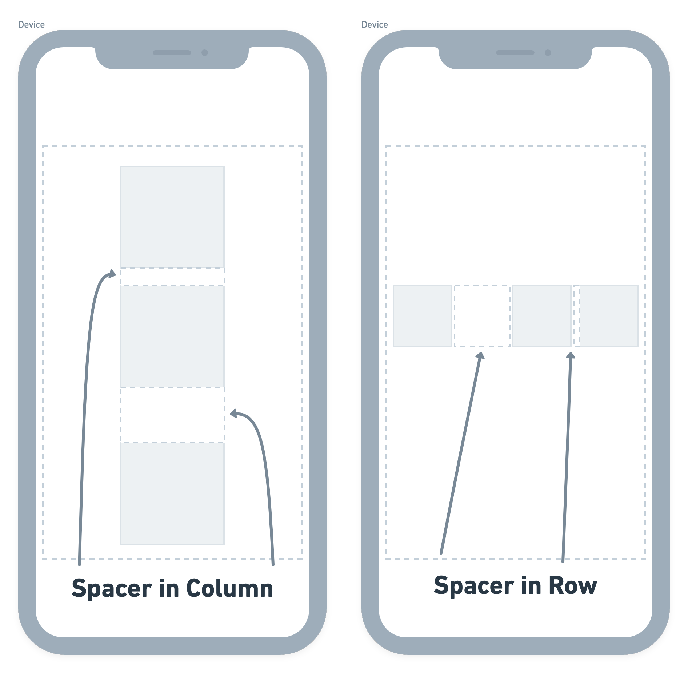
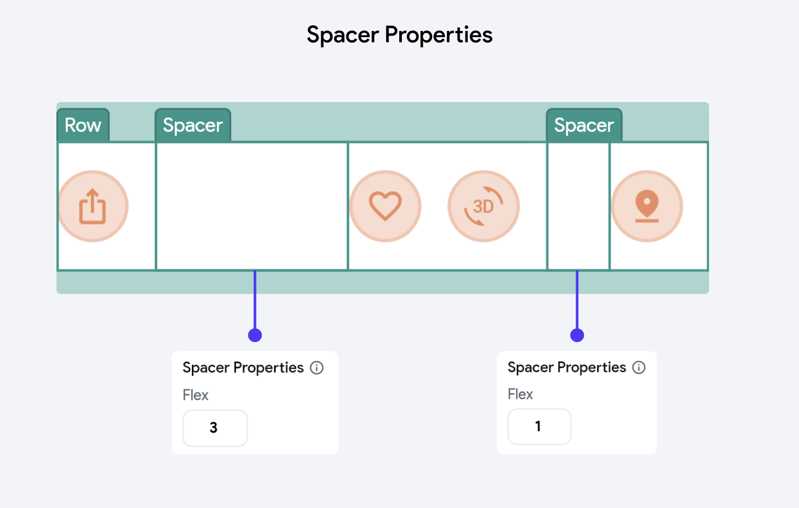

---
tags:
  - FlutterFlow
  - Resources
  - UI
title: Spacer
description: >-
  The Spacer widget is used to insert a flexible empty space between the
  children of the Column and Row widget.
keywords:
  - Spacer
  - Built In Widgets
  - Widgets
last_verified: 2026-09-02
---
# Spacer

The [Spacer widget](https://www.youtube.com/watch?v=7FJgd7QN1zI) is used to insert a flexible empty
space between the children of the Column and Row widget.

If you want even space between your child widgets, you can add space by setting the **Main Axis
Alignment** to **Space Around**, **Space Evenly,** and **Space Between.** If you want a more
customized space between your child widgets (example below), you should use the Spacer Widget.

:::info
Spacer consumes the Row or Column's remaining main-axis space. Once a Spacer consumes that space, **Space Around**, **Space Evenly**, and **Space Between** have no remaining free space to distribute.
:::

:::warning
Use Spacer only when the Row or Column has a bounded size on its main axis. For example, a Spacer in a vertically scrolling Column can cause an unbounded-height layout error. Use fixed padding or a SizedBox when the available space is unbounded.
:::

To use the Spacer widget, add it between the children of your Row or Column wherever you like, and set the flex value to a positive whole number. By default, it is set to 1.

<figure>
    
  <figcaption class="centered-caption">Spacer Example </figcaption>
</figure>

In the example above, we have added two Spacer widgets between the Row children. One is set to 3, therefore taking up three times more space than the other Spacer widget, which is set to 1.

## Verify the layout

Run the page at narrow and wide sizes. Confirm that each Spacer expands only along the parent Row or Column's main axis and that multiple Spacer widgets divide the free space in proportion to their positive integer **Flex** values.

## Related documentation

See [Rows, Columns, and Stacks](/resources/ui/widgets/composing-widgets/rows-column-stack) for main-axis layout and [Responsive Layout](/concepts/layouts/responsive-layout) for adapting spacing across breakpoints.
