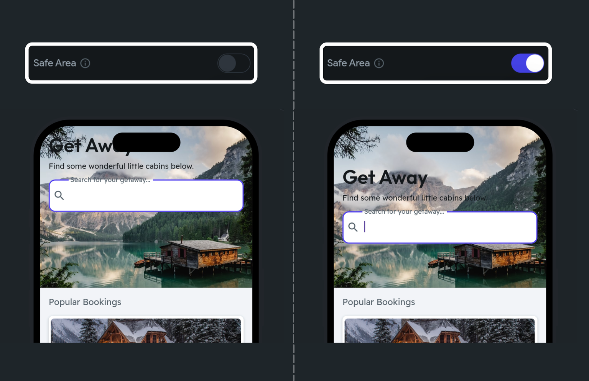
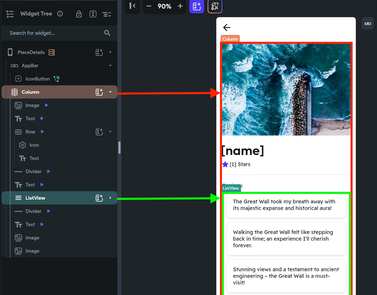
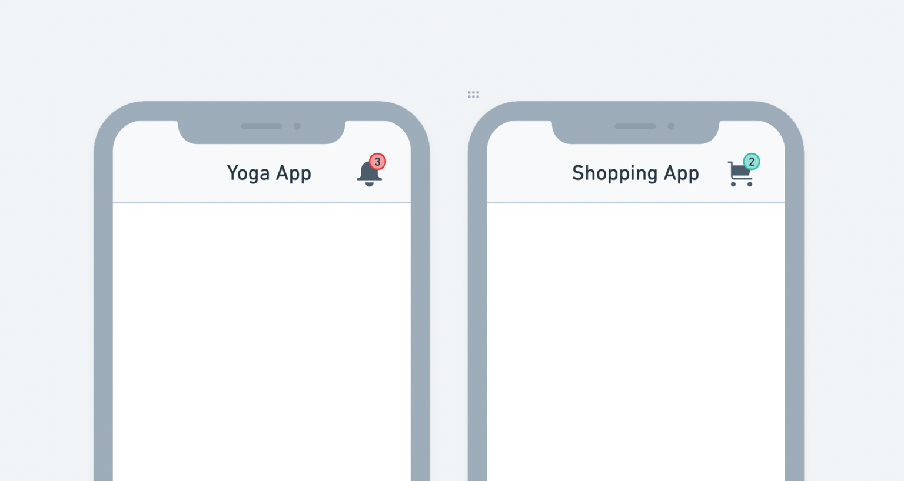

# StickyHeader

The StickyHeader widget is a special type of widget that allows the top part of a scrollable list to "stick" or remain visible at the top of a viewport while the rest of the content can be scrolled. As users scroll down, the sticky header remains fixed at the top, providing consistent context or navigation cues.

For instance, In data-heavy applications where users scroll through large data tables, sticky headers ensure that the column titles are always visible, enhancing usability and readability.

<figure>
    

    <iframe 
        src="https://demo.arcade.software/QBOHjQRfLrn1tCofcQdP?embed&show_copy_link=true"
        title=""
        style={{
            position: 'absolute',
            top: 0,
            left: 0,
            width: '100%',
            height: '100%',
            colorScheme: 'light'
        }}
        frameborder="0"
        loading="lazy"
        webkitAllowFullScreen
        mozAllowFullScreen
        allowFullScreen
        allow="clipboard-write">
    </iframe>

  <figcaption class="centered-caption">StickyHeader widget in action</figcaption>
</figure>

The StickyHeader widget consists of two primary sections: the *StickyHeader Header* and the *StickyHeader Content*.

* **StickyHeader Header**: This section contains the widget that remains fixed at the top while scrolling. It is typically used to display headers, titles, or important information that should stay visible at all times.
* **StickyHeader Content**: This section contains the scrollable widget, such as ListView or GridView, that holds the main content. It allows users to scroll through the content while the header remains in place.

:::caution[Please note]
For the StickyHeader widget to work, you must add it inside the scrollable widget, such as Column and ListView, and make them the **Primary** scrollable widget. **Note**: When you add it inside the Column, make sure you make the column **scrollable**. This enables the desired behavior of the header to stick at the top while the content scrolls.
:::

<figure>
    
  <figcaption class="centered-caption">StickyHeader sections</figcaption>
</figure>

## Adding StickyHeader widget

Let's see how you can use the StickyHeader widget as a replacement for the **AppBar** by building an example that contains a search bar as a sticky header.

Here's how it looks:

<figure>
    

    <iframe 
        src="https://demo.arcade.software/cvvFDg8mw7qcQmeQF06Q?embed&show_copy_link=true"
        title=""
        style={{
            position: 'absolute',
            top: 0,
            left: 0,
            width: '100%',
            height: '100%',
            colorScheme: 'light'
        }}
        frameborder="0"
        loading="lazy"
        webkitAllowFullScreen
        mozAllowFullScreen
        allowFullScreen
        allow="clipboard-write">
    </iframe>

  <figcaption class="centered-caption">Using a search bar as a sticky header widget</figcaption>
</figure>

Here are the steps to build such an example:

1. First, ensure you have a Column widget on a page. if not, add it. Also, make the Column widget **scrollable** and **Primary**.
2. Add the **StickyHeader** widget from the **Base Elements** tab.
3. Inside the **StickyHeader Header**, add a widget that you want to stay at the top when scrolling. For this example, it's the search bar.
4. Inside the **StickyHeader Content**, add the **ListView > Container** widgets to display a list of users.
5. Query and display a list of users in a ListView.

<iframe src="https://www.loom.
com/embed/fb1aa4fcb11240ce95f5e4539ee0c224?sid=c1e3773c-993d-4752-a5ff-770dde87545b" frameborder="0" allow="accelerometer; autoplay; clipboard-write; encrypted-media; gyroscope; picture-in-picture; web-share" referrerpolicy="strict-origin-when-cross-origin" allowfullscreen></iframe>

## Another example

When displaying a long list with categorized sections, such as a contacts list with alphabetical sections (A, B, C...), you can use the `StickyHeader` widget to keep the section headers (e.g., letters) visible as users scroll through the contact list.

The aim is to generate StickyHeader widgets corresponding to each letter. Inside each StickyHeader, display contacts matching its starting letter. By dynamically generating StickyHeader widgets per letter, we can provide a structured view with grouped contacts.

Here's how it looks when completed:

<figure>
    

    <iframe 
        src="https://demo.arcade.software/of8foZd2MMR5kMoq9IKa?embed&show_copy_link=true"
        title=""
        style={{
            position: 'absolute',
            top: 0,
            left: 0,
            width: '100%',
            height: '100%',
            colorScheme: 'light'
        }}
        frameborder="0"
        loading="lazy"
        webkitAllowFullScreen
        mozAllowFullScreen
        allowFullScreen
        allow="clipboard-write">
    </iframe>

  <figcaption class="centered-caption">Contact list page using StickyHeader widget</figcaption>
</figure>

Here are the steps to build such an example:

1. Prepare a list of letters starting from A-Z. You can use the `AppState` variable for this.

2. Prepare a list of contacts.

3. Add the **ListView > StickyHeader** widgets.

    1. In ListView, generate dynamic children from a variable that holds the letters.
    2. Inside the `StickyHeader` section, add a widget to display the current letter.

<iframe src="https://www.loom.
com/embed/39bb5fc9068f4a759a4b0d6fd62e3f16?sid=ed5c274e-f1e0-4830-9702-dd35ac2d6d51" frameborder="0" allow="accelerometer; autoplay; clipboard-write; encrypted-media; gyroscope; picture-in-picture; web-share" referrerpolicy="strict-origin-when-cross-origin" allowfullscreen></iframe>

4. Now, inside the *StickyHeader* *Content* section, add the **ListView** with a **Container** 
inside to display the list of matching contacts.

    1. On this ListView, generate dynamic children from a variable that holds all the contacts. But while doing so, filter the list and extract only matching contacts using [Code expression](../../../../resources/control-flow/functions/utility-functions.md#code-expressions).
    2. Now you can display the contact's details, such as name, inside the UI.

<iframe src="https://www.loom.
com/embed/990913b5d2ce4ae9b3884519d661ad5b?sid=74fb34c2-f08b-40e2-b0df-d0d42aa30f2b" frameborder="0" allow="accelerometer; autoplay; clipboard-write; encrypted-media; gyroscope; picture-in-picture; web-share" referrerpolicy="strict-origin-when-cross-origin" allowfullscreen></iframe>

