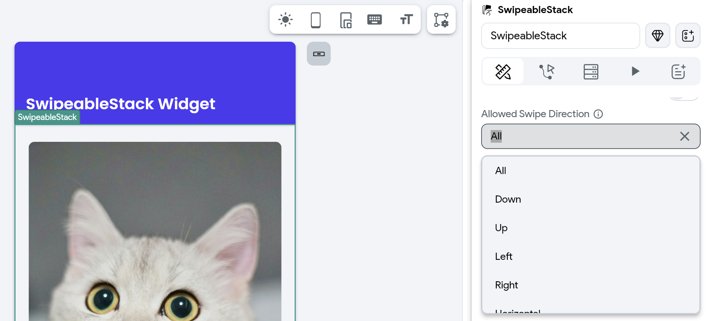

# SwipeableStack

The SwipeableStack is a widget designed to stack cards or content layers that users can swipe in any direction. It is commonly used in dating apps like Tinder for profile browsing.

    <iframe 
        src="https://www.loom.com/embed/e7f59a4565084bda8b1fd8182bb5b169?sid=d0489d7a-c9b2-46ba-b63a-e944b09633e0"
        title=""
        style={{
            position: 'absolute',
            top: 0,
            left: 0,
            width: '100%',
            height: '100%',
            colorScheme: 'light'
        }}
        frameborder="0"
        loading="lazy"
        webkitAllowFullScreen
        mozAllowFullScreen
        allowFullScreen
        allow="clipboard-write">
    </iframe>

## Adding SwipeableStack widget

To add a Stack widget:

1. Open the [Widget Palette](../../../../intro/ff-ui/widget-palette.md) and locate the **SwipeableStack** widget under the **Layout Elements** tab. You can drag it into your desired location or add it directly from the widget tree or canvas area.
2. By default, it adds four cards and is represented as **SwipeableStack Page**. To see another page in the canvas, move to the **Properties Panel >** set the **Active Page** to the card you want to see.
3. To add a new card, move to the **Properties Panel > Active Page >** click **+ Add Page**.
4. To delete any card, select the **SwipeableStack Page** (which you want to delete) from the widget tree or the canvas area and press the **Delete** key on the keyboard.
5. By default, SwipeableStack Page contains an Image widget; however, you can customize it as per your requirement. For example, if you want to create a Tinder like user experience, you could wrap (`⌘` + B) the default image widget inside the Stack widget and then add some more widgets.

    <iframe 
        src="https://www.loom.com/embed/c07a029c001c4a0faf4413f91246b310?sid=b79a41bb-e067-4dbd-9be2-a7819567c2ce"
        title=""
        style={{
            position: 'absolute',
            top: 0,
            left: 0,
            width: '100%',
            height: '100%',
            colorScheme: 'light'
        }}
        frameborder="0"
        loading="lazy"
        webkitAllowFullScreen
        mozAllowFullScreen
        allowFullScreen
        allow="clipboard-write">
    </iframe>

## Swipe card on the button press

You might want to allow users to swipe the cards with a button press—for instance, swiping a card left through an 'unlike' or 'reject' button, and right with a 'like' or 'accept' button.

    <iframe 
        src="https://www.loom.com/embed/5e6d86f975f64f4b81b80109426c77e2?sid=4fbae627-da87-423d-8c41-4bfa9301b5b0"
        title=""
        style={{
            position: 'absolute',
            top: 0,
            left: 0,
            width: '100%',
            height: '100%',
            colorScheme: 'light'
        }}
        frameborder="0"
        loading="lazy"
        webkitAllowFullScreen
        mozAllowFullScreen
        allowFullScreen
        allow="clipboard-write">
    </iframe>

Here's how you can swipe the card with a button press:

1. First add the [SwipeableStackwidget](#adding-swipeablestack-widget).
2. Add a couple of buttons inside.
3. Now, [add the Control SwipeableStack action](#control-swipeable-stack-action).

## Get notified on swipe

You might want to get a callback when the child widget (e.g., card) gets swiped and then add further actions. For example, updating the item (like or unlike flag) in the backend based on the swipe type (left or right).

Here is how you can get a callback when the child widgets get swiped:

1. Select the **SwipeableStack** widget.
2. Select **Actions** from the Properties panel and open **Action Flow Editor**.
3. Select the swipe type (among the **OnWidgetSwipe, OnLeftSwipe, OnRightSwipe, OnUpSwipe, On Down Swipe**) on which you would like to get a callback. If the swipe direction is not important to you, select **On Widget Swipe**.
4. Now you can add any action that will be triggered upon receiving the selected callback—for example, showing the Snackbar message on swipe.

    <iframe 
        src="https://www.loom.com/embed/73536e21a77e4fa1924dd48974e6eed1?sid=c765ff28-ce65-4eac-9cec-d370c8cff581"
        title=""
        style={{
            position: 'absolute',
            top: 0,
            left: 0,
            width: '100%',
            height: '100%',
            colorScheme: 'light'
        }}
        frameborder="0"
        loading="lazy"
        webkitAllowFullScreen
        mozAllowFullScreen
        allowFullScreen
        allow="clipboard-write">
    </iframe>

## Customizing

You can customize the appearance and behavior of this widget using the various properties available under the properties panel.

### Loop cards

To loop the cards in SwipeableStack, move to the **Properties Panel > SwipeableStack Properties >** turn on the **Loop** toggle.

### Allowed Swipe Direction
You can control the directions in which users can swipe cards by adjusting the **Allowed Swipe Direction** property. It enables you to customize how users interact with the SwipeableStack, letting you limit swipes to certain directions or enable swiping in any direction.

To do so, navigate to the **Properties Panel > SwipeableStack Properties > Allowed Swipe Direction**, and select one of the following options:

- **All**: Users can swipe in all directions.
- **Left**: Swipe only to the left.
- **Right**: Swipe only to the right.
- **Down**: Swipe only downward.
- **Up**: Swipe only upward.
- **Vertical**: Swipe up or down.
- **Horizontal**: Swipe left or right.

For example, in Tinder-like Swipeable Cards layout, you can set the **Allowed Swipe Direction** to **Horizontal**, enabling users to swipe left to "dislike" and right to "like" a profile.

### Customize card display count and scale

You can adjust how many cards are visible in the stack at one time and how they are scaled. This customization enhances the UX by letting you create a more engaging and visually appealing card stack, where the depth and hierarchy of cards can be easily perceived by users.

To do so, move to the **Properties Panel > SwipeableStack Properties >** enter the value in **Card Display Count** and **Next Card Scale**. For *Next Card Scale,* experiment with values ranging from 0.9 to 0.99 to achieve the desired visual effect.

    <iframe 
        src="https://www.loom.com/embed/06113eea1f6345788c66e330a3f2612a?sid=72b3decd-cffd-461d-b2bf-e5ec9a61b9cb"
        title=""
        style={{
            position: 'absolute',
            top: 0,
            left: 0,
            width: '100%',
            height: '100%',
            colorScheme: 'light'
        }}
        frameborder="0"
        loading="lazy"
        webkitAllowFullScreen
        mozAllowFullScreen
        allowFullScreen
        allow="clipboard-write">
    </iframe>

### Change swipe threshold

A "threshold" typically refers to the sensitivity of swipe gestures. It determines how much a user needs to swipe a card for it to be considered a complete swipe action. It accepts value between 0 and 1; the threshold set closer to 1 requires the user to swipe or drag the card further across the screen to trigger a swipe action.

To do so, move to the **Properties Panel > SwipeableStack Properties >** enter the value in **Swipe Threshold** property.

    <iframe 
        src="https://www.loom.com/embed/c97977ee73624ddc94f6f53b1f26a3d3?sid=341b96e9-3793-48e8-a08f-c1e49f663f85"
        title=""
        style={{
            position: 'absolute',
            top: 0,
            left: 0,
            width: '100%',
            height: '100%',
            colorScheme: 'light'
        }}
        frameborder="0"
        loading="lazy"
        webkitAllowFullScreen
        mozAllowFullScreen
        allowFullScreen
        allow="clipboard-write">
    </iframe>

### Set card swiping angle

You can control the tilt or rotation effect of cards as they are swiped. The *Max Angle* property allows you to set the maximum rotation angle a card can reach during a swipe gesture.

To do so, move to the **Properties Panel > SwipeableStack Properties >** enter the value (0-360) in **Max Angle** property.

    <iframe 
        src="https://www.loom.com/embed/b1c95dd80bde49fb8ced6e53d67ea610?sid=4a47662d-0cfb-4f0a-a92d-1c5bb0d6c688"
        title=""
        style={{
            position: 'absolute',
            top: 0,
            left: 0,
            width: '100%',
            height: '100%',
            colorScheme: 'light'
        }}
        frameborder="0"
        loading="lazy"
        webkitAllowFullScreen
        mozAllowFullScreen
        allowFullScreen
        allow="clipboard-write">
    </iframe>

### Change back card offset

You can control how the subsequent cards are visually offset relative to the top card, creating a layered effect. This enhances the visual depth and appeal of the card stack within the app.

To change the offset of the back cards move to the **Properties Panel > SwipeableStack Properties > Back Card Offset >** enter the values in **Horizontal** and **Vertical** boxes.

    <iframe 
        src="https://www.loom.com/embed/6239da42312b46c489ee2a45739d526d?sid=30d5ff46-e468-4596-ba7e-fe0bd48261f4"
        title=""
        style={{
            position: 'absolute',
            top: 0,
            left: 0,
            width: '100%',
            height: '100%',
            colorScheme: 'light'
        }}
        frameborder="0"
        loading="lazy"
        webkitAllowFullScreen
        mozAllowFullScreen
        allowFullScreen
        allow="clipboard-write">
    </iframe>

---
## Control Swipeable Stack [Action]

Using this action, you can swipe the widgets inside the SwipeableStack widget. For example, swiping the card left or right with the tap of a button.

### Types of card swipe

There are the following types of card swipes you can add:

- **Trigger Left Swipe**: Moves the current card from right to left.
- **Trigger Right Swipe**: Moves the current card from left to right.
- **Trigger Up Swipe**: Moves the current card upwards from bottom to top.
- **Trigger Down Swipe**: Moves the current card downwards from top to bottom.