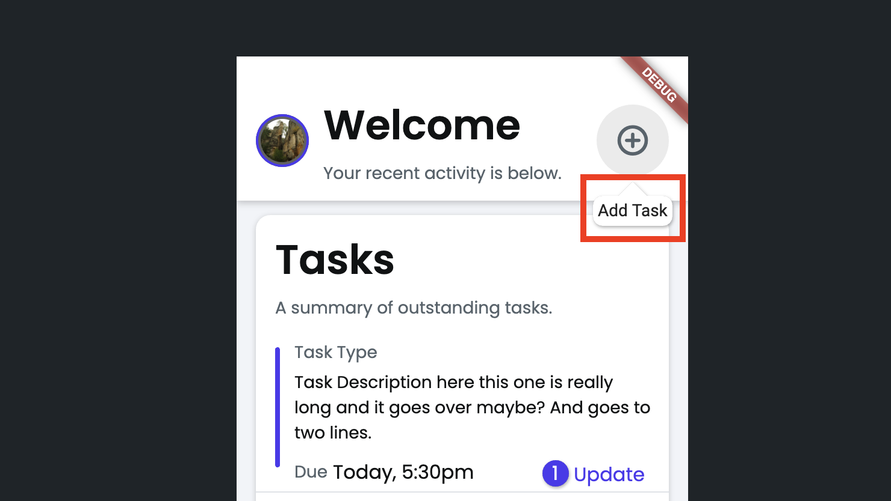
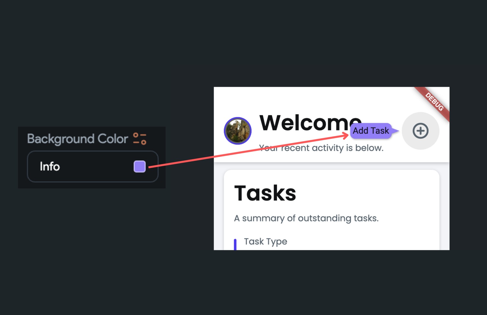
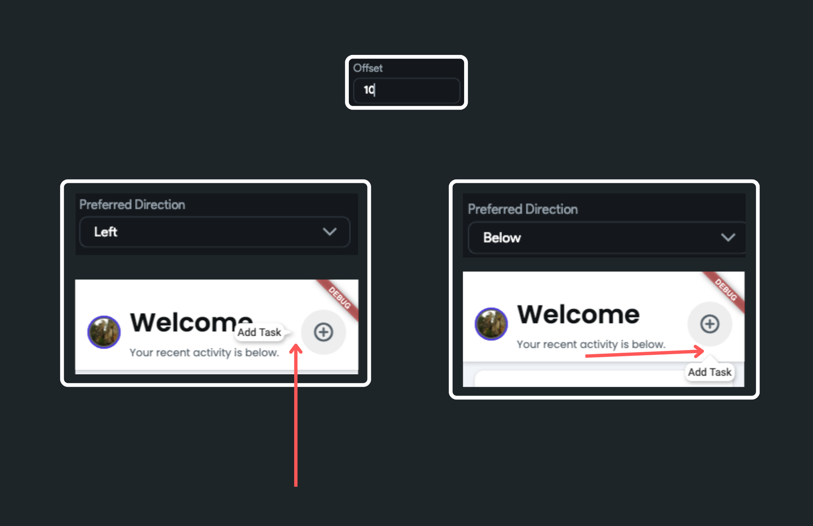
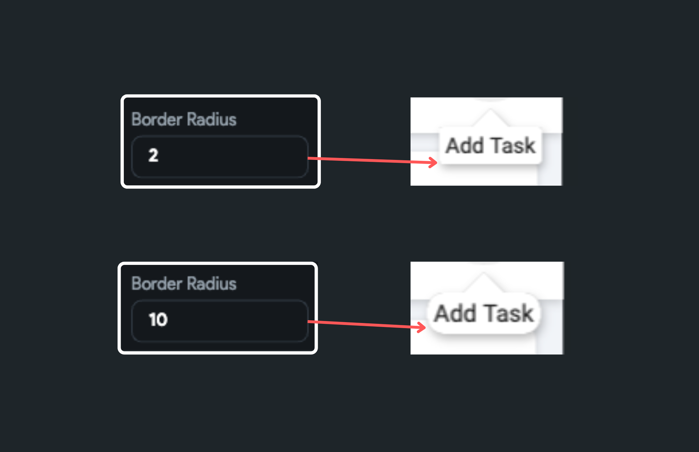
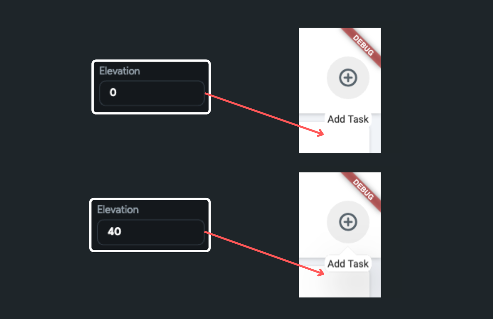
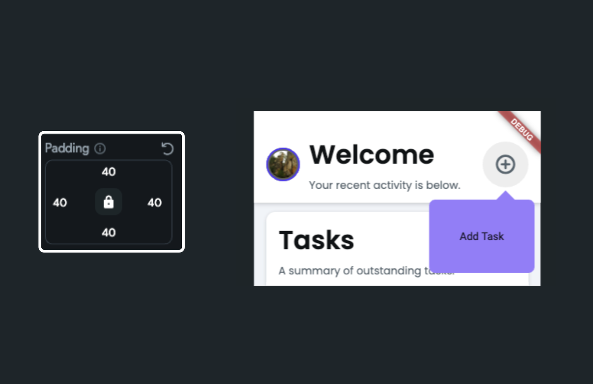

# Tooltip

The Tooltip widget provides additional information or visual cues of a widget in a small popup box. It appears when the user taps or long-presses the widget or hovers over it. It's typically used to provide an explanation about the function of a widget.

:::info
It is not frequently used on touch devices where tapping or long-pressing can initiate other actions. But they can be incredibly useful in the desktop environment where hover functionality is available.
:::

## Adding Tooltip widget

To add the *Tooltip* widget to your app:

1. Identify the widget you want to provide a description for and right-click on it. Select **Wrap 
Widget** and then select **Tooltip** widget.
2. Now select the **Tooltip** widget, move to the **Properties Panel > Message > Text**, and enter the message you want to display.

    <iframe 
        src="https://demo.arcade.software/DKBr9UPnDliuVPrekbuW?embed&show_copy_link=true"
        title=""
        style={{
            position: 'absolute',
            top: 0,
            left: 0,
            width: '100%',
            height: '100%',
            colorScheme: 'light'
        }}
        frameborder="0"
        loading="lazy"
        webkitAllowFullScreen
        mozAllowFullScreen
        allowFullScreen
        allow="clipboard-write">
    </iframe>

## Customizing

You can customize the appearance and behavior of this widget using the various properties 
available under the Properties Panel.

### Component as Tooltip

Sometimes, you may want to display more than just text in a tooltip—such as images, icons, buttons, or other custom components. For example, in an e-commerce app, a tooltip could show a detailed breakdown of customer reviews when users hover over the overall rating.

To achieve this, simply set the **Tooltip Type** to **Component** and select the custom component you'd like to display.

    <iframe 
        src="https://demo.arcade.software/jnFUZZQ9pmCH5vgvhVVA?embed&show_copy_link=true"
        title=""
        style={{
            position: 'absolute',
            top: 0,
            left: 0,
            width: '100%',
            height: '100%',
            colorScheme: 'light'
        }}
        frameborder="0"
        loading="lazy"
        webkitAllowFullScreen
        mozAllowFullScreen
        allowFullScreen
        allow="clipboard-write">
    </iframe>

To display dynamic content in tooltips, you can create a wrapper component that accepts a [**WidgetBuilder**](../../components/widget-builder-parameters.md) as a parameter and use this component within the tooltip.

Here’s exactly how you do it:

    <iframe 
        src="https://demo.arcade.software/vFDY8DNskFzGWKFFmlM4?embed&show_copy_link=true"
        title=""
        style={{
            position: 'absolute',
            top: 0,
            left: 0,
            width: '100%',
            height: '100%',
            colorScheme: 'light'
        }}
        frameborder="0"
        loading="lazy"
        webkitAllowFullScreen
        mozAllowFullScreen
        allowFullScreen
        allow="clipboard-write">
    </iframe>

### Change trigger mode

On touch devices, the *Tooltip* opens on tap. To make it open on long press instead, use the **Trigger Mode** property.

### Change tooltip alignment

By default, the *Tooltip* appears below the target widget. You can change this setting using the **Preferred Direction** property. This allows you to open the Tooltip **Above**, **Left,** and **Right** directions in addition to the **Below**.

    <iframe 
        src="https://demo.arcade.software/m3AvKjAFREonuvITk9Sw?embed&show_copy_link=true"
        title=""
        style={{
            position: 'absolute',
            top: 0,
            left: 0,
            width: '100%',
            height: '100%',
            colorScheme: 'light'
        }}
        frameborder="0"
        loading="lazy"
        webkitAllowFullScreen
        mozAllowFullScreen
        allowFullScreen
        allow="clipboard-write">
    </iframe>

### Customize tail size

To change the tail's size, you can use the **Tail Width** and **Tail Lenght** properties.

    <iframe 
        src="https://demo.arcade.software/FjlmVtguwO4OjyB2BdtE?embed&show_copy_link=true"
        title=""
        style={{
            position: 'absolute',
            top: 0,
            left: 0,
            width: '100%',
            height: '100%',
            colorScheme: 'light'
        }}
        frameborder="0"
        loading="lazy"
        webkitAllowFullScreen
        mozAllowFullScreen
        allowFullScreen
        allow="clipboard-write">
    </iframe>

### Changing background color

You can change the Tooltip's background color using the **Background Color** property.

### Set tooltip offset

By setting the tooltip offset, you can adjust the space between the tooltip and the target widget. To do so, move to the **Properties Panel >** set the **Offset** value.

### Customize border radius

To change the rounded corner of the Tooltip widget, move to the **Properties Panel >** set the **Border Radius** property.

### Elevate tooltip

To add a shadow or to create a sense of depth on this widget, you can use the **Elevation** property. It allows a widget to stand out, making it appear like it's floating above the surface of the UI, ultimately making the tooltip more noticeable.

toolt
### Set internal padding

In case you want to add some space around the tooltip message, navigate to the **Properties Panel >** set the **Padding** property.

### Change wait duration

The wait duration specifies the amount of time that the Tooltip widget waits before it displays. To change this setting, move to the **Properties Panel >** set the **Wait Duration** value.

    <iframe 
        src="https://demo.arcade.software/1QNwHqcvgzN1HGZRS1WT?embed&show_copy_link=true"
        title=""
        style={{
            position: 'absolute',
            top: 0,
            left: 0,
            width: '100%',
            height: '100%',
            colorScheme: 'light'
        }}
        frameborder="0"
        loading="lazy"
        webkitAllowFullScreen
        mozAllowFullScreen
        allowFullScreen
        allow="clipboard-write">
    </iframe>

### Change show duration

The show duration specifies the duration for which the Tooltip widget continues to be displayed on the screen, even after the user has navigated away from it. As a best practice, it's often recommended to set this value to zero. This ensures that the tooltip disappears instantly once the user navigates away.

To change the default duration, move to the **Properties Panel >** set the **Show Duration** value.

    <iframe 
        src="https://demo.arcade.software/k3vqhFfHRAcDgcvzPVde?embed&show_copy_link=true"
        title=""
        style={{
            position: 'absolute',
            top: 0,
            left: 0,
            width: '100%',
            height: '100%',
            colorScheme: 'light'
        }}
        frameborder="0"
        loading="lazy"
        webkitAllowFullScreen
        mozAllowFullScreen
        allowFullScreen
        allow="clipboard-write">
    </iframe>

