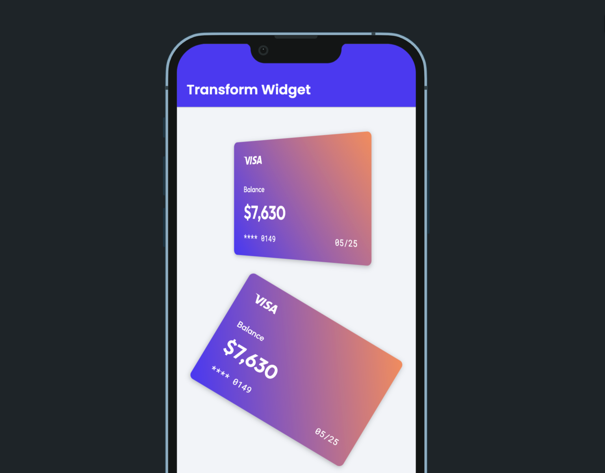

# Transform

The `Transform` widget applies graphic transformations such as skew (or tilt), rotate, scale, and translate (or slide) to its child widget. You could use this widget in combination with animations to build visually engaging apps.

## Adding Transform widget

To add a Transform widget to your app:

1. First, click on the **+ Add Widget**, drag the **Transform** widget from the **Base Elements** 
tab, or add it directly from the widget tree.

2. Add a child widget inside the Transform widget that you want to transform.
3. By default, the transformation applied to a child widget is the **Skew** transformation. This type of transformation allows you to tilt the child widget, i.e., top and bottom or the left and right sides no longer remain to be parallel. To add/customize tilt to the child widget:

    1. Select the **Transform** widget and move to the properties panel.
    5. To add tilt in the horizontal direction, find the **Skew X** property and use the slider or directly enter the value into the box. The positive value will move the top side to the left and the bottom side to the right.
    8. To add tilt in the vertical direction, use the **Skew Y** property. The positive value will move the left side in an upward direction and the right side in a downward direction.
    11. The negative value will move the sides in the opposite direction.
4. Optional: To change the position of the origin (a center of the transform widget), you can use the **Transform Orgin and Alignment** options.

    <iframe 
        src="https://demo.arcade.software/WrRdoc4FGhUxVLA3bwIE?embed&show_copy_link=true"
        title=""
        style={{
            position: 'absolute',
            top: 0,
            left: 0,
            width: '100%',
            height: '100%',
            colorScheme: 'light'
        }}
        frameborder="0"
        loading="lazy"
        webkitAllowFullScreen
        mozAllowFullScreen
        allowFullScreen
        allow="clipboard-write">
    </iframe>

## Customizing

You can customize the appearance and behavior of this widget using the various properties available under the [Properties Panel](../../../../intro/ff-ui/builder.md#properties-panel).

### Changing transform type

To change the transform type, select the **Transform** widget, move to the properties panel, find the **Transform Type** dropdown and choose the desired one.

* For **Scale** type, use the **Scale X** property to increase or decrease the size in the horizontal direction. Use the **Scale Y** property to change the size in the vertical direction. For example, If you enter 0.5, it will make the widget half the size, whereas value two will make the widget twice its size.

    <iframe 
        src="https://demo.arcade.software/PcuzlbUjcBR9Yy7l9uQX?embed&show_copy_link=true"
        title=""
        style={{
            position: 'absolute',
            top: 0,
            left: 0,
            width: '100%',
            height: '100%',
            colorScheme: 'light'
        }}
        frameborder="0"
        loading="lazy"
        webkitAllowFullScreen
        mozAllowFullScreen
        allowFullScreen
        allow="clipboard-write">
    </iframe>

* For **Rotate** type, use the **Rotate (degree)** property to turn the widget. The value must be in degrees (i.e., 0 to 360). By default, the widget rotates in a clockwise direction. To turn the widget anticlockwise, enter the negative value.

    <iframe 
        src="https://demo.arcade.software/G4O5Uw6xnTt75EUx72oN?embed&show_copy_link=true"
        title=""
        style={{
            position: 'absolute',
            top: 0,
            left: 0,
            width: '100%',
            height: '100%',
            colorScheme: 'light'
        }}
        frameborder="0"
        loading="lazy"
        webkitAllowFullScreen
        mozAllowFullScreen
        allowFullScreen
        allow="clipboard-write">
    </iframe>

* For **Translate** type:
	+ Set the **Translate X** property to slide the widget in horizontal direction. The positive value will move the widget in the right direction, whereas the negative value will move in the left direction.
	+ Set the **Translate Y** property to slide the widget in the vertical direction. The positive value will move the widget in a downward direction, whereas the negative value will move in an upward direction.

    <iframe 
        src="https://demo.arcade.software/AGK0hFPfcmhVmbipxAj7?embed&show_copy_link=true"
        title=""
        style={{
            position: 'absolute',
            top: 0,
            left: 0,
            width: '100%',
            height: '100%',
            colorScheme: 'light'
        }}
        frameborder="0"
        loading="lazy"
        webkitAllowFullScreen
        mozAllowFullScreen
        allowFullScreen
        allow="clipboard-write">
    </iframe>

