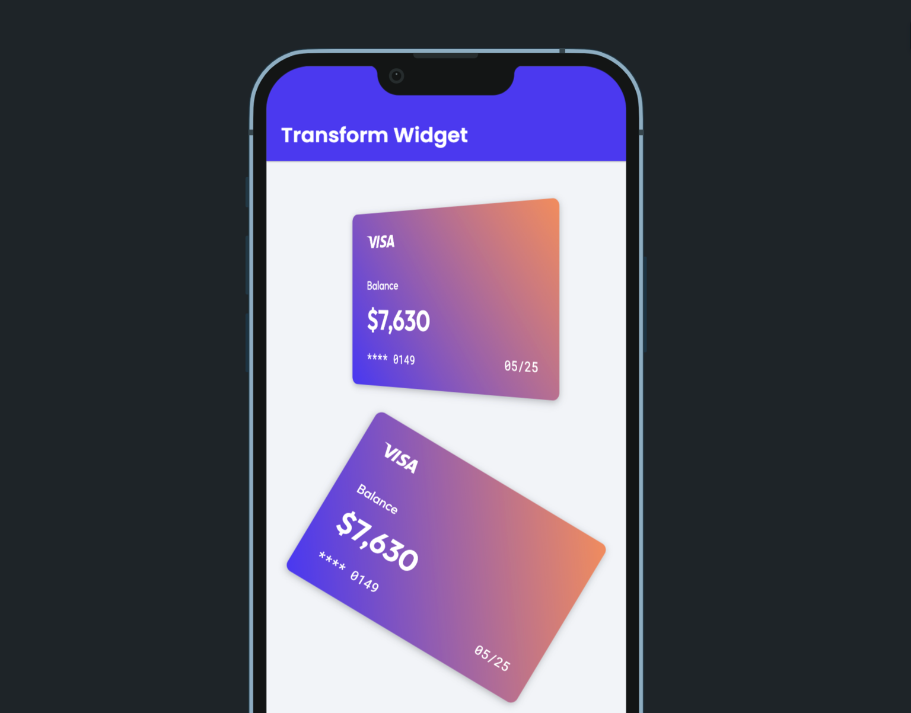

---
tags:
  - FlutterFlow
  - Resources
  - UI
title: Transform
description: >-
  The widget applies graphic transformations such as skew (or tilt), rotate,
  scale, and translate (or slide) to its child widget.
keywords:
  - Transform
  - Built In Widgets
  - Widgets
last_verified: 2026-09-02
---
# Transform

The `Transform` widget applies graphic transformations such as skew (or tilt), rotate, scale, and translate (or slide) to its child widget. You could use this widget in combination with animations to build visually engaging apps.

## Adding Transform widget

To add a Transform widget to your app:

1. First, click on the **+ Add Widget**, drag the **Transform** widget from the **Base Elements**
tab, or add it directly from the widget tree.

2. Add a child widget inside the Transform widget that you want to transform.
3. A new Transform starts as **Rotate** with an angle of 0 degrees, so it does not initially change the child. To apply a skew instead, set **Transform Type** to **Skew**, then configure it:

    1. Select the **Transform** widget and open the Properties panel.
    2. Set **Skew X** for horizontal skew and **Skew Y** for vertical skew. These values are angular inputs; small values produce the most predictable result.
    3. Use negative values to reverse the direction.
4. For Scale, Skew, or Rotate, use **Transform Origin and Alignment** to change the pivot alignment and its horizontal or vertical offset. Translate does not expose origin controls because it moves the whole painted child.

    <iframe
        src="https://demo.arcade.software/WrRdoc4FGhUxVLA3bwIE?embed&show_copy_link=true" title="Transform interactive tutorial"
        style={{
            position: 'absolute',
            top: 0,
            left: 0,
            width: '100%',
            height: '100%',
            colorScheme: 'light'
        }}
        frameborder="0"
        loading="lazy"
        webkitAllowFullScreen
        mozAllowFullScreen
        allowFullScreen
        allow="clipboard-write">
    </iframe>

## Customizing

You can customize the appearance and behavior of this widget using the various properties available under the [Properties Panel](../../../../intro/ff-ui/builder.md#properties-panel).

### Changing transform type

To change the transform type, select the **Transform** widget, move to the properties panel, find the **Transform Type** dropdown and choose the desired one.

* For **Scale** type, use the **Scale X** property to increase or decrease the size in the horizontal direction. Use the **Scale Y** property to change the size in the vertical direction. For example, If you enter 0.5, it will make the widget half the size, whereas value two will make the widget twice its size.

    <iframe
        src="https://demo.arcade.software/PcuzlbUjcBR9Yy7l9uQX?embed&show_copy_link=true" title="Transform interactive tutorial"
        style={{
            position: 'absolute',
            top: 0,
            left: 0,
            width: '100%',
            height: '100%',
            colorScheme: 'light'
        }}
        frameborder="0"
        loading="lazy"
        webkitAllowFullScreen
        mozAllowFullScreen
        allowFullScreen
        allow="clipboard-write">
    </iframe>

* For **Rotate**, use **Rotate (degree)**. The editor slider covers 0–360 degrees; a value supplied through a variable may also be negative to rotate in the opposite direction.

    <iframe
        src="https://demo.arcade.software/G4O5Uw6xnTt75EUx72oN?embed&show_copy_link=true" title="Transform interactive tutorial"
        style={{
            position: 'absolute',
            top: 0,
            left: 0,
            width: '100%',
            height: '100%',
            colorScheme: 'light'
        }}
        frameborder="0"
        loading="lazy"
        webkitAllowFullScreen
        mozAllowFullScreen
        allowFullScreen
        allow="clipboard-write">
    </iframe>

## Layout, hit testing, and animation

Transform changes how its child is painted; the parent still lays out the widget at its original size and position. Leave enough surrounding space to avoid visual clipping or overlap, and test taps after translating, rotating, or scaling an interactive child.

**Implicit Animation** is available for Scale and Rotate. Enabling it defaults to an ease-in-out curve over 300 milliseconds and animates later value changes. Animated Scale is uniform and uses **Scale X** as its scale value; keep Scale X and Scale Y equal when animation is enabled. Skew and Translate do not support Transform's implicit-animation option.

## Verify the result

Run the page and test the transform at its minimum, maximum, and neutral values. Confirm the pivot, direction, clipping, hit target, and any implicit animation. For responsive screens, test multiple sizes because a visual translation does not reserve new layout space.

* For **Translate** type:
	+ Set the **Translate X** property to slide the widget in horizontal direction. The positive value will move the widget in the right direction, whereas the negative value will move in the left direction.
	+ Set the **Translate Y** property to slide the widget in the vertical direction. The positive value will move the widget in a downward direction, whereas the negative value will move in an upward direction.

    <iframe
        src="https://demo.arcade.software/AGK0hFPfcmhVmbipxAj7?embed&show_copy_link=true" title="Transform interactive tutorial"
        style={{
            position: 'absolute',
            top: 0,
            left: 0,
            width: '100%',
            height: '100%',
            colorScheme: 'light'
        }}
        frameborder="0"
        loading="lazy"
        webkitAllowFullScreen
        mozAllowFullScreen
        allowFullScreen
        allow="clipboard-write">
    </iframe>

