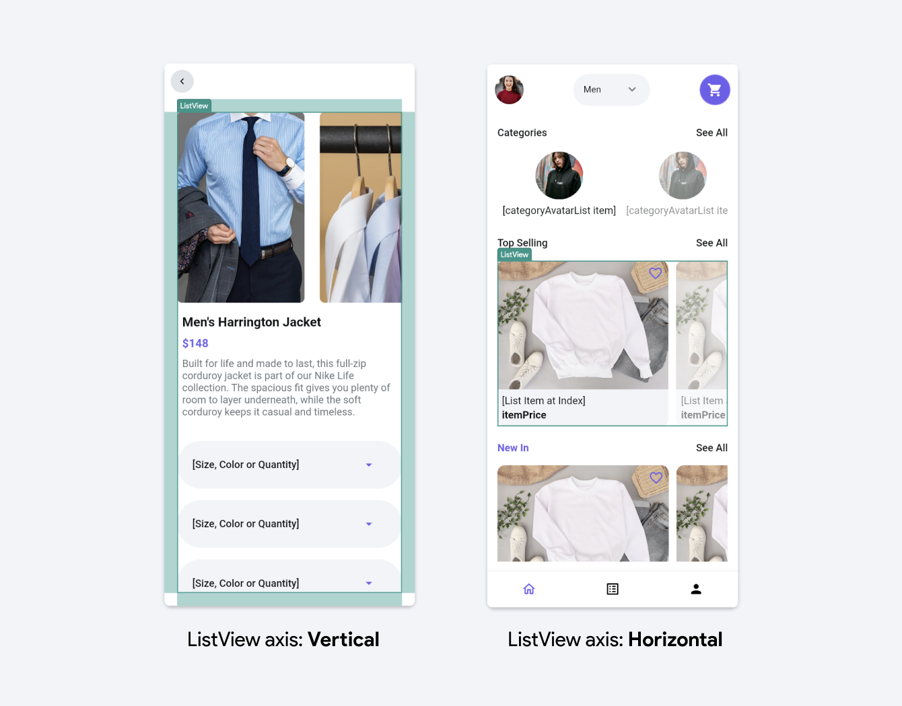
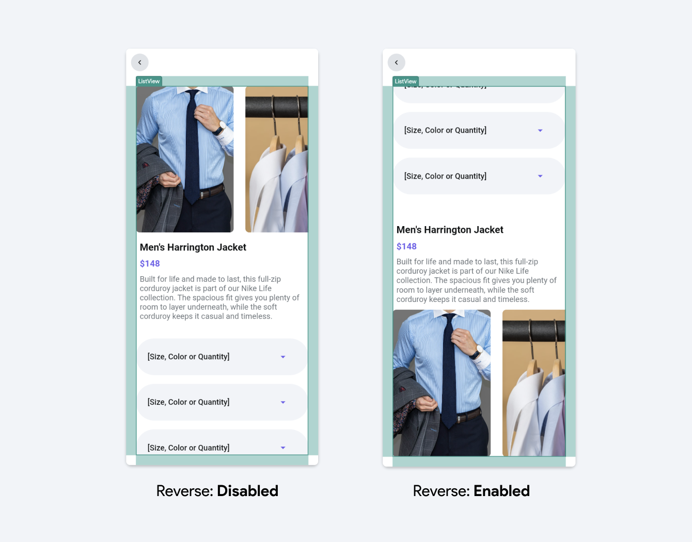
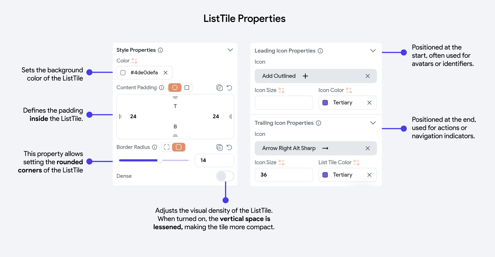
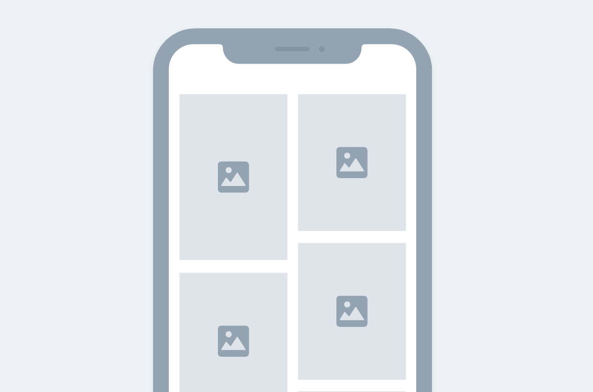

In FlutterFlow, `ListView` and `GridView` are versatile widgets designed for displaying lists and grids of elements, respectively. Both are highly customizable and optimized for dynamic content, making them essential for any app that requires scrolling through a collection of items such as images, text, or interactive elements.

## ListView Widget

ListView is a scrollable list of widgets arranged linearly. It is ideal for scenarios where items need to be displayed one after another, either **vertically or horizontally**.

It is particularly useful for efficiently rendering long lists. Only the items visible on the screen are rendered, enhancing performance for lists with many elements.

You can customize the ListView using the following properties:

### Axis

The **Axis** property sets the orientation of the ListView. Select **Vertical** or **Horizontal**, depending on how you want the list to scroll.



### Spacing

- **Items Spacing:** Defines the space, in pixels, between individual items in the ListView.

:::tip[Items Spacing vs Padding]
For static lists, set **Items Spacing** on the parent row or column instead of adding padding to individual elements. This helps maintain consistent spacing.
:::

- **Apply to Start & End:** Applies the item spacing to the beginning and end of the ListView, in addition to the spacing between items.

- **Start Spacing and End Spacing:** Sets additional spacing at the beginning and end of the ListView independently from the spacing between items.

### Advanced Properties {#advanced-functionalities}

- **Shrink Wrap:** When enabled, the ListView sizes itself to the combined size of its children, so it does not take up more space than necessary. This is useful for lists whose items fit within the available constraints.

- **Primary:** If set to true, the ListView will act as the primary scrolling view in the context. This usually affects how the view interacts with other scrolling views and whether it stretches to fill the viewport. [**See more info here**](#primary-property).

- **Reverse:** When enabled, this property reverses the order in which items appear in the ListView. For a vertical list, items start from the bottom; for a horizontal list, they start from the right.



### Reorderable List

Enable this option to allow users to reorder items in the list. On web and desktop, FlutterFlow adds drag handles. On mobile, users can reorder an item by long-pressing it.

:::info[Note]
Reordering does not automatically persist the updated item order. Use the **On Reorder** action trigger to define how the new order should be saved.
:::

:::danger[Contents of a Reorderable List]
A **Reorderable ListView** must have dynamic children; otherwise, enabling this option will cause an error.
:::

Follow these steps to set up a Reorderable ListView:

#### Using an App State Variable

1. Create an App State variable containing a few items of type `String`, and display them in the ListView.
2. Select the ListView, go to **Properties Panel > ListView Properties**, and enable **Reorderable**.
3. Open the **Actions** section in the properties panel and then open the **Action Flow Editor**.
4. Select the **On Reorder** action trigger. Actions added under this trigger run after a user repositions an item in the interface.
5. Create a custom action that updates the item's position in the source list. Add three arguments for the list, the **Old Index**, and the **New Index**. You can access the old and new index values from **Set Variable > Reorderable ListView**.
6. Use the following custom code:

```jsx
// Define a function called `reorderItems` that returns a Future
// containing a reordered list of strings.
Future<List<String>> reorderItems(
  List<String> list,
  int oldIndex,
  int newIndex,
) async {
  // If the item is being moved further down the list, adjust the
  // destination index because removing the item shifts the indices.
  if (oldIndex < newIndex) {
    newIndex -= 1;
  }

  // Remove the item from its original position.
  final item = list.removeAt(oldIndex);

  // Insert the item at its new position.
  list.insert(newIndex, item);

  // Return the updated list.
  return list;
}
```

7. Use the list returned by the custom action to update the original list with the **Update App State** action.

<div style={{
    position: 'relative',
    paddingBottom: 'calc(56.67989417989418% + 41px)', // Keeps the aspect ratio and additional padding
    height: 0,
    width: '100%'}}>
    <iframe
        src="https://demo.arcade.software/SvDZFuPzJCon7gkZHt18?embed&show_copy_link=true"
        title="Create a reorderable ListView"
        style={{
            position: 'absolute',
            top: 0,
            left: 0,
            width: '100%',
            height: '100%',
            colorScheme: 'light'
        }}
        frameBorder="0"
        loading="lazy"
        webkitAllowFullScreen
        mozAllowFullScreen
        allowFullScreen
        allow="clipboard-write">
    </iframe>
</div>
<p></p>

#### Reordering Items in a Firestore Query

To reorder items retrieved from a Firestore collection query, follow the previous steps with these changes.

:::danger[Caution]
Reordering items in a Firestore query is best suited for smaller lists. For larger datasets, this method can be inefficient and might lead to performance issues. Additionally, frequent writes and updates to Firestore can increase costs significantly.
:::

1. Create an `order` field in the collection.
2. Order the collection query by the `order` field.
3. Ensure that infinite scroll is disabled.
4. Replace the custom action code with the following code:

```jsx
Future reorderFirebaseItems(
  List<PlaylistRecord> list,
  int oldIndex,
  int newIndex,
) async {
  // If the item is being moved down the list, we adjust the newIndex.
  if (oldIndex < newIndex) {
    newIndex -= 1;
  }

  // Remove the item from its current position in the list.
  final PlaylistRecord item = list.removeAt(oldIndex);

  // Insert the item into its new position.
  list.insert(newIndex, item);

  // Create a batch to combine multiple Firestore operations into one.
  final batch = FirebaseFirestore.instance.batch();

  // Iterate through the list and update the order field for each document in Firestore.
  for (int i = 0; i < list.length; i++) {
    final PlaylistRecord doc = list[i];
    // Update the 'order' field of the document with its new index.
    // This assumes that you have an 'order' field in Firestore where you store the order of the items.
    batch.update(doc.reference, {
      'order': i
    });
  }

  // Commit all the batched operations to Firestore.
  return await batch.commit();
}
```

<p></p>

## ListTile Widget

The `ListTile` widget provides a standardized horizontal row containing elements such as a title, subtitle, and interactive icons at either end. It is commonly used in menus, drawers, and other collections with a consistent item structure. Using ListTile saves time compared to building custom rows while maintaining visual consistency.

:::tip[When to Use ListTile Over Custom Components]
Use ListTile when you need a simple layout with standard elements and interactions. It is ideal for:

- Lists where items have a uniform structure.
- Quick assembly of functional interfaces without needing complex customization.
- Scenarios requiring integrated touch feedback and accessibility features, which ListTile provides by default.

:::

You can customize the **Title**, **Subtitle**, and **Icon** properties from the properties panel.



:::info
To learn how to customize the Text widgets in this component, refer to the [**Text widget documentation**](../basic-widgets/text.md).
:::

### Convert to a SlidableListTile

You can convert a ListTile into a slidable version and add actions that users can reveal by swiping the tile to the left.

The following demo shows how to enable the slidable functionality and configure its actions:

<div style={{
    position: 'relative',
    paddingBottom: 'calc(56.67989417989418% + 41px)', // Keeps the aspect ratio and additional padding
    height: 0,
    width: '100%'
    }}>
    <iframe
        src="https://demo.arcade.software/oJpg6I5T9YeZzp8O75Xc?embed&show_copy_link=true"
        title="Convert a ListTile to a SlidableListTile"
        style={{
            position: 'absolute',
            top: 0,
            left: 0,
            width: '100%',
            height: '100%',
            colorScheme: 'light'
        }}
        frameBorder="0"
        loading="lazy"
        webkitAllowFullScreen
        mozAllowFullScreen
        allowFullScreen
        allow="clipboard-write">
    </iframe>
</div>

## GridView Widget

GridView provides a scrollable grid of widgets. Use it to display items in a grid pattern, such as a photo gallery or board game layout.

Like [ListView](#listview-widget), GridView only renders the visible items, making it efficient for displaying large collections of elements. GridView supports multiple configurations for column count, spacing, child aspect ratio, and scroll direction, offering robust customization options for diverse layout needs.


Here's a quick demo showing how to add a GridView widget and modify its properties:

<div style={{
    position: 'relative',
    paddingBottom: 'calc(56.67989417989418% + 41px)', // Keeps the aspect ratio and additional padding
    height: 0,
    width: '100%'
}}>
    <iframe
        src="https://demo.arcade.software/PLTPrupR5Xgx85TIH1Yk?embed&show_copy_link=true"
        title="Add and configure a GridView"
        style={{
            position: 'absolute',
            top: 0,
            left: 0,
            width: '100%',
            height: '100%',
            colorScheme: 'light'
        }}
        frameBorder="0"
        loading="lazy"
        webkitAllowFullScreen
        mozAllowFullScreen
        allowFullScreen
        allow="clipboard-write">
    </iframe>
</div>

<p></p>

### Staggered View

:::tip[Grid View vs Staggered View]
**GridView** arranges its children in a fixed-size grid, while **StaggeredView** supports children of varying sizes. Use StaggeredView for more flexible layouts, such as a Pinterest-style arrangement.


:::

### Advanced Properties

- **Shrink Wrap:** By default, the GridView widget takes up all the available space in its main axis. That means if the Axis property is set to Vertical, GridView will occupy all vertical space on the screen. Similarly, if the Axis is set to Horizontal, then GridView will reserve all the horizontal space.

- **Primary:** When set, this indicates whether the GridView is the primary scrollable widget in the layout. A primary GridView handles the scroll interactions, usually necessary when there's only one scrolling view in the viewport. [**See more info here**](#primary-property).

:::tip[Video Tutorial]
Watch the following video tutorial:

<div class="video-container"><iframe src="https://www.youtube.com/embed/zZTCMyz8U1w" title="GridView video tutorial" frameBorder="0" allow="accelerometer; autoplay; clipboard-write; encrypted-media; gyroscope; picture-in-picture; web-share" referrerPolicy="strict-origin-when-cross-origin" allowFullScreen></iframe></div>
:::

## Adding Infinite Scroll

Infinite scroll automatically loads new items as you scroll down the list. It initially displays a limited number of items, such as 15 or 25, and then loads subsequent items before the user reaches the end. A circular progress indicator appears at the end of the list while new items load.

<div style={{
    position: 'relative',
    paddingBottom: 'calc(56.67989417989418% + 41px)', // Keeps the aspect ratio and additional padding
    height: 0,
    width: '100%'}}>
    <iframe
        src="https://demo.arcade.software/N4U8iNhfWCoXoRFw2y1t?embed&show_copy_link=true"
        title="Add infinite scroll"
        style={{
            position: 'absolute',
            top: 0,
            left: 0,
            width: '100%',
            height: '100%',
            colorScheme: 'light'
        }}
        frameBorder="0"
        loading="lazy"
        webkitAllowFullScreen
        mozAllowFullScreen
        allowFullScreen
        allow="clipboard-write">
    </iframe>
</div>
<p></p>


Infinite scroll improves the user experience by reducing the initial loading time and loading additional items only when required.

You can enable infinite scroll for items retrieved from two sources:

- [Infinite scroll on a list from a Firestore collection](#infinite-scroll-on-a-list-from-a-firestore-collection)
- [Infinite scroll on a list from an API call](#infinite-scroll-on-a-list-from-an-api-call)

### Infinite Scroll on a List from a Firestore Collection

In FlutterFlow, you can enable infinite scroll for a list of items retrieved from a Firestore collection.

To enable infinite scroll:

1. [Query a collection](../../../control-flow/backend-logic/backend-query/query-collection.md) on a ListView (skip if you have already done so).
2. Select the ListView and open the **Backend Query** section in the properties panel.
3. Find the configured query and turn on **Enable Infinite Scroll**.
4. Enabling infinite scroll also enables **Listen For Changes**, which updates displayed items when their data changes. It does not update the list when items are added or deleted. If you do not need real-time updates, disable this property.
5. Items are loaded in chunks called pages. The **Page Size** property determines how many items are loaded on each page. Its default value is 25. The ListView loads the first page when it becomes visible and loads subsequent pages as you scroll. Adjust this value according to your requirements.
6. Click **Save**.


### Infinite Scroll on a List from an API Call

To use infinite scroll with an API call, you need an endpoint that supports pagination through at least one query parameter, such as `page`, `offset`, or `limit`.

#### Pagination Variables

When you add a paginated API call in the builder and enable infinite scroll, FlutterFlow provides the following pagination variables in the **Set Variable** menu. You can pass these values to your API parameters.


1. **Next Page Index:** Pass this variable to the query parameter that accepts the page number. Its default value is `0`, and it increases by one as you scroll until the list reaches the end.
2. **# (Number of) Loaded Items:** Contains the number of items returned by the paginated API call.
3. **Last Response:** Provides data from the previous response that you can use to retrieve the next set of results.

:::tip
For query parameters such as `limit`, `per_page`, or `size`, set **Number of Loaded Items** to a **Specific Value**, such as `15` or `20`.
:::

To configure infinite scroll for an API call, complete these steps:

#### 1. Add a Paginated API Call

A paginated API returns results in chunks. Most paginated APIs use query parameters to determine how many items to retrieve and where to begin.

For example, [`https://reqres.in/api/users?per_page=20&page=1`](https://reqres.in/api/users?per_page=20&page=1) uses the `per_page` parameter to request 20 items and the `page` parameter to request the first page. This is called page-based pagination.

See [how to configure query parameters for an API call](../../../control-flow/backend-logic/api/rest-api.md#passing-query-parameters).

#### 2. Pass a Pagination Variable to an API Call

In this step, add a ListTile inside a ListView and configure the ListView to display data returned by the paginated API.

1. Query the API and display its data.
2. Set the relevant API query parameter using a pagination variable.

<div style={{
    position: 'relative',
    paddingBottom: 'calc(56.67989417989418% + 41px)', // Keeps the aspect ratio and additional padding
    height: 0,
    width: '100%'}}>
    <iframe
        src="https://demo.arcade.software/u1ObCVYlsOHRiE5nHInu?embed&show_copy_link=true"
        title="Configure API pagination variables"
        style={{
            position: 'absolute',
            top: 0,
            left: 0,
            width: '100%',
            height: '100%',
            colorScheme: 'light'
        }}
        frameBorder="0"
        loading="lazy"
        webkitAllowFullScreen
        mozAllowFullScreen
        allowFullScreen
        allow="clipboard-write">
    </iframe>
</div>
<p></p>

## Primary Property
When this property is true and even if the content inside the scrollable widget, such as ListView, or GridView, doesn't overflow the visible area, the user can still attempt to scroll it. The content might move slightly and then bounce back, especially noticeable on iOS with the bounce effect.

:::tip
In situations where you have multiple scrollable widgets nested within each other, only one should typically be set as primary.
:::

In most cases, the outermost scrollable widget (usually the one that takes up the most space or the full screen) is set as primary, while inner scrollables are not. For example, when you have a widget structure like this Column > ListView, you should keep the Column as primary and ListView as non-primary.

<div style={{
    position: 'relative',
    paddingBottom: 'calc(56.67989417989418% + 41px)', // Keeps the aspect ratio and additional padding
    height: 0,
    width: '100%'}}>
    <iframe
        src="https://demo.arcade.software/mOL6C2pNw6V30SowwXg6?embed&show_copy_link=true"
        title="Configure the Primary property"
        style={{
            position: 'absolute',
            top: 0,
            left: 0,
            width: '100%',
            height: '100%',
            colorScheme: 'light'
        }}
        frameBorder="0"
        loading="lazy"
        webkitAllowFullScreen
        mozAllowFullScreen
        allowFullScreen
        allow="clipboard-write">
    </iframe>
</div>
<p></p>

## Pull-to-Refresh on ListView or GridView

Pull-to-refresh allows users to refresh content manually by pulling down a scrollable area, such as a list. When the content is pulled down far enough and released, the app fetches the latest data.

To enable pull-to-refresh:

1. Select your scrollable widget, such as `ListView`, `GridView`, or `StaggeredView`.
2. Open the **Backend Query** section in the properties panel.
3. Turn on **Enable Pull to Refresh**.

<div style={{
    position: 'relative',
    paddingBottom: 'calc(56.67989417989418% + 41px)', // Keeps the aspect ratio and additional padding
    height: 0,
    width: '100%'}}>
    <iframe
        src="https://demo.arcade.software/A61B5l92zfTX8jN22pBi?embed&show_copy_link=true"
        title="Enable pull-to-refresh"
        style={{
            position: 'absolute',
            top: 0,
            left: 0,
            width: '100%',
            height: '100%',
            colorScheme: 'light'
        }}
        frameBorder="0"
        loading="lazy"
        webkitAllowFullScreen
        mozAllowFullScreen
        allowFullScreen
        allow="clipboard-write">
    </iframe>
</div>
<p></p>

:::info
To enable pull-to-refresh for Firestore documents, first enable **Single Time Query**.


:::

## Scroll To [Action]

Use this action to move a scrollable widget to its beginning or end.

:::info
Before adding this action, make sure you have a scrollable widget, such as a **ListView**, **StaggeredView**, or **GridView**, with enough items to enable scrolling.
:::

Follow the steps below to add this action to any widget.

1. Select the widget, such as a FloatingActionButton, on which you want to add the action.
2. Open **Actions** in the properties panel and click **+ Add Action**.
3. Search for and select the **Scroll To** action under *Widget/UI Interactions*.
4. Under **Scrollable Widget to Control**, select the scrollable widget on your page, such as a ListView.
5. Set **Scroll To** to either **Beginning** or **End**.
6. Specify the **Duration** in milliseconds. For example, `1000 ms = 1 second`. This determines how long the scroll animation takes to complete.

:::tip
If you expect the list to be long, consider setting a shorter duration.
:::


