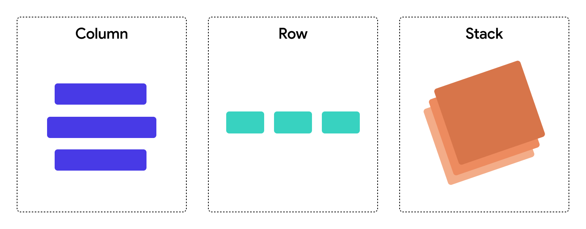
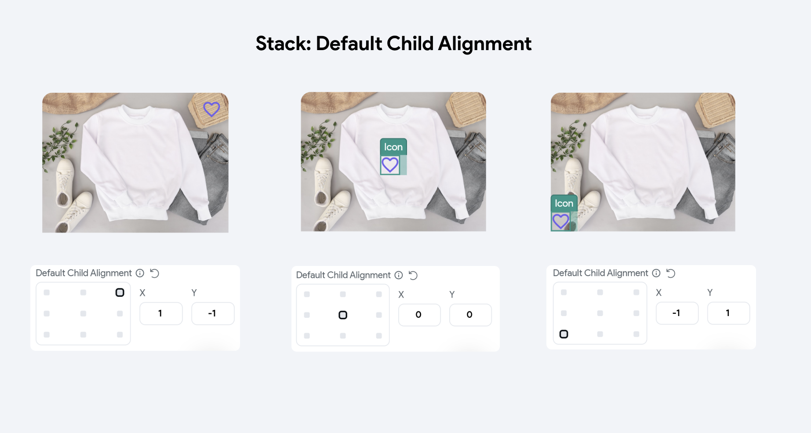
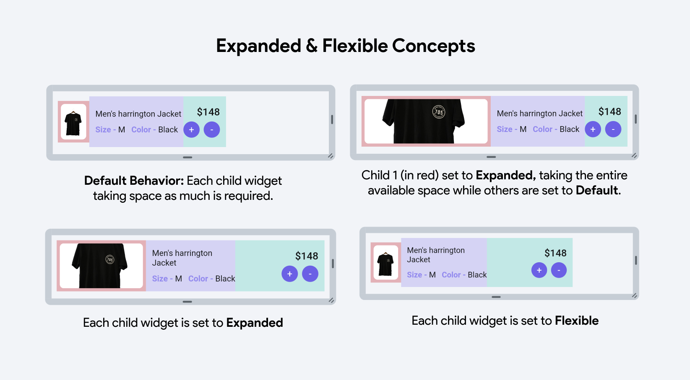
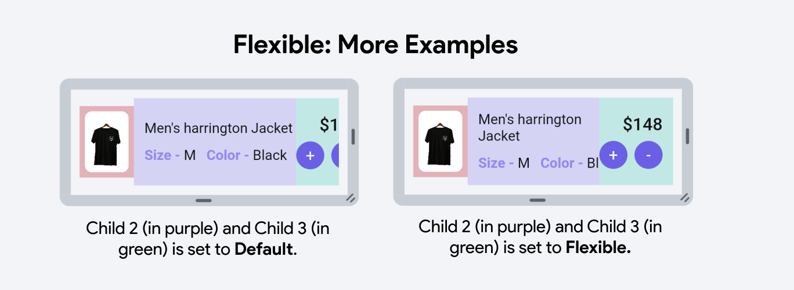
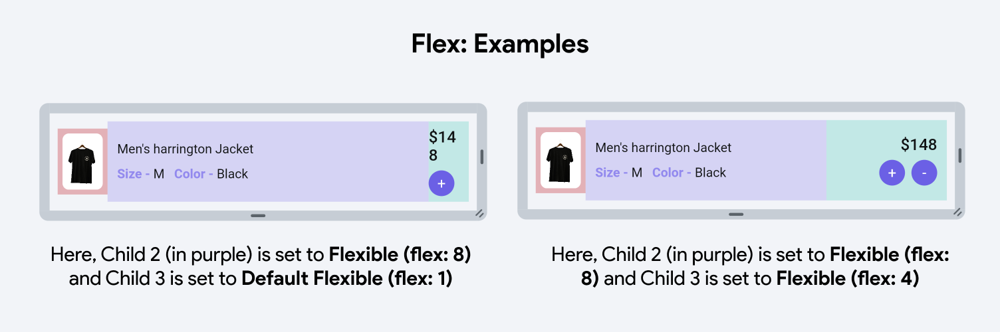

# Rows, Column & Stack

In Flutter, `Rows`, `Columns`, and `Stacks` are fundamental layout widgets that
help
you structure the UI by organizing other widgets in different visual
arrangements. Here's how each one works:

- **Row**: A `Row` arranges its child widgets in a horizontal line. This is useful when you
want to place elements side by side across the screen.

- **Column**: A `Column` organizes its child widgets vertically, stacking them from top to
bottom. This is ideal for placing elements that need to appear in a vertical
sequence, such as a list of messages in a chat app or entries in a form. 

- **Stack**: A `Stack` layers its child widgets on top of each other, allowing for
overlapping elements. In a `Stack`, widgets can be positioned absolutely relative to the
edges of the `Stack`, giving you control over the exact location of each element.

Each of these widgets serves different purposes and choosing between them
depends on how you need to arrange your UI components:

:::tip[Minimum Layout Nesting]
Use the minimum amount of rows/columns necessary to achieve your layout to avoid unnecessary complexity. No page or component should nest more than 10 levels deep. Reaching this limit likely signals the need for **[converting a part of the widget tree into components](../../components/creating-components.md#convert-into-a-component)**.
:::

<!---TODO #### Choosing your parent widget
link to quickstart for how to choose parent widget [Rows/Column/Stacks]
with examples --->

## Common Property: Alignment

### Main Axis

The main axis is the primary direction in which child widgets are laid out in a
`Row` or `Column`.

**Row:** The main axis runs **horizontally**. Child widgets are arranged from
left
to right.

FlutterFlow allows you to set Row's Main Axis property to the following
types:

<figure>
    
  <figcaption class="centered-caption">Row's Main Axis property has the following types: Start, End, Center, SpaceEvenly, SpaceAround, SpaceBetween</figcaption>
</figure>

**Column:** The main axis runs **vertically**. Child widgets are laid out from
top
to bottom.

FlutterFlow allows you to set Column's Main Axis property to the following
types:
<figure>
    
  <figcaption class="centered-caption">Column's Main Axis property has the following types: Start, End, Center, SpaceEvenly, SpaceAround, SpaceBetween</figcaption>
</figure>

Manipulating the main axis allows you to control how widgets are spaced and how
they should expand or align in relation to each other along this primary
direction.

### Cross Axis

The cross axis is **perpendicular to the main axis** and controls the alignment
and
spacing of widgets across this secondary direction. It has the following types:
Start, Center, End.

**Row:** The cross axis runs **vertically**. It determines how child widgets are
aligned from top to bottom within the row.

<figure>
    
  <figcaption class="centered-caption">Cross Axis types for Row. Main Axis of Row is set to Center.</figcaption>
</figure>

**Column:** The cross axis runs **horizontally**. It controls how child widgets
align from left to right within the column.

<figure>
    
  <figcaption class="centered-caption">Cross Axis types for Column. Main Axis of Column is set to Center</figcaption>
</figure>

### Stack Alignment

For `Stacks`, the concept of main and cross axes is less applicable because
widgets are aligned relative to the entire area of the `Stack`. In
FlutterFlow you can control the `Stack` children's alignment using the
`Stack` property called _Default Child Alignment_ which positions the children
using
`X` and `Y` coordinates.

Understanding these axes and their properties is essential for effectively
designing layouts that behave as expected on different screen sizes and
orientations, ensuring a robust and flexible UI.

## Expansion & Flex (for Row & Column)
When widgets are placed inside a Row or Column in a layout, they gain access to an additional 
property called **Expansion** & **Flex**. This property controls how a widget behaves in terms of taking up 
available space within its parent Row or Column.

#### Expanded   

The Expansion properties are as follows: 

- **Default:** Make the widget NOT fill space along the main axis (horizontal for Row, vertical 
  for Column), therefore taking the minimum space required by its contents.

- **Flexible:** Allow the widget to take up to the available space along
  the main axis (horizontal for Row, vertical for Column). You can think of this as giving it a "Max Width" equal to the amount
of available space. The widget can take up less space if it is smaller,
but otherwise will be constrained to the available width.

  :::warning[Understanding Layouts]
  Flexible will be **disabled** if the child widget is in a Row with unbounded width or Column with unbounded height.
  :::

- **Expanded:** Make the widget fill the space along the main axis (horizontal for Row, vertical for Column).

:::tip[Using Expanded & Flexible in an Example]

1. **Default Behavior:** Here, you see two child widgets displayed next to each other, each 
   occupying only the necessary space to show its content without any expansion.

2. **Expanded Widget Usage:** The first child widget (highlighted in red) is wrapped with an 
   **Expanded** widget. This causes it to take up all the remaining space in the container after accounting for the space required by the other widgets. Here, the first child stretches to fill all the extra space, pushing the other widgets to the side or shrinking them to their minimum size.

3. **All Expanded Widgets:** In this example, all child widgets are set to **Expanded**. This configuration divides the container's space equally among all child widgets, regardless of their intrinsic size. Each widget stretches to fill an equal portion of the container.

4. **All Flexible Widgets:** In the last example, each child widget is wrapped with a **Flexible** 
   widget. 
   This allows the widgets to expand to fill the available space but unlike **Expanded**, they can also shrink below their allocated space if necessary, based on the flex factors and the minimum space required by each widget. If all have the same flex factor, they will divide the space equally but are able to shrink if the content size demands less space.

:::

Let's understand Flexible concept with another example: 

:::tip[Flexible Concept]

- In the left image, Child 2 (in purple) and Child 3 (in green) retain their intrinsic sizes due to **default settings**, causing their content to appear cut off when the container's width is limited. They cannot adapt to smaller spaces, leading to potential content clipping. This highlights the limitations of default settings in confined spaces where dynamic resizing would improve content visibility.

- In contrast, the right image uses the **Flexible widget** for Child 2 and Child 3, allowing them to 
adjust dynamically to the container's width constraints. Instead of sticking to their original sizes, these widgets can shrink or expand, making the layout responsive and ensuring content remains visible and well-aligned, regardless of screen size changes. This adaptability is crucial for maintaining accessibility and visual coherence in diverse display environments.

:::

#### Flex

Additionally, you can utilize Flex factors to determine the flexibility of a widget within its parent container. A Flex factor is an integer assigned to a child widget, indicating its proportional size compared to other children in the same parent. The space a child occupies is determined by its Flex factor in relation to the total Flex factors of all siblings in the layout.

:::info[Default Behavior]
If no flex factor is provided, the child will not expand to fill extra 
space 
in the parent container. It will occupy only the space required for its content unless styled otherwise.
:::

When you assign a flex factor, the widget can expand to fill any available space in the parent container. For instance, in a Row or Column, if one widget has a flex factor of 1 and another has a flex factor of 2, the second widget will take up twice as much space as the first.

:::tip[Flex Example]

- Child 2 (purple) with a higher Flex factor (8) consistently occupies a larger portion of space, 
showing how a higher number increases the space allocation relative to other widgets.

- Child 3 (green) has varying Flex factors (1 and 4), illustrating how increasing the Flex 
  factor allows the widget to occupy more space, albeit still less than Child 2 due to its lower Flex factor.
:::

Find a video tutorial about Expanded & Flexible: 

<iframe src="https://www.youtube.
com/embed/Mmzwb0mYEQ4" frameborder="0" allow="accelerometer; autoplay; clipboard-write; encrypted-media; gyroscope; picture-in-picture; web-share" referrerpolicy="strict-origin-when-cross-origin" allowfullscreen></iframe>

## Scrollability
Scrollability for **Row or Column** widgets in FlutterFlow determines whether the content within these layouts can extend beyond the visible boundaries of the screen or container, enabling horizontal or vertical scrolling:

- **Allow Scrolling:** When enabled, this allows the content to exceed the device or parent 
  container’s screen limits, making the overflow content accessible through scrolling.

- **Do Not Allow Scrolling:** If disabled, the content that exceeds the boundaries of the screen or 
its parent container will not be accessible through scrolling. This setting forces the content 
  to fit within the available visible space, hiding overflow content or potentially causing layout 
  issues.

:::tip[Generated Code]
In the generated Flutter code, enabling scrollability simply involves wrapping the Row or Column 
in a `SingleChildScrollView()`. This widget adjusts its child's size and position based on the 
incoming constraints and the scrolling movement, effectively managing overflow by introducing scrollable behavior.
:::

## Spacing

- **Items Spacing:** This field sets the space between each child widget within the Row or 
  Column. You can specify a static numerical value that determines the pixel spacing between 
  adjacent children or set it from a variable.

:::tip[Items Spacing vs Padding]
Prefer “Items Spacing” set on the parent row or column instead of padding on individual elements. This ensures consistency, especially on non-dynamically generated lists.
:::

- **Apply to Start & End:** When toggled on, this applies the specified item spacing to the 
  beginning and the end of the Row or Column. This effectively adds padding at the start and end of the layout in addition to between the items.

- **Start Spacing and End Spacing:** These properties allow for additional specific spacing at 
  the start and end of the Row or Column, respectively. This is useful for fine-tuning the layout to ensure content is visually balanced within the container or to provide clear margins.