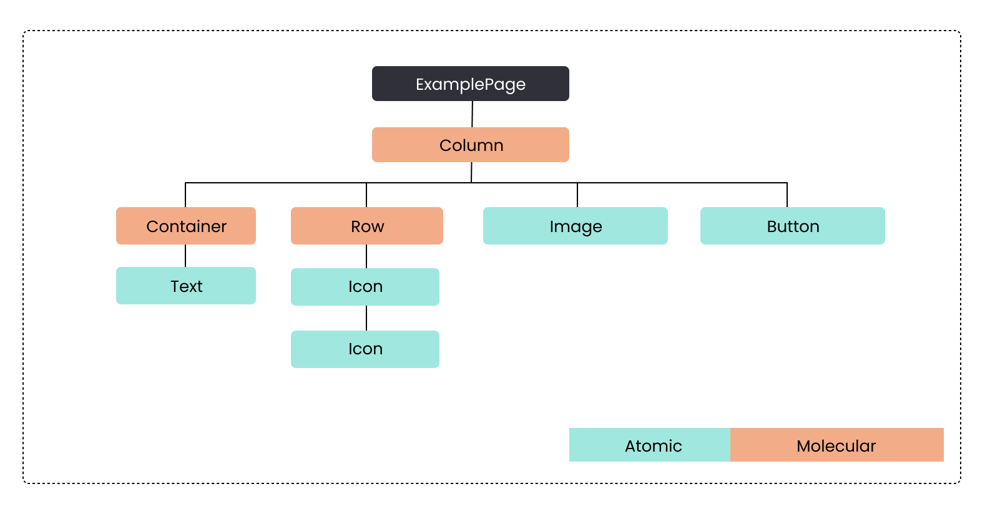
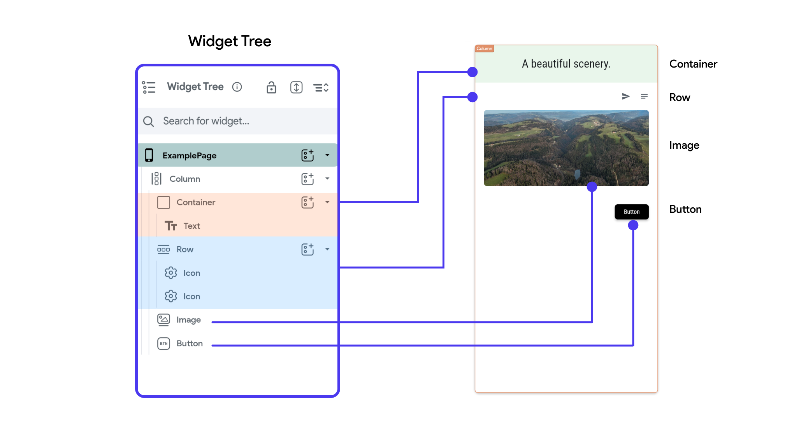

# Introduction to Widgets

Widgets are the building blocks of your app's user interface in FlutterFlow. Each widget represents a fundamental UI element that contributes to the overall layout and functionality of your app. In FlutterFlow, you create your app's UI by combining basic widgets like **Text, Button** and **Container** with more complex, multi-child widgets like **Rows, Column, Lists**. 

Understanding the parent-child relationship between widgets is crucial, as it forms the foundation of the [**Widget Tree**](#widget-tree), which defines the structure and hierarchy of your app's UI.

## Types of Widgets in FlutterFlow

- **Built-in Widgets**: You can choose from a variety of built-in widgets in FlutterFlow. These are discussed throughout this section. 

- **[Components](../components/creating-components.md)**: You can also build your own reusable widgets, or 
  Components by assembling multiple widgets using FlutterFlow’s drag-and-drop interface. 

- **[Custom Widgets](../../../ff-concepts/adding-customization/custom-widgets.md)**: For scenarios where more complex functionalities are required, FlutterFlow
  allows you to develop your own Custom Widgets using code. 

- **[Theme Widgets](../../../ff-concepts/design-system/design-system.md#theme-widgets)**: Themed widgets can be reused across your app, making it easy to update styles universally. If you decide to change any properties, such as color schemes or fonts, you can update the theme widget instead of modifying each widget individually.

## Widget Tree
The Widget Tree is a structural representation of how widgets—ranging from [atomic elements](../overview.md) like Text and Button to more [complex molecules and organisms](../overview.md)—organized within a Page. It outlines the parent-child relationships that define the layout and functionality of your UI. This hierarchy is similar to the concept of atomic design, where atoms and molecules combine to form more complex structures, ultimately creating a cohesive interface.

:::info[WIDGET TREE BREAKDOWN]

The above diagram illustrates a widget tree for an `ExamplePage`. The page is
structured using a hierarchy of widgets that define its layout and functionality.

- **ExamplePage**: The root of the widget tree, representing the entire Page.
    - **Column**: Directly under the root, this widget organizes its child widgets vertically. It is
      the main layout widget for this Page.
        - **Container**: A molecular widget that contains another widget, providing padding,
          margins, borders, or color to its child.
            - **Text**: An atomic widget, this displays a string of text within the `Container`.
        - **Row**: A molecular widget that arranges its children horizontally. It contains multiple
          `Icon` widgets.
            - **Icon**: These are atomic widgets, each representing an `Icon` image. They are
              repeated here
              twice under the `Row`.
        - **Image**: An atomic widget placed directly under the `Column`, used here to display an
          image.
        - **Button:** An atomic widget also under the `Column`, used for user interaction.

Each widget in this tree plays a specific role in constructing the user interface, from basic
elements like `Text` and `Image` to layout structures like `Row`s and `Column`s that organize these
elements.

Here's how this widget tree would be represented in FlutterFlow:

:::

Understanding the widget tree is crucial for developers using FlutterFlow because it helps visualize
the composition of the application's interface. It shows how individual widgets (atoms) combine and
nest within each other to form more complex widgets (molecules and organisms) and ultimately
complete pages.

### Widget categories

In FlutterFlow, we have the following categories of widgets:

- [Layout Elements](#layout-elements)
- [Base Elements](#base-elements)
- [Page Elements](#page-elements)
- [Form Elements](#form-elements)

#### Layout Elements

These widgets help organize the structure and layout of your app. They determine
how other widgets are arranged and displayed on the screen.

Common layout elements include:

| Widget        | Description                                                                                                               | Example                                                    |
|---------------|---------------------------------------------------------------------------------------------------------------------------|------------------------------------------------------------|
| **Row**       | Arrange its child widgets horizontally                                                                                    |    |
| **Column**    | Organizes its child widgets vertically.                                                                                   |  |
| **Stack**     | Layers its child widgets on top of each other, allowing for overlapping elements.                                         |  |
| **Container** | Provides a box model for a single child widget, with optional padding, margins, borders, box shadow and background color. |   |

Find the entire list on this [**index page**](/tags/layout-elements).

#### Base Elements

Base elements are the fundamental building blocks for creating the visual and
interactive components of your app.

Examples include:

| Widget                                | Description                                                                                                                            | Example                                                     |
|---------------------------------------|----------------------------------------------------------------------------------------------------------------------------------------|-------------------------------------------------------------|
| **[Text](basic-widgets/text.md)**     | Displays a string of text and allows you to customize fonts, sizes, and styles.                                                        |    |
| [**Image**](basic-widgets/image.md)   | Displays image.                                                                                                                        |     |
| [**Icon**](basic-widgets/icons.md)    | Displays icon.                                                                                                                         |    |
| [**Button**](basic-widgets/button.md) | A widget meant to trigger actions and take users to another flow in the app. It can be styled with different colors, borders, and text |  |

Find the entire list on this [**index page**](/tags/base-elements).

#### Page Elements

In FlutterFlow, the **Page Elements** category consists of widgets like **[AppBar](../pages/page-elements.md#appbar)**, **[Floating Action Button (FAB)](../pages/page-elements.md#floating-action-button-fab)**,
**[Drawer](../pages/page-elements.md#drawers)**, and **[End Drawer](../pages/page-elements.md#end-drawer)**, which are essential for structuring pages and facilitating navigation throughout the app.

:::info
Learn more about **[Page Elements](../pages/page-elements.md)** such as **AppBar**, **Snackbar**, **Drawers** etc and how to use them in FlutterFlow.
:::

#### Form Elements

Form elements are widgets specifically used for creating forms where users can
enter data. These are crucial for tasks like user registration, login, and data
entry.

Examples include:

| Widget           | Description                                                       | Example                                                                        |
|------------------|-------------------------------------------------------------------|--------------------------------------------------------------------------------|
| **Text Field**   | Allows users to enter text.                                       |  |
| **Radio Button** | Allows users to select one option from a set.                     |  |
| **Dropdown**     | Provides a menu with multiple options where users can select one. |    |

Find the entire list on this [**index page**](/tags/form-elements).

Each category in FlutterFlow serves distinct purposes, helping you design both
the appearance and functionality of your app more efficiently.
