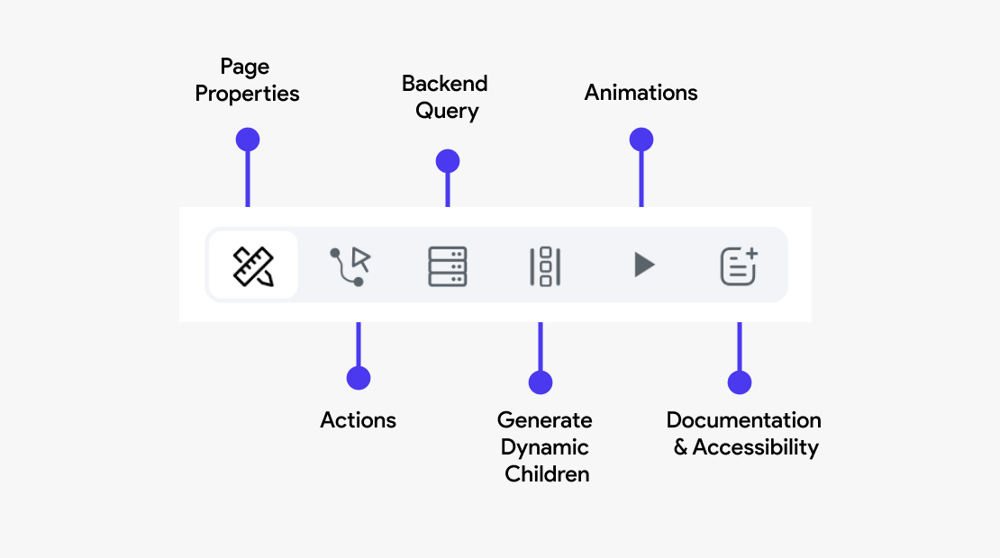
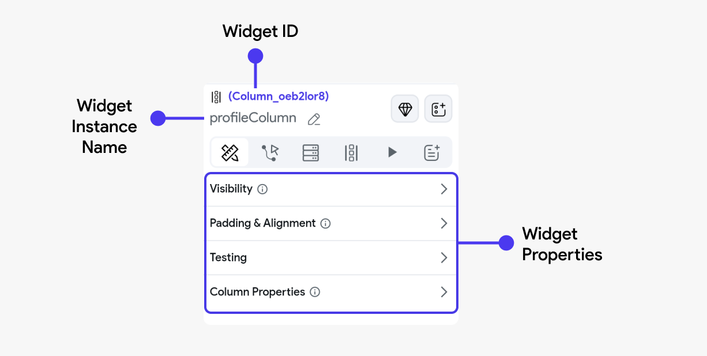

# Properties Panel

In FlutterFlow, the Properties Panel located on the right side of the interface plays a crucial role
in configuring and managing the various aspects of your widgets. This panel is divided into several
sections, each dedicated to different settings and adjustments you can make to customize your
widgets.

## Widget Properties

When you click on a widget from the Widget Tree, the **Widget Properties Panel** opens up on the
right side. There you can customize the properties for the selected widget, which may vary
based on the type of widget and also add other advanced configurations to the widget.

### Widget name

When you select any widget, its name appears on the properties panel. The default name for any
widget is its type. For example, if you select the Container widget, the name appears as '**Container**'. However, you can use the edit icon on the right to change its name.

## Actions

This section allows you to define and manage interactions or events triggered by user actions. For
example, you can configure a button to navigate to another page, submit form data, or call an API.
Actions are crucial for creating interactive and functional apps.

In the case of widgets, you can add user interactions on action triggers such as **On Tap** or **On
Long
Press**. The availability of these actions may vary depending on the widget.

Actions differ according to the widget selected; on some widgets, you can't apply any actions.

## Backend Query

Here, you can configure the page to fetch data from a backend source or database. This is
typically done through API calls or direct database queries. Setting up a backend query allows
the widget to display dynamic content, such as user profiles, product lists, or any other data your
app needs to retrieve from a server.

## Generate Dynamic Children

Widgets capable of handling multiple child widgets have an additional tab called **Generate Dynamic
Children**. This feature helps you generate multiple child widgets from a list variable.

This is particularly useful when you are retrieving data from an API call.

Some of the widgets that can handle multiple children include **Column, Row, Stack, ListView,
GridView, and PageView**.

:::info
To learn more about [**Generating Dynamic Children**](composing-widgets/generate-dynamic-children.md), refer here.
:::

## Animations
You can apply animations to a widget to enhance the visual appeal and user experience. Animations can be used to draw attention to important elements, provide feedback on user interactions, or create visually engaging transitions between states. 

:::info
Learn more about adding **[animations](../../../ff-concepts/animations/animations.md)** here
:::

## Documentation and Semantic Labels
**Documentation** helps developers understand the purpose and function of a widget within the app, 
making maintenance and future updates easier.

**Semantic labels** are crucial for accessibility, allowing screen readers to accurately describe 
the widget's function to users with visual impairments.