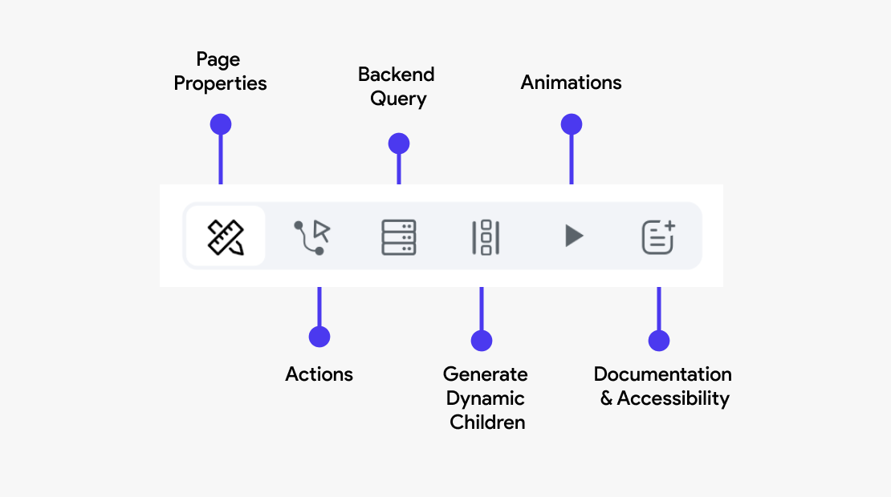
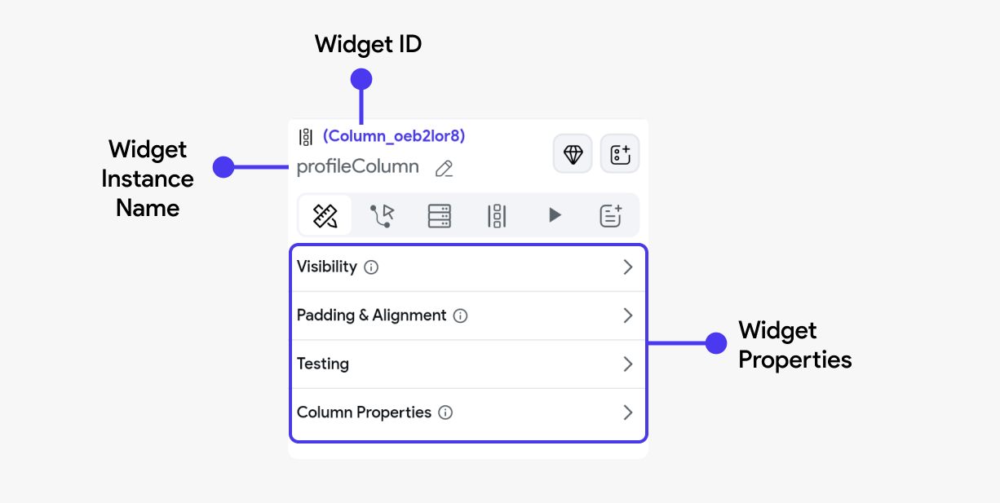

# Properties Panel

In FlutterFlow, the Properties Panel on the right helps you configure and manage your widgets. It opens when you click on a widget or [component](../components/intro-components.md) in the [**Widget Tree**](../widgets/intro-widgets.md#widget-tree).

Here's a quick demo showing how to add a widget to the canvas, which opens the widget properties panel on the right, allowing you to update the widget's properties:

    <iframe
        src="https://demo.arcade.software/pHghP4lV54SC3RqwCWBt?embed&show_copy_link=true" title="Widget Properties interactive tutorial"
        style={{
            position: 'absolute',
            top: 0,
            left: 0,
            width: '100%',
            height: '100%',
            colorScheme: 'light'
        }}
        frameborder="0"
        loading="lazy"
        webkitAllowFullScreen
        mozAllowFullScreen
        allowFullScreen
        allow="clipboard-write">
    </iframe>

The panel is divided into sections, each focusing on settings specific to the selected widget. The available options may vary depending on the widget type, with additional advanced configurations available for further customization.

Depending on the current selection, the panel can include **Properties**, **Actions**, **Backend Query**, **Generate Dynamic Children**, **Animations**, **Documentation & Accessibility**, and **State Management**. A tab appears only when it applies to that widget, page, or component.

### Widget name

When you select any widget, its name appears on the properties panel. The default name for any
widget is its type. For example, if you select the Container widget, the name appears as '**Container**'. However, you can use the edit icon on the right to change its name.

## Actions

This section allows you to define and manage interactions or events triggered by user actions. For
example, you can configure a button to navigate to another page, submit form data, or call an API.
Actions are crucial for creating interactive and functional apps.

In the case of widgets, you can add user interactions on action triggers such as **On Tap** or **On
Long
Press**. The availability of these actions may vary depending on the widget.

Actions differ according to the widget selected; on some widgets, you can't apply any actions.

## Backend Query

Here, you can configure the selected widget, page, or component to fetch data from a backend source or database. This is
typically done through API calls or direct database queries. Setting up a backend query allows
the widget to display dynamic content, such as user profiles, product lists, or any other data your
app needs to retrieve from a server.

## Generate Dynamic Children

Widgets capable of handling multiple child widgets have an additional tab called **Generate Dynamic
Children**. This feature helps you generate multiple child widgets from a list variable.

This is particularly useful when you are retrieving data from an API call.

Some of the widgets that can handle multiple children include **Column, Row, Stack, ListView,
GridView, and PageView**.

:::info
To learn more about [**Generating Dynamic Children**](composing-widgets/generate-dynamic-children.md), refer here.
:::

## Animations
You can apply animations to a widget to enhance the visual appeal and user experience. Animations can be used to draw attention to important elements, provide feedback on user interactions, or create visually engaging transitions between states.

:::info
Learn more about adding **[animations](../../../ff-concepts/animations/animations.md)** here
:::

## Documentation & Accessibility

**Documentation** helps developers understand the purpose and function of a widget within the app,
making maintenance and future updates easier.

**Semantic labels** are crucial for accessibility, allowing screen readers to accurately describe
the widget's function to users with visual impairments.

## State Management

When available for the selected element, **State Management** lets you define and manage state scoped to a page or component. Use the narrowest scope that needs the value so unrelated parts of the app do not depend on it.

## Verify widget configuration

Run the page in **Test Mode** after changing a property, action, query, generated child, animation, accessibility label, or state value. Confirm the visible result and interaction, then test loading, empty, error, and assistive-technology states when those apply.
