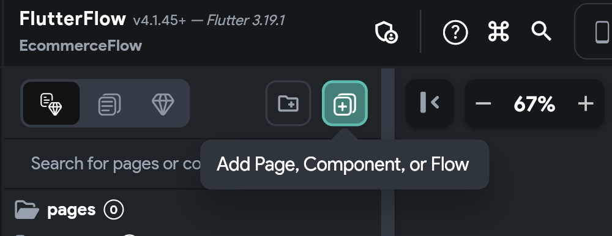

#

FlutterFlow allows you to easily create new pages using the Page Selector
button, which is available in the Widget Tree menu (Tab+2). This will help you
quickly start and add new pages to your app.

## Create an empty page

To create an empty FlutterFlow page from scratch, follow the steps:

<iframe src="https://demo.arcade.software/rtOPRXVUByUAXxUynd8T?embed&show_copy_link=true" title="app.flutterflow.io/authentication" frameborder="0" loading="lazy" webkitallowfullscreen mozallowfullscreen allowfullscreen allow="clipboard-write" width="100%" height="600"></iframe>

## Create a page from a popular template

FlutterFlow simplifies the process of page creation by offering a variety of
popular template use cases. These templates provide a basic structure for your
pages, which you can quickly customize with your own styling, widgets, and text.

To utilize a template from FlutterFlow, follow these steps:

<iframe src="https://demo.arcade.software/bkaz68ipgi497Pf4v8EB?embed&show_copy_link=true" title="app.flutterflow.io/authentication" frameborder="0" loading="lazy" webkitallowfullscreen mozallowfullscreen allowfullscreen allow="clipboard-write" width="100%" height="600"></iframe>

## Create an AI generated page

FlutterFlow's 'AI Gen' feature allows you to generate various elements,
including pages, from a prompt. This can be particularly useful when you're
unsure where to start.

Once the page is generated, you can preview it with different color schemes, in
both light and dark themes, and add new themes as desired. You also have the
option to view the page's code and regenerate images as needed.

To create an AI Generated page, follow the steps:
<iframe src="https://demo.arcade.software/hLpE44TVjb72rzTTpxRK?embed&show_copy_link=true" title="app.flutterflow.io/authentication" frameborder="0" loading="lazy" webkitallowfullscreen mozallowfullscreen allowfullscreen allow="clipboard-write" width="100%" height="600"></iframe>

## Properties Panel

In FlutterFlow, the properties panel located on the right side of the interface
plays a crucial role in configuring and managing the various aspects of your
pages. This panel is divided into several sections, each dedicated to different
settings and adjustments you can make to customize your pages. Here’s a detailed
look at what you can typically find and modify in this panel:

### Page Parameters

This section allows you to define and manage parameters that your page can
receive from other pages of the app. Parameters are essentially variables that
hold values which can be passed between pages. For example, you might pass a
user ID from a list page to a detail page to display specific information about
that user.

### Route Settings

In FlutterFlow, Route Settings are essential for defining how pages within your
application are accessed and interacted with. These settings allow you to
customize the URL paths for web and mobile deep linking, set meaningful Page
Names as unique identifiers, integrate dynamic parameters into your routes, and
set access restrictions based on user authentication.

### Page (Scaffold) Properties

This section is where you set the fundamental aspects of a page’s layout and
behavior, including:

**Background Color:** This property allows you to set a background color for the
entire page. You can choose a color that fits the theme and design of your app.

**Safe Area:** When this toggle is enabled, the page content will be
automatically adjusted to not overlap with the system status bar, navigation
bar, and other critical device UI elements. This ensures that all elements of
the page are visible and accessible on different devices.

**Hide Keyboard on Tap:** Enabling this option makes the keyboard retract when
the
user taps anywhere outside the keyboard area on the screen. This is particularly
useful for improving user experience by preventing the keyboard from obscuring
content.

**Disable Android Back Button:** This toggle, when activated, prevents the
Android
back button from affecting the navigation on this particular page. This can be
useful in scenarios where you don't want users to navigate back to the previous
screen easily, such as in a login or payment screen.

### Additional Configurations

For more advanced customization and functionality within your FlutterFlow
projects, the properties panel offers additional configuration settings beyond
the basic page properties. These settings allow for greater interactivity,
dynamic data handling, and more tailored user experiences. Here's an overview of
these additional configurations:

#### Actions
This section allows you to define and manage interactions or events triggered by
user actions. For example, you can set up a button to navigate to another page,
submit form data, or call an API. Actions are crucial for creating interactive
and functional apps.

#### Backend Query
Here, you can configure the page to fetch data from a backend source or
database. This is typically done through API calls or direct database queries.
Setting up a backend query allows the page to display dynamic content, such as
user profiles, product lists, or any other data your app needs to retrieve from
a server.

#### Animations
Animations enhance the visual appeal and user experience of your app. In this
section, you can add and configure animations for entering or exiting the page,
or for specific elements on the page. Effective use of animations can make your
app feel more dynamic and engaging.

#### State Management
State management configurations are essential for maintaining the state or
status of a page across user interactions or app sessions. This can include
tracking user inputs, remembering user choices, or preserving the app's state
during navigation between pages. Proper state management ensures a smooth and
consistent experience for users as they interact with your app.

In FlutterFlow, setting page properties is an essential step to customizing the
behavior and appearance of your app’s pages. Here’s an overview of how you can
set and manage
these properties in FlutterFlow:

### Accessing Page Properties

To access and modify page properties in FlutterFlow, you navigate to the page
you want to edit and look for the page properties panel on the right.

Dynamically vs statically

### Creating / using page parameters		What things would you usually use as page parameters

### Creating / using page state		