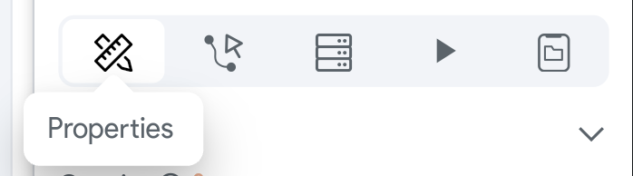
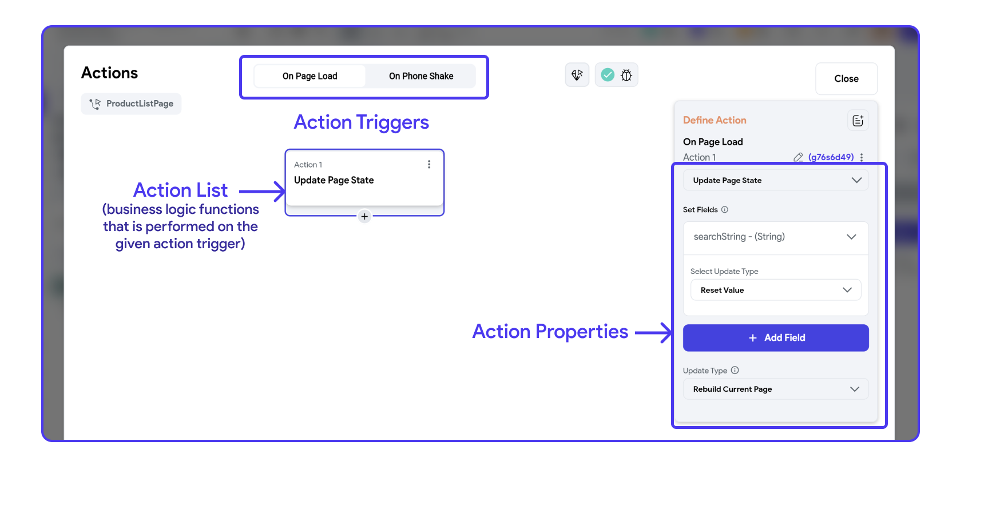
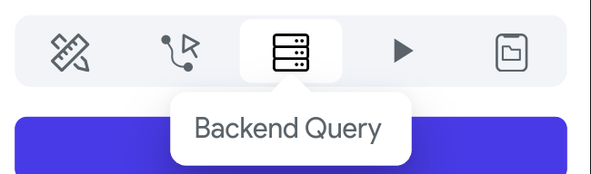
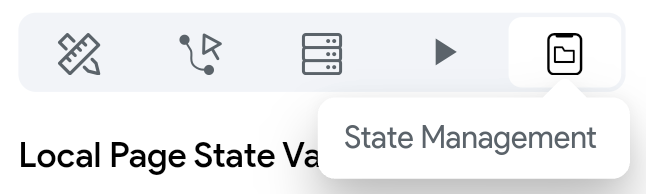

#
## Properties Panel

In FlutterFlow, the properties panel located on the right side of the interface
plays a crucial role in configuring and managing the various aspects of your
pages. This panel is divided into several sections, each dedicated to different
settings and adjustments you can make to customize your pages. Here’s a detailed
look at what you can typically find and modify in this panel:

### Page Parameters

This section allows you to define and manage parameters that your page can
receive from other pages of the app. Parameters are essentially variables that
hold values which can be passed between pages. For example, you might pass a
user ID from a list page to a detail page to display specific information about
that user.

### Route Settings

In FlutterFlow, Route Settings are essential for defining how pages within your
application are accessed and interacted with. These settings allow you to
customize the URL paths for web and mobile deep linking, set meaningful Page
Names as unique identifiers, integrate dynamic parameters into your routes, and
set access restrictions based on user authentication.

### Page (Scaffold) Properties

This section is where you set the fundamental aspects of a page’s layout and
behavior, including:

**Background Color:** This property allows you to set a background color for the
entire page. You can choose a color that fits the theme and design of your app.

**Safe Area:** When this toggle is enabled, the page content will be
automatically adjusted to not overlap with the system status bar, navigation
bar, and other critical device UI elements. This ensures that all elements of
the page are visible and accessible on different devices.

**Hide Keyboard on Tap:** Enabling this option makes the keyboard retract when
the
user taps anywhere outside the keyboard area on the screen. This is particularly
useful for improving user experience by preventing the keyboard from obscuring
content.

**Disable Android Back Button:** This toggle, when activated, prevents the
Android
back button from affecting the navigation on this particular page. This can be
useful in scenarios where you don't want users to navigate back to the previous
screen easily, such as in a login or payment screen.

:::info
To learn how to modify these page properties, refer [here](docs/resources/widgets/pages/how-tos.md)
:::

## Additional Configurations

For more advanced customization and functionality within your FlutterFlow
projects, the properties panel offers additional configuration settings beyond
the basic page properties. These settings allow for greater interactivity,
dynamic data handling, and more tailored user experiences. Here's an overview of
these additional configurations:

### Actions  

This section allows you to define and manage interactions or events triggered by
user actions. For example, you can configure a button to navigate to another
page, submit form data, or call an API. Actions are crucial for creating
interactive and functional apps.

In the case of Scaffold (Page) actions, you can establish specific behaviors or
functions that are triggered by certain events related to the page's lifecycle.

For instance, the "On Page Load" action is a type of Page Action triggered when
a page is first loaded or entered by a user. This action is part of the page's
lifecycle methods, which are functions that execute at different stages of a
page’s existence in the app, such as when it's created, displayed, or closed.

#### Uses of On Page Load Action

**Initializing Data:** You can use the On Load action to initiate API calls,
database queries, or read from local storage, setting up the data that the page
needs to display. This ensures that all necessary data is ready and available by
the time the user sees the page.

**Setting State:** If your page depends on certain state conditions (like toggles,
selections, or input fields), you can set these states appropriately as the page
loads.

**Running Animations:** Start animations that welcome users or draw attention to
certain UI elements on the page.

#### Add OnPageLoad Action
To add an action to "On Page Load" action trigger, follow the steps: 

<iframe src="https://demo.arcade.software/ii0otHqkoRtPY66n4c2y?embed&show_copy_link=true" title="app.flutterflow.io/authentication" frameborder="0" loading="lazy" webkitallowfullscreen mozallowfullscreen allowfullscreen allow="clipboard-write" width="100%" height="600"></iframe>

### Backend Query

Here, you can configure the page to fetch data from a backend source or
database. This is typically done through API calls or direct database queries.
Setting up a backend query allows the page to display dynamic content, such as
user profiles, product lists, or any other data your app needs to retrieve from
a server.

:::info
To learn more about how to connect to a backend source, refer to our Database section
:::

### State Management

State management configurations are essential for maintaining the state or
status of a page across user interactions or app sessions. This can include
tracking user inputs, remembering user choices, or preserving the app's state
during navigation between pages. Proper state management ensures a smooth and
consistent experience for users as they interact with your app.

<iframe src="https://demo.arcade.software/Qhg62nqMjhg8973XPQhb?embed&show_copy_link=true" title="app.flutterflow.io/authentication" frameborder="0" loading="lazy" webkitallowfullscreen mozallowfullscreen allowfullscreen allow="clipboard-write" width="100%" height="600"></iframe>
