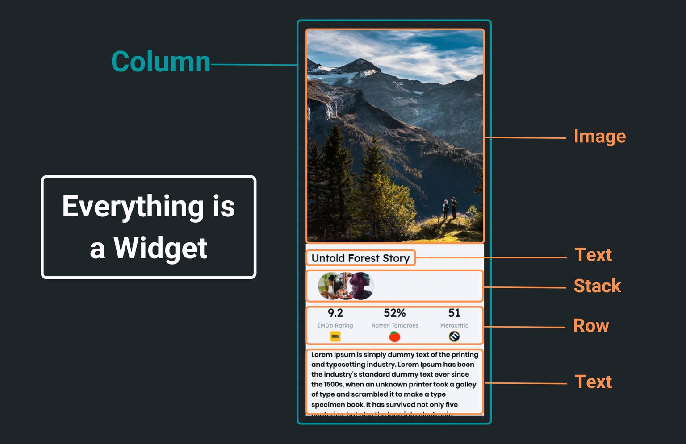
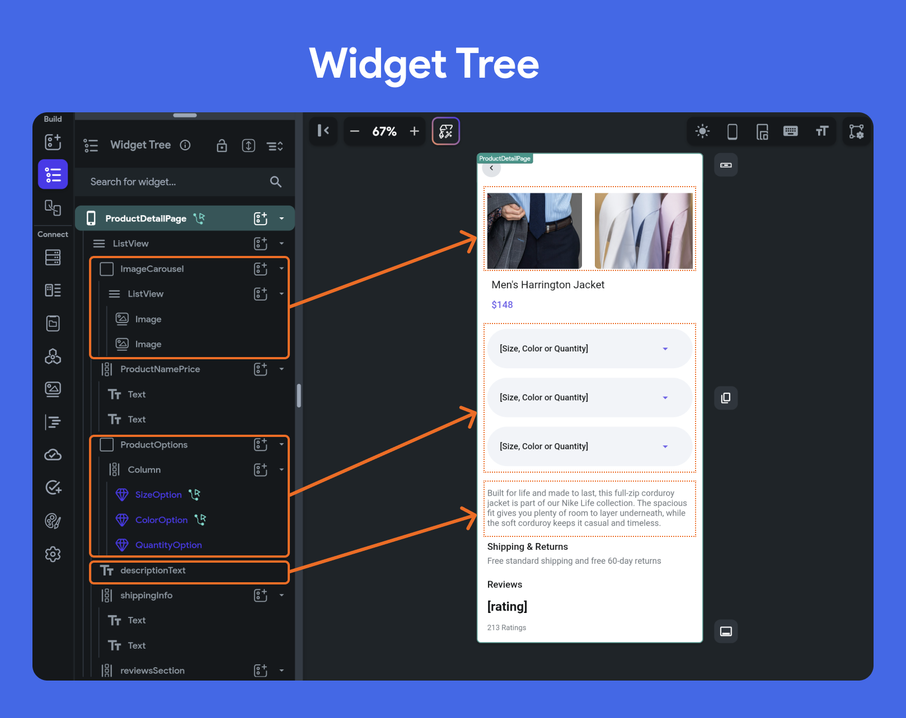

# 
## What's a widget?

In FlutterFlow, a widget is like a building block used to create the user
interface of your app. You can think of it as a UI element that you can use and
customize to build different parts of your app's screen, such as buttons, text
fields, images, and more.

Widgets can be combined and nested to create complex layouts and interactive
elements, making it easier to design your app visually. FlutterFlow provides a
drag-and-drop interface, so you can place these widgets on your app's canvas and
adjust their properties through the interactive interface, without having to
write a lot of code.

### Everything's a widget

FlutterFlow is built with Flutter, Google's popular framework for building
cross-platform apps from a single codebase. In Flutter, _everything is a widget_
—every part of the app's UI is built using widgets that handle layout, styling,
and interaction. FlutterFlow leverages this same concept by providing a visual
editor where you can create and configure these widgets.

#TODO change image

## Widget categories

In FlutterFlow, we have the following categories of widgets:

- Layout Elements
- Base Elements
- Page Elements
- Form Elements

### Layout Elements

These widgets help organize the structure and layout of your app. They determine
how other widgets are arranged and displayed on the screen. Common layout
elements include:

**Row**: Arranges its child widgets horizontally.

**Column**: Organizes its child widgets vertically.

**Stack**: Layers its child widgets on top of each other, allowing for
overlapping elements.

**Container**: Provides a box model for a single child widget, with optional
padding, margins, borders, and background color.

_Check out your builder for the entire list_

### Base Elements

Base elements are the fundamental building blocks for creating the visual and
interactive components of your app. Examples include:

**Text**: Displays a string of text and allows you to customize fonts, sizes,
and styles.

**Image**: Displays image.

**Icon**: Displays icon.

**Button**: A clickable widget that can trigger actions. It can be styled with
different colors, borders, and text.

_...and more._

### Page Elements

In FlutterFlow, the Page Elements category comprises widgets like AppBar, FAB,
Drawer, and End Drawer, which are essential for structuring pages and
facilitating navigation throughout the app.

### Form Elements

Form elements are widgets specifically used for creating forms where users can
enter data. These are crucial for tasks like user registration, login, and data
entry. Examples include:

**Text Field:** Allows users to enter text.

**Radio Button:** Allows users to select one option from a set.

**Dropdown:** Provides a menu with multiple options where users can select one.

Each category in FlutterFlow serves distinct purposes, helping you design both
the appearance and functionality of your app more efficiently.

## Widget Tree

The widget tree in FlutterFlow, organizes the relationships between all the
widgets in your app's user interface. Each widget can contain other widgets
inside it, known as "children," creating a nested
structure. For example, you might have a main screen widget that contains a
column widget, and inside that column, there are text widgets, button widgets,
and so on.

