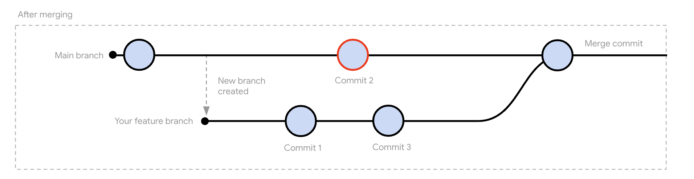
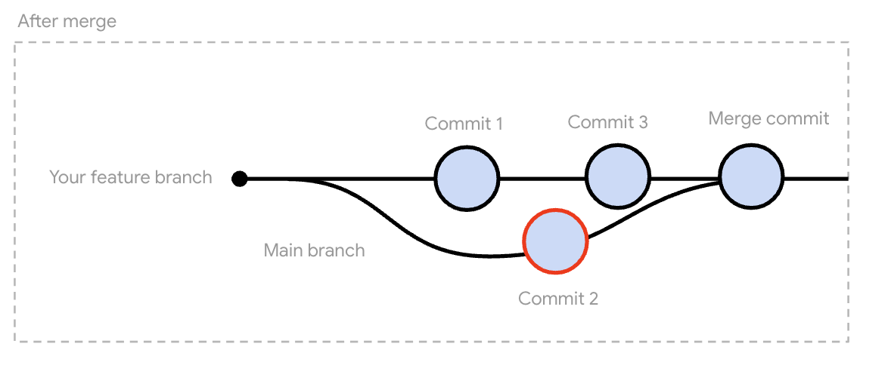
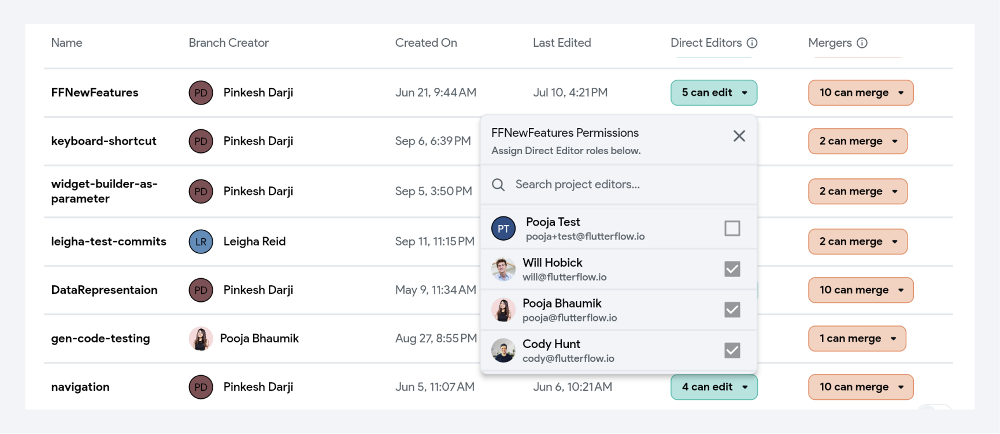

# Branching
Branching creates a separate copy of your work, so you can add new features without disrupting your current progress. It enables multiple developers or teams to work simultaneously on different features without interfering with each other.

Suppose you have an eCommerce app and you want to add a new feature, such as a product recommendation system. Instead of incorporating it directly into your `main` branch and potentially causing problems, you can create a branch to work on this new feature in isolation. Once it's complete, you can integrate it back into the `main` branch.

:::info
This feature is only available for Pro, Teams and Enterprise users.
:::

:::warning

Creating a branch here doesn't create one on GitHub. Branches stay and are managed solely within 
FlutterFlow. You can also learn more about 
[**managing custom code on GitHub**](../exporting-code/push-to-github.md#manage-custom-code-on-github).
:::

## Branching Overview
Before you create and merge a branch, it is essential to understand the general workflow. Here's what it looks like:

First, create a new branch from the `main` branch. After making your changes and finalizing the 
feature, merge this new branch back into the `main` branch. If there are any conflicts, 
you must resolve them first.

## Creating a New Branch
To create a new branch from the current branch, simply go to the **Branching Options** button next to current branch in the **Branching menu.**

    <iframe 
        src="https://demo.arcade.software/5n61rPZR7WuWxs0lTFkE?embed&show_copy_link=true"
        title="Sharing a Project with a User"
        style={{
            position: 'absolute',
            top: 0,
            left: 0,
            width: '100%',
            height: '100%',
            colorScheme: 'light'
        }}
        frameborder="0"
        loading="lazy"
        webkitAllowFullScreen
        mozAllowFullScreen
        allowFullScreen
        allow="clipboard-write">
    </iframe>

:::tip

You can create a new branch from any existing branch, however it's most common to create new branches from `main`

:::

## Commits

A commit is essentially a saved snapshot of your project at a particular point in time. When you make changes to your project (such as adding new widgets, modifying actions, or configuring integrations), you can create a commit to save these changes. Each commit stores a record of what has been modified and serves as a version history for your branch, making it easy to see what has changed and roll back to previous versions if needed.

### Create Commits

To create a commit, follow these steps:

    <iframe 
        src="https://demo.arcade.software/bfqijjODDijWLszOOQqV?embed&show_copy_link=true"
        title=""
        style={{
            position: 'absolute',
            top: 0,
            left: 0,
            width: '100%',
            height: '100%',
            colorScheme: 'light'
        }}
        frameborder="0"
        loading="lazy"
        webkitAllowFullScreen
        mozAllowFullScreen
        allowFullScreen
        allow="clipboard-write">
    </iframe>

:::tip[Best Practices for Commits]
- **Commit Frequently:** Save your work often to ensure that changes are tracked, and you have a detailed version history. You can use the keyboard shortcut (cmd + enter) for faster iteration!
- **Use Clear Messages:** Always provide meaningful commit messages that explain what was done.
- **Test Before Committing:** Ensure that the project works as expected before committing significant changes.
:::

### View Commit Changes

Once the commit is created, you can see the list of all commits under the **Branch History** section. Here, each commit is displayed with a timestamp, the user who made the changes, and a commit message. You can also search and filter through commits by specific users and date range.

To see the commit changes, simply click on the commit. You’ll then land on a **Commit View** page where you can:

- **Review Changed Files**: In the left panel, files that have been modified are marked with a gray dot, making it easy to spot which parts of your project have updates.
- **Compare Before and After**: The center pane provides a side-by-side diff of the YAML for each changed file. Lines highlighted in red indicate removed or altered content, while lines in green show newly added or updated content.
- **See Commit Statistics**: At the top of the page, you’ll see a quick summary of how many files were changed and the total lines added (+) or removed (-).

    <iframe 
        src="https://demo.arcade.software/RwImFTtbmT0hkxj1RtuF?embed&show_copy_link=true"
        title="Viewing Commits"
        style={{
            position: 'absolute',
            top: 0,
            left: 0,
            width: '100%',
            height: '100%',
            colorScheme: 'light'
        }}
        frameborder="0"
        loading="lazy"
        webkitAllowFullScreen
        mozAllowFullScreen
        allowFullScreen
        allow="clipboard-write">
    </iframe>

### Commit Options

The options provided for each commit are as follows:

- **View Commit:** This option lets you view the details of a particular commit.
- **Restore Branch to Commit:** This option allows you to revert your branch to a previous commit. It creates a new commit that resets the branch to the state of the selected commit. This is particularly useful if a recent commit introduced issues, and you need to return to a stable point in the project's history.
- **Copy Commit ID:** Every commit is assigned a unique ID. This option allows you to copy the commit ID, which can be useful for referencing specific commits in collaboration with team members.

### Commits vs. Snapshots and Versions
FlutterFlow offers multiple ways to save the state of your project at specific points in time.

- **Snapshots** are automatically created as you edit your project. Think of them as automatic backups that you can revert to whenever needed.
- **Versions and commits**, on the other hand, are manually created checkpoints. While both serve a similar purpose, commits offer more flexibility by allowing you to view the specific changes made in each commit. If you're using a plan that supports branching, it's recommended to use commits for better tracking and version control.

You can learn more about [snapshots and versions here](/collaboration/saving-versioning). 

## Merging

Merging allows you to push the changes you've made in one branch into another. For example, you may want to push your changes from a feature branch, or a branch where you are developing a new feature, back into the `main` branch once it's ready to be deployed to your users.

Say your feature branch has two commits: `Commit 1` and `Commit 3` (which are your changes), and `Commit 2` (made by a colleague in the main branch).  The merge would look like the below image:

You can also merge changes from the parent branch, into the current branch. For example, say you want to pull the latest commits on `main` into your feature branch. This merge would look like the below image:

During a merge, FlutterFlow compares the changes made in both branches, if the changes don't overlap or conflict then the branches are automatically combined. If there are conflicts (for example, both branches modified the same widget property) you'll need to resolve these before the merge can be completed.

:::note Few things to note here

- At the moment, FlutterFlow only supports merging into the parent branch, or the branch that the current branch was created from (usually `main`)
- Only the user who initiated the merge can access both the `main` branch and the branch during an ongoing merge.
- Merges result in a merge [commit](#commits), which means you can undo a merge by restoring the branch to a prior commit
- If you leave the project during the merge and come back, the progress you have made on the merge will be preserved.

:::

### Initiating a Merge

FlutterFlow currently supports **two merging approaches**: the existing “**Merge**” functionality and the new “**Git Merge**” (v2).

- [**Merge (Legacy)**](#merge-legacy): The legacy merge uses a custom tool (originally built in FlutterFlow) to calculate differences and conflicts between branches.
- [**Git Merge (New)**](#git-merge-new): The new Git Merge option leverages Git's robust repository and conflict-resolution capabilities.

:::warning

At present, both methods are available side by side, allowing you to either continue using the legacy merge or adopt Git Merge. Over time, as Git Merge proves its stability, the Legacy Merge option may be deprecated. 

The Merge (Legacy) option has some known issues with merges being incorrectly calculated. Therefore, we **strongly recommend using [Git Merge](#git-merge-new)** whenever possible for a smoother and more accurate merge process.

:::

#### Merge (Legacy)

You can initiate a merge in either direction—merging from a parent branch into a child branch or from a child branch back into the parent branch—by selecting the **Branch** Options button next to the current branch in the Branching Menu.

    <iframe 
        src="https://demo.arcade.software/VHuZbhTfT8Q8GbaMzMWA?embed&show_copy_link=true"
        title="Initiating a Merge"
        style={{
            position: 'absolute',
            top: 0,
            left: 0,
            width: '100%',
            height: '100%',
            colorScheme: 'light'
        }}
        frameborder="0"
        loading="lazy"
        webkitAllowFullScreen
        mozAllowFullScreen
        allowFullScreen
        allow="clipboard-write">
    </iframe>

Next, you'll see a screen that will display if there are any conflicts. If you don’t have any conflicts, you can simply go ahead and click **Merge Branch**.

#### Git Merge (New)

The new Git Merge option uses Git under the hood to calculate differences between project files. Each project is backed by a repository of YAML files (except for custom code, which appears as Dart files). These YAML files map directly to various project properties, and Git calculates differences among these files to identify merge conflicts. This method provides clearer and more consistent conflict detection compared to [Merge (legacy)](#merge-legacy) (a custom solution).

:::info[Future Plans]

This option is currently in **Beta**. In addition to fixing any issues, here’s what we have planned:

- **Hover-Based Documentation**: Display helpful tooltips for YAML fields (scheduled before production release).
- **Inline YAML Errors**: Show errors directly in the file for quicker fixes (scheduled before production release).
- **Simplified YAML**: Make YAML files and errors more user-friendly and understandable.
- **Enhanced Visual Diff Tools**: Provide more intuitive views for comparing changes.
- **User Experience Improvements**: Continuously refine merging workflows and UI elements.
- **Performance Optimizations**: Improve speed when initiating merges.

:::

To initiate a Git Merge, navigate to **Toolbar >** select **Branching > Branching options >** select **Git Merge**.

    <iframe 
        src="https://demo.arcade.software/8RY2cm1vYI5waxHLGImY?embed&show_copy_link=true"
        title=""
        style={{
            position: 'absolute',
            top: 0,
            left: 0,
            width: '100%',
            height: '100%',
            colorScheme: 'light'
        }}
        frameborder="0"
        loading="lazy"
        webkitAllowFullScreen
        mozAllowFullScreen
        allowFullScreen
        allow="clipboard-write">
    </iframe>

When performing a Git merge in FlutterFlow, you’ll see a screen with multiple panels and info sections. Here are the details of it.

**Top Panel**

- **Branch Information**: At the top of the merge interface, you’ll see exactly which branches are being merged. You have two options for merging directions:
    - **Parent → Child**: Pulls changes down from the parent into the child branch, often used to keep a feature branch in sync with the parent branch.
    
    - **Child → Parent**: Pushes features (or other changes) from the child branch back up to the parent, commonly done once a feature is ready to go into the parent branch.
    
- **YAML Validation Errors**: These occur when the resulting data is not in a “FlutterFlow-friendly” format—whether that’s due to manual edits or merges that generate incompatible YAML. For example, imagine you have two pages in your project, and each branch independently deletes a different one. After merging, there are zero pages left. Even though no lines of code are edited or directly have a conflict, this results in a YAML Validation Error. Clicking on these errors should redirect you to the specific file. Invalid lines will be underlined in red within the file, and, you cannot complete the merge while YAML errors exist.

- **Project Errors**: Project errors occur when the result of a merge creates a problem in your project. For example, this might happen if the merge results in two data types having the same name. These errors need to be resolved to ensure your project works as expected. You have several options to deal with project errors:
    - **Fix Errors During the Merge**: This approach ensures that the merged project is error-free right from the start. Here’s how you can do it:
        - **Edit the YAML files:** Update the project YAML files (in the Right Lower Panel) to fix issues, such as renaming a data type that causes a conflict.
        
            

                <iframe 
                    src="https://demo.arcade.software/nMguF4fBc0xk27yLd1rw?embed&show_copy_link=true"
                    title=""
                    style={{
                        position: 'absolute',
                        top: 0,
                        left: 0,
                        width: '100%',
                        height: '100%',
                        colorScheme: 'light'
                    }}
                    frameborder="0"
                    loading="lazy"
                    webkitAllowFullScreen
                    mozAllowFullScreen
                    allowFullScreen
                    allow="clipboard-write">
                </iframe>
            

            

        - **Edit the Project Directly while Merging:** While still in the merge process, open the project, make the necessary changes (like renaming the conflicting data type), and then continue.
    - **Fix Errors After the Merge**: If you prefer, you can complete the merge first and address the errors later. For example, finish the merge process as it is. After merging, go back to the project and resolve any issues.
- **Cancel**: Abandons the merge process and discards any conflict resolutions you’ve already applied during this merge session.
- **Merge**: Finalizes the merge once all merge conflicts and YAML validation errors are cleared. Project errors can remain if you choose to resolve them later.
- **Bulk Accept Changes**: Accessible via the **arrow** next to **Merge** button. This option lets you accept all changes from one branch at once—handy if you already know which branch’s changes take precedence.

**Left Panel**

The left-hand side panel displays all the project files in YAML format. YAML (Yet Another Markup Language) files use a simple, human-readable format to define configuration data. They are particularly useful during a merge because they allow you to directly review, understand, and resolve any changes or conflicts in your project’s file.

- **Filter Files:** You can use filters to narrow down the list of YAML files based on specific criteria:
    
    - **All Files (Unchanged Files)**: Shows every YAML file in the project that has no changes.
    - **Files with Changes**: Displays only files where a change has been made on either branch.
    - **Files with Conflicts**: Shows only files that have merge conflicts, where the changes in one branch directly contradict the changes in the other.

        :::info
        - A **change** refers to any update, addition, or deletion made in one of the branches. For example, modifying a field name or changing the properties of a widget.
        
        - A **conflict** occurs when the same part of a file has been changed in both branches, making it unclear which version to keep. For instance, if one branch changes the color of the Container to blue and the other changes it to red, this creates a conflict.
        
        :::
    
- **Search File:** If you’re looking for a particular file, you can use the search bar to locate it quickly. This is especially useful in larger projects with many files.
    
Clicking on a file in the panel opens it in the editor, allowing you to view, edit, and resolve issues directly.
    
**Right Upper Panel**

The Upper Right Panel offers a quick, side-by-side comparison of file changes from both branches, along with easy one-click accept buttons and previews. This panel makes it simple to decide which changes to keep or discard.

:::info
The edits are highlighted using green and red (Git) color coding:

- **Green** indicates lines or values **added** (or unique) in one branch.
- **Red** indicates lines or values **removed** (or replaced) by that branch.
:::

- **Accept Change Button**: Quickly accept changes from one branch if you know it has the correct edits.
- **Eye (Preview) Icon**: Open or view the file in the FlutterFlow builder to see how the changes look. For example, you can preview a theme color change visually rather than just reading its name in the file.

**Right Lower Panel**

The **Lower Panel** displays the final merged files after Git applies its merging logic. It gives you a chance to manually inspect and edit the outcome—whether or not a conflict occurs.

Git attempts to combine changes from both branches automatically. If Git can’t reconcile certain lines, it flags a **merge conflict** in the file. Conflicts appear with special markers like `<<<<<<<`, `=======`, and `>>>>>>>`.

- `<<<<<<<`: Marks the beginning of other branch’s changes
- `=======`: Separates your current branch’s changes from the other branch’s changes.
- `>>>>>>>`: Marks the end of the conflict, indicating your current branch’s changes.

:::tip
You might decide to keep certain lines from `<<<<<<<` (from the other branch) or `>>>>>>>` (from your branch) or combine them manually.
:::

You can modify files or edit the project directly from the lower panel at any time—even if there’s no conflict.

After editing, click **Save Changes** to confirm your changes. A red reset button appears if you want to undo your changes and restore the file to its initial state before you began editing.

For more information, check out the video below.

    <iframe 
        src="https://www.youtube.com/embed/r8BR248HR0U"
        title=""
        style={{
            position: 'absolute',
            top: 0,
            left: 0,
            width: '100%',
            height: '100%',
            colorScheme: 'light'
        }}
        frameborder="0"
        loading="lazy"
        webkitAllowFullScreen
        mozAllowFullScreen
        allowFullScreen
        allow="clipboard-write">
    </iframe>

### Resolve Merge Conflicts
A merge conflict occurs when multiple team members make changes to the same part of the project.

For example, imagine two developers, Alice and Bob, are working on the same FlutterFlow project and both decide to update the same button widget.

| **Developer**       | **Branch Name**     | **Changes**                                        |
|---------------------|---------------------|----------------------------------------------------|
| Alice               | `feature-alice`     | - Changes the button text to "Submit Form"         |
|                     |                     | - Changes the button color to blue                 |
| Bob                 | `feature-bob`       | - Changes the button text to "Send"                |
|                     |                     | - Changes the button color to green                |

When Alice's changes are merged into the main project first, her updates will be integrated without any issues. However, when Bob tries to merge his changes afterward, a merge conflict will occur because the changes to the button text and color have already been modified by Alice.

In your project, if you get merge conflicts, here’s how you resolve them.

#### Merge (Legacy)

    <iframe 
        src="https://demo.arcade.software/Ttcvg8zDKtlQSakqppOf?embed&show_copy_link=true"
        title="Resolving Merge Conflicts"
        style={{
            position: 'absolute',
            top: 0,
            left: 0,
            width: '100%',
            height: '100%',
            colorScheme: 'light'
        }}
        frameborder="0"
        loading="lazy"
        webkitAllowFullScreen
        mozAllowFullScreen
        allowFullScreen
        allow="clipboard-write">
    </iframe>

For certain conflicts, such as those involving variables and API configurations, you'll see a **View Configuration** option. Enabling this option opens the split screen view displaying changes from the new branch, allowing you to easily identify what has changed.  In this view, you can see things that were removed highlighted in red, and things that were added highlighted in green.

If you choose to resolve manually, you can directly make changes in the **Accepted Changes** section. Note that if you cancel a manual resolution, you can choose to either keep or discard the changes you have made since starting the manual resolution.

    <iframe 
        src="https://demo.arcade.software/xZsRHG7d5rfNf5z937hZ?embed&show_copy_link=true"
        title="Sharing a Project with a User"
        style={{
            position: 'absolute',
            top: 0,
            left: 0,
            width: '100%',
            height: '100%',
            colorScheme: 'light'
        }}
        frameborder="0"
        loading="lazy"
        webkitAllowFullScreen
        mozAllowFullScreen
        allowFullScreen
        allow="clipboard-write">
    </iframe>

:::info

If the visual editor doesn't display something in the split screen UI that you need to manage during a merge, click the **Edit Project** button and edit the project as usual.

::::

#### Git Merge (New)
When you initiate a merge using Git, the system attempts to automatically reconcile your project files. Any conflicts that cannot be automatically resolved are flagged for your attention.

You can review each file with merge conflicts and choose to:

- Accept all changes from one branch.

- Pick specific changes from any branch.

- Manually edit the YAML files. **Note that** it’s essential to correct any YAML validation errors that arise from manual edits.
    

        <iframe 
            src="https://demo.arcade.software/P5NM88UwmeiZ1PHwcnp6?embed&show_copy_link=true"
            title=""
            style={{
                position: 'absolute',
                top: 0,
                left: 0,
                width: '100%',
                height: '100%',
                colorScheme: 'light'
            }}
            frameborder="0"
            loading="lazy"
            webkitAllowFullScreen
            mozAllowFullScreen
            allowFullScreen
            allow="clipboard-write">
        </iframe>
    

    

Finally, complete the merge by clicking **Merge**.
:::tip
- If you merged a child branch into its parent and are confident everything looks correct, you may delete the child branch.
- If you find any issues after the merge, you can revert the branch to an earlier commit. However, be aware that any changes made after that commit will be lost.
:::

## Branch-level Permissions
In your project, you have the ability to assign specific roles such as **Editors** and **Mergers** to project members for each branch.

To configure these permissions, navigate to **Settings & Integrations > Project Setup > Collaboration > Branch-Level Access**.

- **Editors** assigned to a branch have the authority to make direct modifications to the project while working within that branch. 
- **Mergers** on the other hand, are only allowed to merge other branches into that branch. This is especially useful for protected branches where you don't want any users to make direct modifications. Instead, users should only merge other branches into that branch.

## Closing Branch

Closing a branch is a common practice after the branch has served its purpose, typically once its changes have been merged into another branch (like the `main` or `development` branch). By regularly closing inactive or merged branches, you help maintain a clean, efficient, and well-organized project.

:::info[When to Close a Branch]
- **After a Merge:** Once the branch’s changes have been merged into the `main` branch (or another target branch), it’s safe to close the branch. This often happens after a feature is complete or a bug is fixed.
- **Unused Branch:** If a branch is no longer needed (e.g., a feature was abandoned or changes were made in another branch), it’s a good idea to close it.
:::

Here’s how you can close a branch:

    <iframe 
        src="https://demo.arcade.software/4k3cjnyfVo8uHtjC2PR2?embed&show_copy_link=true"
        title=""
        style={{
            position: 'absolute',
            top: 0,
            left: 0,
            width: '100%',
            height: '100%',
            colorScheme: 'light'
        }}
        frameborder="0"
        loading="lazy"
        webkitAllowFullScreen
        mozAllowFullScreen
        allowFullScreen
        allow="clipboard-write">
    </iframe>

:::tip[Best Practices]

- **Review before deletion:** Before closing a branch, ensure that all necessary changes have been merged or no longer need to be kept.
- **Coordinate with your team:** If you’re working in a team, ensure that no one is actively using the branch before you close it, to avoid disrupting ongoing work.
:::

Once a branch is closed, it will no longer appear in the list of active branches. However, you can restore a closed branch within **30 days** of its closure.

### Restore Branch
To restore a branch, open the **Branch Filter** menu and enable **Show Closed Branches**. Search for or select the branch you want to restore, and it will open in a new browser tab. Then, within the closed branch, open the **Branching Options** menu and select **Restore Branch** to reactivate it.

    <iframe 
        src="https://demo.arcade.software/RQ8lrFH85EZr71sQ7VKN?embed&show_copy_link=true"
        title=""
        style={{
            position: 'absolute',
            top: 0,
            left: 0,
            width: '100%',
            height: '100%',
            colorScheme: 'light'
        }}
        frameborder="0"
        loading="lazy"
        webkitAllowFullScreen
        mozAllowFullScreen
        allowFullScreen
        allow="clipboard-write">
    </iframe>

## FAQs

How YAML files are helpful during a merge?

YAML files play a key role in managing and resolving conflicts during the merge process because:
- YAML files hold important configuration data, such as settings, resource definitions, and project properties. During a merge, changes in these files reflect modifications to the structure or behavior of the project.
- The simple and hierarchical nature of YAML makes it easy to spot changes or conflicts, even in complex files. 
- YAML files allow you to manually edit and resolve conflicts during the merge process.
- Since YAML files are text-based, they are version-controlled effectively, enabling multiple team members to make changes and merge their work.

