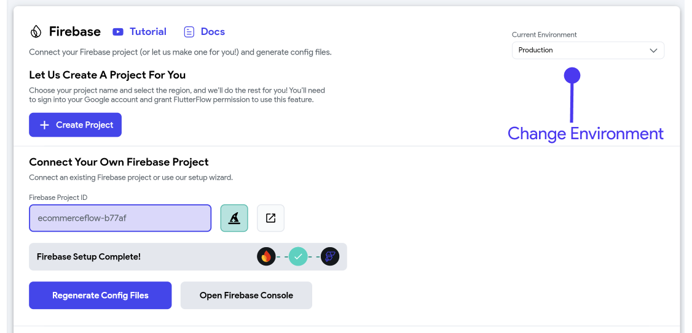

# Development Environments

Development Environments in FlutterFlow allow you to set up multiple environments for your apps, such as `Development`, `Staging`, and `Production`. For each environment, you can create environment-specific values and databases. This allows you to easily point to different backends depending on where you are in your development lifecycle. 

:::note
By default, every FlutterFlow project starts with a `Production` environment.
:::

:::info[When to Use Dev vs. Staging Environments]
- **Dev Environment**: Use for testing and developing new features without affecting production data.
- **Staging Environment**: Use to simulate the production environment before launching, and is isolated from the actual production data.

*This is a common best practice, but you can create custom environments with different names for your own workflow.*
:::

### Create and Switch Development Environments

You can create and switch environments in the **Dev Environments** page in **App Settings**. You can always see the current environment that is selected by looking in the top left hand corner of the project.

    <iframe 
        src="https://demo.arcade.software/yR8P5pFPOKtuQ0jFSOJ7?embed&show_copy_link=true"
        title="Creating and Switching Development Environments"
        style={{
            position: 'absolute',
            top: 0,
            left: 0,
            width: '100%',
            height: '100%',
            colorScheme: 'light'
        }}
        frameborder="0"
        loading="lazy"
        webkitAllowFullScreen
        mozAllowFullScreen
        allowFullScreen
        allow="clipboard-write">
    </iframe>

The selected environment is used to generate the proper app code when you run, test, deploy or export your app. The only things that change between environment are the [Firebase Project](#configuring-firebase-or-supabase-for-each-environment) or variables that are tied to [Environment Values](#environment-values)

### Environment Values
Environment Values can be used to dynamically change parts of your app's code based on the environment that is being used. 

For example, in an e-commerce app, you might define an `apiUrl` Environment Value that points to different API URLs for Development, Staging, and Production. This allows you to test new features without affecting the live production environment, where real customer orders are processed.

#### Use Environment Value
Let's see an example of creating and using `apiUrl`:

    <iframe 
        src="https://demo.arcade.software/bAVpkNAanVDlBTyeRwJy?embed&show_copy_link=true"
        title="Creating and Using Environment Values"
        style={{
            position: 'absolute',
            top: 0,
            left: 0,
            width: '100%',
            height: '100%',
            colorScheme: 'light'
        }}
        frameborder="0"
        loading="lazy"
        webkitAllowFullScreen
        mozAllowFullScreen
        allowFullScreen
        allow="clipboard-write">
    </iframe>

:::tip[Generated Code]
When you switch to an environment, FlutterFlow generates code specific to that environment, for any of the following interactions:
- Test / Run mode sessions
- Local Run
- Code export
- Deployment

You may also encounter different project errors depending on the selected environment.

In the generated code, FlutterFlow creates two files:

- `environment.json` – Stores the environment values defined by the user in FlutterFlow.
- `FFDevEnvironmentValues` class – A singleton class that holds a single instance of the `FFDevEnvironmentValues` object. It includes initialization logic and getters for accessing these environment values. They can also be referenced in your custom code resources. See **[Common Custom Code Examples](../../ff-concepts/adding-customization/common-examples.md#get-dev-environment-values-in-custom-code)**. 
:::

#### Private Environment Values

You can mark environment values as private when they contain sensitive information that should not be exposed in the client-side code. **Private** environment values are not included in the generated code.

Currently, the only way to use a private environment value is as a variable in a private API call. Since private API calls are routed through a Cloud Function, the variable value remains hidden from any client-side requests made by the app.

:::tip[Generated Code]
For private environment values, the generated code does not include these values in the `environment.json` file, and no getter logic is created in the `FFDevEnvironmentValues` class.
:::

### Configuring Firebase or Supabase for each Environment
A single FlutterFlow project can have **multiple environments**, each mapped to its **own Firebase or Supabase project**. This ensures that environments like `Development`, `Staging`, and `Production` remain independent, giving you better control over your app's data and behavior throughout different stages of development.

You must complete the Firebase or Supabase setup for an environment before you can test your app using that environment. However, this doesn't stop you from continuing to run and test your app in other environments. Just switch back to Production, and you can keep testing while finishing the setup for the new environment.

#### Configuring Firebase
If your project uses Firebase, you'll need to create a separate Firebase project in the Firebase Console for each environment. Then, you can change the selected environment in the Firebase settings page (see below), and follow the steps to [**manually configure the Firebase project**](../../ff-integrations/firebase/connect-to-firebase-setup.md#connect-an-existing-firebase-project-manually) for each one. 

Additionally, you must manually set up [**Firestore rules**](../../ff-integrations/database/cloud-firestore/firestore-rules.md) and [**collections**](../../ff-integrations/database/cloud-firestore/creating-collections.md) for the new environment.

:::info
The data that you add to Firebase through the Content Manager is specific to the Firebase project, and environment, that you have selected.
:::

#### Configuring Supabase
If your project uses Supabase, you'll need to [**set up a new Supabase project**](../../ff-integrations/supabase/supabase-setup.md) for each environment. 

Create environment-specific values like `SupabaseAPIURL` and `SupabaseAnonKey`, and then configure the Supabase properties to point to these newly created values. Below is an example of how it would look like.

    <iframe 
        src="https://demo.arcade.software/VxEaC6uxhnB4zzluIE9i?embed&show_copy_link=true"
        title=""
        style={{
            position: 'absolute',
            top: 0,
            left: 0,
            width: '100%',
            height: '100%',
            colorScheme: 'light'
        }}
        frameborder="0"
        loading="lazy"
        webkitAllowFullScreen
        mozAllowFullScreen
        allowFullScreen
        allow="clipboard-write">
    </iframe>

:::note
It's recommended that you keep schemas consistent between the different Supabase environments. It's also recommended that you
**Get Schema** from the Production environment and build from there.
 :::

### FAQ

How can you push code from one environment to another?

It’s important to note that the **Development Environments** feature in FlutterFlow is primarily designed to configure different backends for testing

If you are building new features, you should consider using [**Branching**](../branching-collaboration/branching.md). You can develop and test new features on a new branch by selecting a development environment. Once tested, you can merge the branch into `main` and switch to the `Production` Environment to go live.

Are you using Flutter flavors under the hood?

No, FlutterFlow does not use Flutter flavors. Instead, it generates code based on the environment selected in FlutterFlow. The environment-specific code is generated and applied for the following actions:

- Test / Run mode sessions
- Local Run
- Code export
- Deployment

How to deploy apps for different environments?

You can configure deployment settings for each environment using the dropdown interface on the deployment page. For mobile, set a new package name, and for web, set a new site URL. Once done, deploy your app as usual. See how to do it in [**detail here**](../publishing/deploy-for-environment.md).

