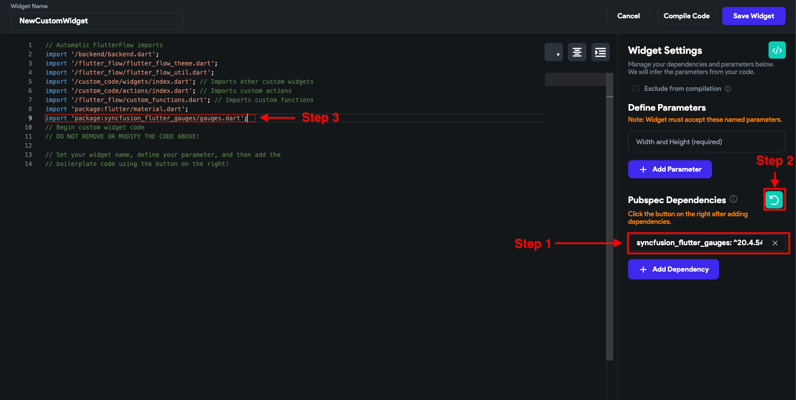

# Add Dependencies in pubspec.yaml for Custom Code

This article outlines the workaround for adding external dependencies when building with **Custom Widgets** or **Custom Actions** in FlutterFlow.

:::note
FlutterFlow currently does not support directly adding dependencies for the entire project. However, dependencies can be included at the widget/action level.
:::

:::info[Prerequisites]
- A project with at least one Custom Widget or Custom Action.
- Familiarity with editing custom code inside FlutterFlow.
:::

Follow the steps below:

   1. **Open the Custom Widget or Action**
      - Navigate to **Custom Code > Widgets** or **Actions**, and select the one where you want to use the dependency.

   2. **Add the Dependency**
      - In the right panel, find the **Dependencies** section and add the required package.  
      Example: `http: ^0.13.4`

   3. **Click the Refresh Icon**
      - After adding the dependency, click the **Refresh** icon to update the `pubspec.yaml` and fetch the package.

   4. **Import the Package in Your Code**
      - Inside your Dart code, use standard import syntax:
      ```dart
      import 'package:http/http.dart' as http;
      ```

      

      :::note
      - These dependencies will only be included in the scope of that specific Custom Widget or Action.
      - Global dependency injection is not yet supported.
      :::
