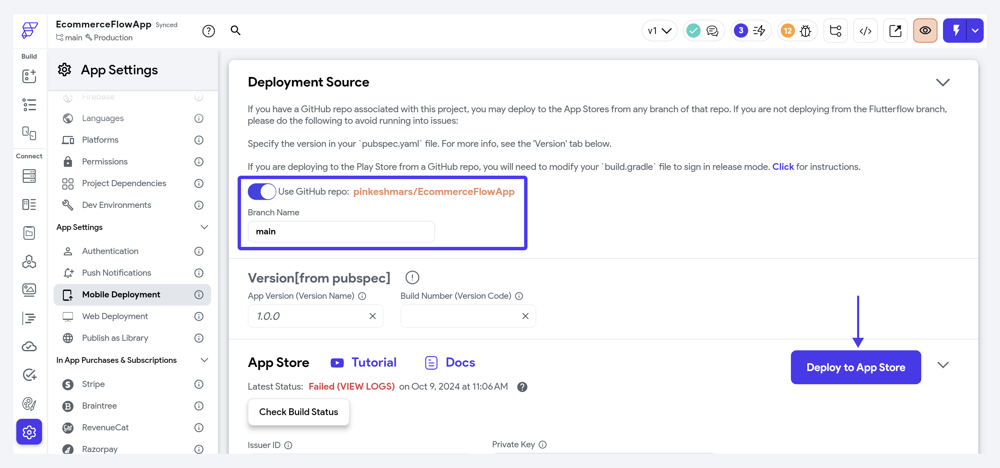

If your FlutterFlow project is connected to a GitHub repository, the generated code can be pushed to GitHub, giving you full control over your project’s code. Then, you can deploy your app directly from the same repository, rather than deploying through FlutterFlow.

Deploying from GitHub is particularly beneficial when:

- You have written custom code that cannot be managed directly in FlutterFlow, such as features that require advanced Flutter functionality.
- You want to manage the source code in an external GitHub repository for better version control.
- You want to automate the process of deploying your app directly from GitHub to the Play Store or App Store after modifying the code.
- You want to deploy from a specific branch of your GitHub repository.

Treat the selected branch as production input. Protect it with reviews and required checks, pin or review dependency changes, scan for secrets, and ensure only trusted collaborators and workflows can modify deployment code. Never commit keystores, signing passwords, service-account files, API secrets, or production environment files.

## Steps to Deploy

To deploy from a GitHub repository:

1. If you haven't already added your project to the GitHub repository, follow the instructions provided [here](../exporting-code/push-to-github.md#connect-a-github-repo).
2. In FlutterFlow, go to **Settings & Integrations > App Settings > Mobile Deployment.**
3. Locate the **Deployment Source** section and click the arrow icon on the right to expand it.
4. Turn on the toggle for **Use GitHub repo: [your repo URL]**.
5. Enter the branch name of your repository that contains the code you want to deploy. Ensure the branch name is correct.
6. Click the **Deploy to App Store** or **Deploy to Play Store** button, depending on your desired platform for deployment.

:::info[important]

When deploying from your GitHub branch, you will need to manage the app versioning manually. This is done through the `pubspec.yaml` file. For example, to set the version to **1.1.0** and the build number to **2**, you can use the format: `version: 1.1.0+2`.

:::

The store build number must increase for every submitted build. Verify that the branch's bundle or package identifier, environment, signing configuration, backend endpoints, and production flags match the intended listing before deployment.

## FAQs

I am having an issue while Deploying from a GitHub branch. Error: *You uploaded an APK or Android App Bundle that was signed in debug mode. You need to sign your APK or Android App Bundle in release mode.*

Confirm that the branch still contains FlutterFlow's generated release signing configuration and that deployment credentials are configured through the approved FlutterFlow deployment flow. Do not hard-code keystore passwords or commit `key.properties` or a keystore to the repository. If generated Android build files were customized, compare them with a fresh export and restore the release build type carefully, preserving intentional changes. Then build an Android App Bundle locally or in CI and verify that it is release-signed before uploading again.

