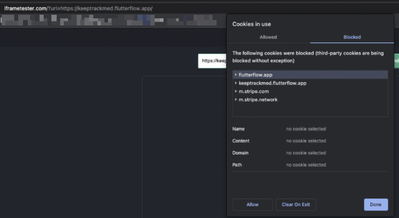

# Embed a FlutterFlow Web App in an Iframe

Embedding a FlutterFlow web application inside an `iframe` is technically possible, but it may not always work as expected due to browser security restrictions and FlutterFlow’s use of `localStorage`.

:::warning
Embedding a FlutterFlow web app in an `iframe` may result in **incomplete functionality** or loading issues—particularly if third-party cookies are disabled in the browser.
:::

:::info[Prerequisites]
- A deployed FlutterFlow web app (e.g., on Firebase Hosting or FlutterFlow subdomain).
- Ability to modify the host page where the `iframe` is embedded.
:::

Follow the steps below to embed a Web App in an Iframe:

   1. **Enable Third-Party Cookies**  
      Ensure that third-party cookies are allowed in the browser for the FlutterFlow app’s domain. This is critical for `localStorage` access inside the iframe.

   2. **Embed the Iframe Code**  
      Use the following HTML snippet in your host page to embed the FlutterFlow app:

      ```html
      <iframe
      src="https://your-flutterflow-app.web.app"
      width="100%"
      height="1000px"
      style="border: none;"
      ></iframe>

   

   Replace `https://your-flutterflow-app.web.app` with the actual hosted URL of your FlutterFlow web app.

:::note
- Some features in your app might not function properly when embedded in an iframe, especially those that rely on session storage or local storage.

- Security policies like `X-Frame-Options` or `Content-Security-Policy` headers can also prevent embedding.

- Many platforms (e.g., Google, LinkedIn) disallow embedding their apps in iframes to prevent clickjacking and other attacks.
:::